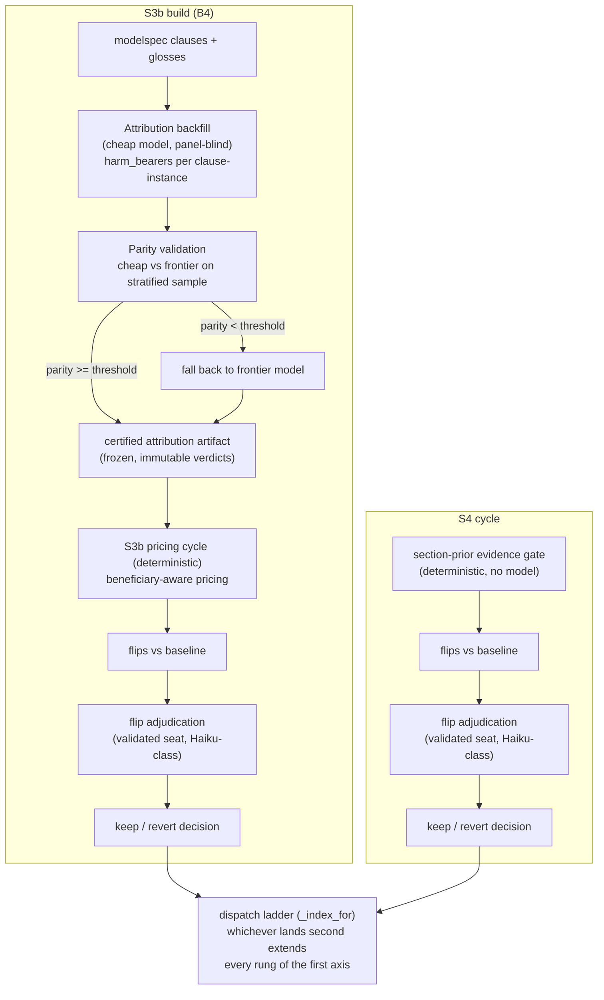

# BUILD OVERVIEW — S3b build (B4) and S4 cycle

Self-describing overview for whoever reads this next. Purpose: explain what each build
entails, which models do what, and why we believe those models are adequate. Written
2026-08-05 by the session coordinator. This is an overview, not a design — the designs
are `S3B_REDESIGN.md` (REVISION 9) and `SECTION_PRIOR_DESIGN.md`.

## 0. Do they help if run together? — No, sequence them.

S3b and S4 extend the SAME dispatch ladder (`_index_for`, keyed on `pricing_version`
first). `SECTION_PRIOR_DESIGN.md` (two-axis composition) states: whichever of S3b and S4
lands SECOND must extend every rung of the first axis with the other, or a snapshot
carrying both keys is dispatch-ambiguous. So they compose, and must land one after the
other, not in parallel. The one piece that is model-bound and somewhat independent is the
S3b attribution backfill, but the cycles themselves (OPEN → MEASURE → ADJUDICATE → CLOSE)
must be sequential.

Recommended order: **S3b build first** (it's the largest census error cause, 53%), then S4.

## 1. What each build entails

### S3b build (B4) — beneficiary-aware patient pricing
Attacks the census's largest error cause, `fp_promiscuous_atom` (155 of 294 = 53%): clauses
firing on atoms whose harm does not actually fall on the query's declared patient.

⚠️ **Expected coverage is NOT 53% — cost this build against ~27%.** 53% is the size of the
CLASS, not of the fix. At the ruled attribution population (D5: b-trim/439) the mechanism
reaches 79 of the 155 cases (51%), because the remaining 76 are credited through atoms no
band includes — 66 of the 80 resolved matched atoms there are patient-free ACTS, excluded
by the situations-only scope pin. 79/294 ≈ **27% of all disagreements**. The residue is not
one problem: part is the implied-effects layer's (bearer implied, not named), part is a
possible act-population extension (`D5B_ACT_ATOMS.md`, ceiling ≤17 cases), and roughly 30
cases are helpfulness-domain matches with no harm or protection in them at all, which
attribution cannot address at any band. Evidence: `D5_WORKED_EXAMPLES.md`.

Three steps:
1. **Attribution backfill** (model-bound): a cheap model attributes, per clause-instance,
   who the harm/protection falls on (`harm_bearers`), panel-blind.
2. **Parity validation** (model-bound): certify the cheap model against a frontier model
   on a stratified sample before trusting it.
3. **S3b pricing cycle** (deterministic): apply beneficiary-aware pricing, measure flips,
   adjudicate flips. No model in the pricing itself.

### S4 cycle — section-prior evidence gate
Attacks `fp_section_prior` (10%): clauses getting credit from a section prior without
atom-level evidence. Deterministic gate (no model); measure flips, adjudicate flips.

## 2. Which models, what we ask them, why we trust them

| step | model | what we ask it | why we trust it |
|---|---|---|---|
| Attribution backfill | **cheap, capable model** (candidate DeepSeek V4 Flash) | per clause-instance: name the harm-bearer(s) from a CLOSED vocabulary (`third_party / developer / operator / system / model / root / user / unclear`), cite a verbatim `license_quote`; panel-blind | task is constrained classification, not open-ended reasoning; closed vocabulary + verbatim quote + fixed procedure; parity-validated next |
| Parity validation | cheap model **and** a **frontier model** | both attribute the same stratified sample; require agreement ≥ threshold (verdict + unclear-call + golden accuracy ≥ 0.90) | the frontier model is the yardstick; the cheap model is only trusted if it matches |
| Flip adjudication (S3b + S4) | **validated seat** (Haiku-class, proven at frontier parity) | per flip: is the flip correct or a regression, judged against the document | adjudication seat is proven at Haiku/frontier parity (one divergence ever, m0108, recorded contested) |
| S3b pricing / S4 gate | none (deterministic code) | — | no model in the pricing/gate logic |

The key point: the ONLY open-ended model work is the attribution backfill, and it is (a) a
constrained classification task and (b) parity-validated against a frontier model before it
is trusted. Everything downstream is deterministic or uses the parity-proven adjudication
seat. So the build's correctness does not rest on an unvalidated model.

## 3. Data flow

## 4. Known caveats / do-not-misread

- The attribution backfill is the ONLY step that spends model tokens on open-ended work;
  everything else is deterministic or parity-proven. If parity fails, the fallback is the
  frontier model (more cost, same correctness).
- S3b and S4 must be SEQUENCED (dispatch-ladder composition), not parallelized.
- The adjudication seat's one historical divergence (m0108) is recorded as contested, not
  silently resolved.
