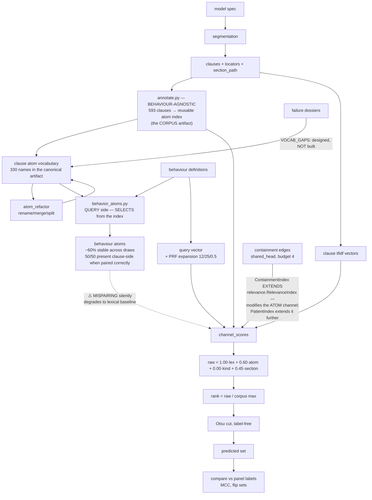
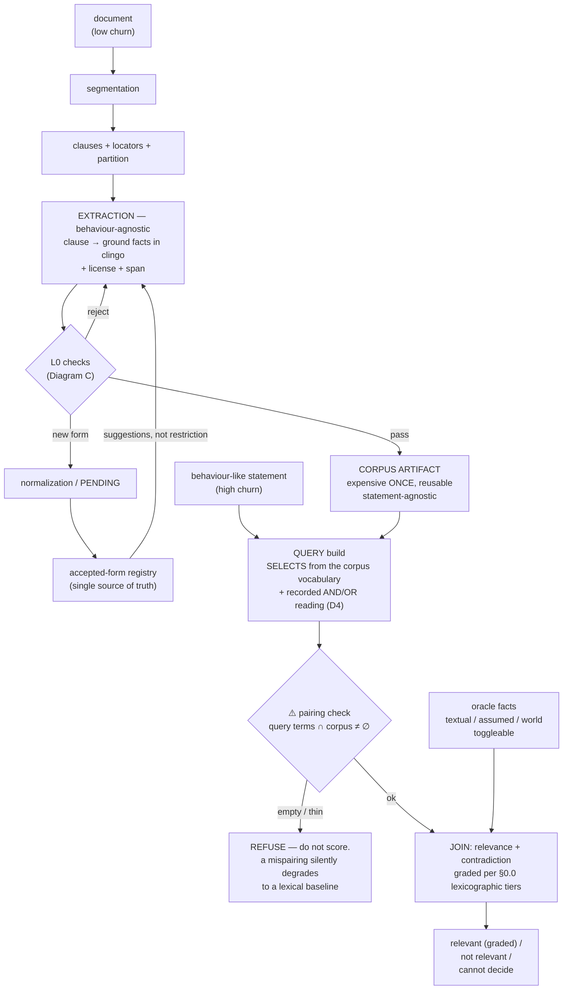
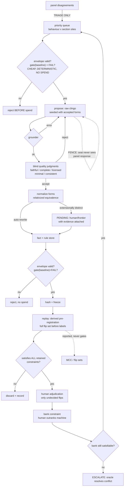
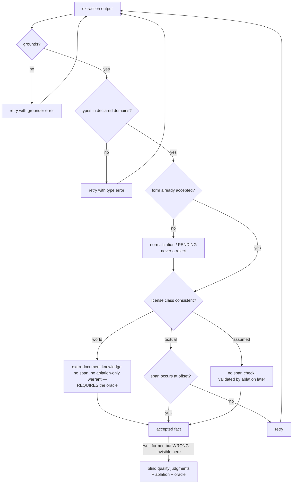

# Harness REDESIGN — migrating from the current tool to a machine for testing representations

> ⚠️ **This is a REDESIGN document, and it is meant to be retired.** It carries the transition —
> what exists today (§1, §2), what changed and why (§0.1), what is superseded (§4b), which
> alternatives were rejected (§4c), and the migration (§4). Once the migration is done, the
> transition material has no readers: **replace this with a design document that states only
> where we are going.** Rulings (§0.0, §0.0a) and the north star (§0) survive that retirement;
> everything comparing old to new does not. Repo-level traps live in `REPO_TRAPS.md`.


**Status: DESIGN, 2026-08-06. Supersedes `RELATIONAL_PAPER_ENCODING.md`**, which proposed a
specific relational encoding. That proposal is demoted to a hypothesis (§6) on the evidence in §2.
Nothing here is built. No cycle is open.

**Confidence marking is used throughout.** ✅ = verified against code/artifacts this session.
⚠️ = inferred, not verified. ❌ = known wrong, recorded so it is not re-derived.

⚠️ **Reading rule.** A `✅` header licenses only the claims it names explicitly. Any unmarked
numeric claim is `⚠️` by default, whatever the header says — errors clustered inside `✅` sections
precisely because the mark did work no one had done per-claim (`REPO_TRAPS.md` #12). Section-level
marks are retained for history and are no longer load-bearing.

---

## 0.0 THE GOAL (Matt, 2026-08-06 — the scope decision, now taken)

> **The tool provides logically consistent readings of the document for a given behaviour**, with
> known alternative readings called out, and the ability to specify new ones by manipulating
> explicit assumptions.

⚠️ **ADDED 2026-08-06 (Product review m-6) — the goal above states a PROPERTY, not a benefit.**
"Provides logically consistent readings" is something the tool *has*; nowhere did this document
say who is better off or what they stop doing. Derived from §0.0b's one recorded expert (this is
a restatement for review, **not** a replacement for Matt's words above):

> **So that** a person who must show that a document does or does not address a topic
> **can** hand someone else a citable derivation — *this passage, under this reading, because of
> these facts; here is the alternative reading and what it turns on* — **instead of** re-reading
> the document by hand, or pasting it into a frontier model that gives a different answer each
> run and cannot show its working.

The differentiator in that sentence is **not accuracy** (§0.0 retires parity by name, and §2.5
records the frontier bar as +0.555 against our +0.316). It is **the derivation and the named
alternative reading.** Every design choice below should be checkable against that clause: a
change that improves the score but not the showable derivation is not on the goal.

**Retired:** "quality equivalent to or higher than just asking the frontier models." Reproducing
human judgment is not the goal and cannot be — it requires holding mutually incompatible
commitments at once, which is what an LLM does and what a consistent formal system must not.

**Disagreement is output, not error.** Every tool-vs-human disagreement resolves to (a) a missing
or wrong fact — fixable, and the fix generalises; (b) a demonstrated inconsistency in the human
judgment — an interesting finding, **not** the product; or (c) unexplained — the honest residual.

| | old | new |
|---|---|---|
| metric | MCC vs panel | **fraction of disagreements accounted for**, residual = unexplained |
| can it be fitted? | yes (and was — ~47% of headline) | no — only a fact that survives replay moves it |
| cause established by | attribution (census `side` — withdrawn, block-segregated by run, wrong on H006) | **demonstration**: add the fact, re-run, disagreement resolves, nothing else breaks |
| oracle feedback | a verdict | **never a verdict** — only new/updated facts and relationships |

**The feedback constraint makes LABEL-VALUE fitting impossible by construction:** no labelled
example can enter, because the channel does not accept one. ⚠️ **Not "invariant 9 holds by
construction"** — §3.2 records a residual: the panel still chooses *which sites are asked
repeatedly*, and that is a coarse but real gradient which accumulates across cycles. The reroll cap
bounds per-site multiplicity, **not cumulative selection**. Monitor: record per banked fact whether
its site was panel-flagged, so the panel-driven share is measured rather than assumed small.

Every correction is forced to generalise. And if a correction *cannot* be expressed as a fact or
relation, that is itself the finding.

**No silent verdicts.** Every (clause, behaviour) pair returns one of:

1. **relevant, graded** — with an inspectable derivation
2. **not relevant** — the vocabulary covered the territory and nothing fired
3. **cannot decide** — naming what is missing

Until 2 and 3 are distinguishable (**G-b**), non-coverage cannot be published — and non-coverage is
the headline claim.

**Grading is lexicographic over discrete features, never a fitted score** (a score invites weights;
weights invite fitting). Four tiers — **and their precedence is a user control, not a fixed policy
(R4)**:

1. **match completeness** — how many of the behaviour's sub-conditions are satisfied (`structural.py`'s rung
   ladder; `act_and_situation` is the top rung)
2. **derivation directness** — own facts > one subsumption hop > many > section closure only
3. **license strength** — proof uses only `textual` facts > requires `assumed` > requires `world`
4. **salience** — the clause's **speech act**: rule-stating > illustrating > commentary (**R4**)

The license tier means **the grade falls out of the provenance of the derivation**: *"highly
relevant — every fact in the proof is textual"* vs *"somewhat relevant — holds only under
assumption A."* Same object as the toggleable-assumption layer, not a second mechanism.

⛔ **"Ties are real ties" is SUPERSEDED by R4.** The final tie-break, after every configurable tier,
is **document order** — zero-parameter, document-grounded, deterministic, and it implements
§0.0b's *"the initial strongest expression should outrank the others"* literally.

## 0.0b Who this is for ⚠️ n=1, secondhand — the only human signal in the project

Product review B-1: no user appeared anywhere in this document, and the repo's one human-expert
signal cuts against part of the design. `expert_salience.json` (2026-08-04), self-described as
*"the **FIRST** human-expert relevance signal in this project; everything prior is
model-measuring-model"*:

> **Endorsed use case:** *"interest groups checking whether and how their topics are covered."*
> **Failure mode:** *"**SALIENCE FLATTENING**: it over-flags, treating many related passages as
> equally relevant, and fails to distinguish **THE core passage**."*
> *"Missing nuance and specificity but the tool is very useful and efficient to find relevant parts
> and compare."*
> Anchors: *"should be many related + ~one core"*; *"the initial strongest expression should
> outrank the others."*

**The user, concretely:** someone who must show that a document does or does not address a topic
they care about, and who needs to find *the* governing passage rather than a flat list of twenty
related ones. Today they read the document, or ask a frontier model and cannot show their working.

⛔ **This collides with §0.0 and the collision must be ruled, not left implicit.** §0.0 ends *"Ties
are real ties"*; §2.3 filed ranking as *"a null."* The one person who has looked at the output asked
for **an ordering with the core passage first**. And §2.3's own correction shows ranking is what
earns the only surviving gain — the partition is inert. So the design's stated tie policy points
away from the only endorsed use case, on a reading that has since been overturned.

✅ **RULED 2026-08-06 (Matt) — option (i) taken. See R4 in §0.0a.** Option (ii), "keep ties are real
ties and decline the expert's stated need," is **rejected by name**: it is the only endorsed use
case in the project, and §2.3's correction shows ranking is what earns the only surviving gain.
⚠️ n=1, relayed secondhand, no protocol or transcript — R4 is taken on a signal to weigh, not a
requirement obeyed, and R4 records its own falsification test.

## 0.0a Rulings taken 2026-08-06 (Matt) — R1-R3 close three review findings; R4-R6 take the scope
decision into the grade, the fitting license, and the loop contract

### R1 — Banked constraints are ASSUMPTION-RELATIVE (closes Engineering BL-3)

Constraints must carry the assumptions they were adjudicated under, not stand as bare assertions.

The reviewed design stored banked constraints as bare ground assertions (*clause X must / must-not
be predicted*). Two conflicting constraints form P ∧ ¬P; no fact reconciles them, and the only exit
is retraction—a verdict forbidden by §0.0's feedback rule and by monotonicity. Commitments 3 and 4
contradicted each other with no loop exit.

**Ruling:** constraints carry the fact set and interpretation they were adjudicated under. An
apparent contradiction is not P ∧ ¬P but *"relevant under reading R₁"* vs *"not relevant under
R₂"*—evidence of a hidden assumption. Surfacing it is a fact addition, which the feedback rule
permits. No retraction, no verdict, no exception. This is `interp/1` doing real work: a conflict discovers
the contested interpretation rather than deadlock.

Same for unrealizability (bank consistent, no program satisfies it): adding facts or relations
expands expressibility and can resolve it without drops.

⇒ BL-3 downgrades from blocking to a **storage requirement**. Residual: if the same oracle under the
same assumptions adjudicates a case both ways, that is oracle inconsistency, not a design
conflict—it belongs to A-7 (self-consistency `p`; ExPairT guarantees hold for p > 0.5).

### R2 — Category (b) is established by ATTESTATION against frozen goldens (closes Science MA-6)

Downgrades require timestamped, human-readable attestations; only humans can reverse them.

1. Start from frontier-model goldens, frozen. This fixes MA-6's endogenous-denominator defect since
   downgrades measure against a fixed reference.
2. A prediction may be downgraded as illogical by a human or machine, recorded in timestamped,
   attested form with a human-readable explanation.
3. Un-attesting requires a real human. The asymmetry guards against gaming: machines may attest,
   only a person may reverse.

Attestations come in two grades: *Demonstrated*—a solver shows two commitments jointly unsatisfiable
under the same fact set (`HUMAN_VS_MODEL_JUDGES.md`'s Sonnet case, AND on H002 and OR on H005 in one run). *Attested*—a
human judgment with grounds. Both legitimate; they must not be counted together.

**Reversal rate is the adverse metric.** Attestations later un-attested by a human is a number that
can go up, measuring over-claiming directly. This supplies the falsifiable direction MA-6 correctly
says the accounted-for fraction lacks.

### R3 — The gap is THREE buckets, and one is already bounded

Three independent error sources, only two separable, third already quantified.

The three buckets: (a) illogical judgment · (b) missing extra-document information · (c)
judge-specific idiosyncrasy—not a logical flaw or document information, just that judge.

**(c) is already measured: ≤12%, honest range 12–22%** (cross-judge arm). It is unreachable by *any*
method and must not be charged to (a) or (b).

**(a) vs (b) cannot be split a priori.** The discriminator is *whether a fact exists that resolves
the case without breaking others*; the only way to find out is to try. The experiment is the
harness.

Two cheap pre-build partial probes:

- **Lower bound on (a):** within-judge inconsistency—same judge resolving the same ambiguity two
  ways across items. Sonnet produced one instance in a five-item run.
- **(c) is already bounded** by the cross-judge arm, so it can be set aside first, shrinking the
  remaining split.

### R4 — A SALIENCE tier, and precedence is a user control (closes §0.0b, Product B-2, C2)

Salience, grounded in speech act, can tier results without changing the set.

**Ruling: option (i).** Add salience as a tier of §0.0's lexicographic grade; make precedence
configurable like any human-facing sort.

Salience is grounded in speech act, never in a score. Core paragraphs state the rule; examples
illustrate it. That is structural, not a weight.

✅ The data already exists—recorded as a gap but is not one. `modelspec_clauses.json` carries `kind` on **all 593 clauses**:
conditional 188 · example 183 · definitional 84 · meta 72 · holistic 66, plus `in_example_block` and `focus_ids`. `RelevanceIndex`
already consumes `kind`; `section.CONDUCT_KINDS` uses it for election; `measure_kinds.py` measures by it. ⛔ `HUMAN_VS_MODEL_JUDGES.md`'s H003 says speech act
*"is not recorded anywhere in the representation."* Wrong at clause level. What is missing is
consumption for per-clause salience. H-4 is an unused field, not absent; building costs nothing.

⚠️ Missing: the `illustrates` edge (which rule an example illustrates). H-5 stands. `in_example_block` + section
co-membership is a cheap proxy to test first.

⭐ **The kind distribution SUPPORTS the expert.** Relevance-weighted hits (`annotate.py`): example 39.1% ·
conditional 38.2% · holistic 14.5% · definitional 4.5% · meta 3.6%. Examples are the plurality of
relevant material—precisely §0.0b's *"many related + ~one core"*—examples ARE the many related, the
rule IS the one core.

⛔ Salience ORDERS examples below the rule; must never DROP them. Dropping removes the largest
relevant-hit source and reinstates the conditional-only recall ceiling `annotate.py` escapes.

**Three guards** (sort control + metric needs fitting channels):

1. ⛔ **Sort must never change the SET.** Membership fixed by derivation; precedence orders within. A
   sort that adds or drops is a hidden filter letting result sets be shopped. Set and order computed
   independently.

2. ⛔ **Every reported number names its ordering.** Envelope (§3.3) carries `sort_order` in the frozen
   record—same discipline as `check_bar_provenance` requiring a roster. Otherwise *"the core passage came first"* is a
   claim about an order chosen after seeing it.

3. The default is a product decision, the ordering nearly every user ever sees.

**Falsification test: offline, zero spend, runnable now.** Rank existing result sets by `kind`; check
`expert_salience.json` anchors—does the named core come first under each candidate default? ⛔ CORRECTED 2026-08-06: 4 anchors exist but only 3 are usable (`how-to-approach-tradeoffs` has `expert_core_passage_starts: null`), and those 3 span only 2 behaviours. If no ordering puts it
first, R4's premise is wrong and this should revisit. *"Which default?"* becomes a measurement on
the only human signal the project has.

⇒ H-4 and H-5 promoted from open hypotheses to the product's primary-output mechanism. ⇒ §4c's C2:
C2 is adopted.

### R5 — Fitting is licensed, but CAPACITY-BOUNDED (replaces invariant 9)

Fitting to frontier output is permitted with strict capacity bounds.

**Ruling: the harness MAY fit to frontier-model output.** Invariant 9 ("no labelled examples") is
not deleted—replaced by capacity-bounded fitting. Rejected by name: unbounded fitting controlled by
held-out split alone.

The reason is diagnostic, not performance (Matt, 2026-08-06): for any fit to succeed, there must be
no logical inconsistency preventing an LLM reading of relevance—and that fact is itself the finding.
This first design can settle R3's (a)-vs-(b) empirically.

⛔ The prize is smaller than the headline. `section.py:342` records `supervised_ceiling: {value: 0.536, cross_behaviour_transfer: 0.334}` with 78 free parameters per cell. Against
`relevance.py` label-free at Otsu (+0.278) on the same 3-beh frontier instrument, the honest transferred gap is
**+0.056, not +0.313.** ~78% of headroom is transfer loss. Do not quote +0.591 as available
headroom; the module notes it is *"not a target a label-free query can be asked to reach."*

⚠️ **But that number does not refute this ruling.** The supervised readout fits continuous weights
(78/cell). This ruling licenses discrete selection among independently-admissible statements.
Different capacity classes; transfer collapse is evidence about high-dimensional weight-fitting, not
gated selection.

The measurement is capacity, not fit:

⭐ The readout is HOW MANY admissible statements the fit took. Compression ratio over passage
universe. Fit needing 40 is a discovery; needing 500 is memorization visible at fit time, without
spending held-out data.

The admissibility gate must be independent OF THE FIT TARGET. V2 (`RELATIONAL_TURN_DECISIONS.md`)—judge errors correlate across
tiers—means frontier review of a statement fit to frontier output is not independent. Using existing
`AXIOM_LICENSES`:

| license | checkable by | may fitting select it? |
|---|---|---|
| `textual` | mechanically, against the document | ✅ freely |
| `logical` | clingo | ✅ freely |
| `assumed` | judgment only | ⛔ **human attestation required (R2)** |

⭐ The license mix IS R3's bucket decomposition, measured. `textual`+`logical` only ⇒ bucket (a) empty, judgments
logically reconstructible. Needs `assumed` ⇒ bucket (b), each item named and inspectable—list of
assumptions, strictly more useful than R3's proportion. Cannot fit at any capacity ⇒ (a) or
expressiveness failure. Free minting of `assumed` by autonomous loop: every failure patched, residue
empty—the gate governs the diagnostic.

⚠️ The unrecoverable risk is NOT overfitting. It is an autonomous fitter optimizing a fit signal
reproducing `patient-pricing-2026-08-04` at scale: a change improving the aggregate metric while deleting spec guidance on
de-escalating user radicalization. Mechanically-admissible + logically-valid + semantically-vacuous
is a large space and correlation finds it. R6 mitigates.

Held-out sets are replenishable but not free. Golden data is buyable; behaviours unlimited
(Matt)—and if generalization does not matter, the project fails anyway, so it is load-bearing by
construction. ⚠️ But §3.4a prices one frontier document-pass at 1.75× the entire remaining budget;
$6.44 buys ~330 passage-judgments ever. Replenishment is deliberate budget decision, not mid-loop
assumption.

### R6 — ONE STATEMENT PER ITERATION replaces the flip budget

One admissible statement per iteration fixes attribution and replaces the flip budget.

**Ruling: the fitting loop's contract is one admissible statement per iteration.** This is Matt's
own condition (*"the individual logical statements … all independently reviewed and admissible"*)
taken literally, dissolving F4b rather than working around it.

| it delivers | how |
|---|---|
| clean attribution | every flip in an iteration has exactly one candidate cause |
| the `split` branch by construction | F4b's first-listed remedy becomes the loop's normal shape |
| Matt's admissibility condition | each statement gets its own adjudication |
| **the R5 capacity measure, free** | compression ratio *is* the iteration count; no instrumentation |

⛔ `FLIP_BUDGET = 30` is NOT DERIVED. No document derives it. Sole justification is its comment (*"The first
customer measured 34"*—a note it fired, not why it is 30). Observed flip counts: 0, 1, 0, 0, 18,
0—never fired in a completed cycle, while design documents routinely pre-plan exceeding it (`CYCLE5_DESIGN.md:186`,
`VOCAB_GAPS_DESIGN.md:245`, `DRIFT_STANDING_DESIGN.md:127`).

The defect (Matt, 2026-08-06): flip count conflates change GRANULARITY with effect MAGNITUDE. Coarse
= bundles independent edits (what §4 catches). Broad reach = one atomic edit affects many passages
legitimately. Flip count proxies the first, measures the second. Defensible when "change" was a code
edit that could bundle anything; under R6 **atomicity is guaranteed by construction**, so the proxy
is obsolete.

⛔ Under R5 the budget is ANTI-CORRELATED with the objective. A single statement correctly flipping
60 passages is exactly R5's high-compression reward. A 30-flip halt stops the best statements first.

Split the two concerns the budget bundles:

| concern | mechanism |
|---|---|
| atomicity | the R6 one-statement contract—no threshold |
| adjudication cost | N flips = N seat calls = money → sample when N is large |
| blast radius | a scrutiny signal, not a halt |

⚠️ This reverses an earlier session reading, deliberately. Stratified sampling was rejected as
unable to restore attribution—true when change is a bundle. Under R6 attribution is solved (one
candidate cause), so sampling bounds cost. Sampling is correct precisely in the regime where it was
said unnecessary.

⭐ Sample design from the repo's one documented failure. `cycle.py:115` defines `DIRECTIONS = ("newly_predicted", "no_longer_predicted")`. Patient-pricing's damage
was a deletion—guidance stopped being retrieved while aggregate improved. Stratify by direction and
oversample `no_longer_predicted`. Deletions hold historical harm and are typically smaller, so oversampling is cheap.
Statements only adding retrievals sample lightly; statements removing them read hard.

Keep one halt at higher level, different meaning: not *"this change is too coarse"* (R6 prevents
that) but *"this single statement is suspiciously broad — get a human before keeping it."* ⚠️ Where
to set it is unresolved, derived from the seat-call budget (§3.4a), not invented. Replacing
underived 30 with underived 200 is not progress.

⚠️ Human review is not what this removes. `briefs/flip_adjudicator.md` is a model seat, Haiku-operable by default; per-flip
adjudication was never a human bottleneck. Human/frontier seats (`change_reviewer` (IMPLEMENT) and `decision_signer` (DECIDE))
are per-cycle, not per-flip, scaling not with flip count.

## 0. North star (Matt, 2026-08-06)

> The harness should be applicable to any situation with a set of low-churn documents
> and a set of high-churn, behaviour-like statements, where the goal is to find
> relevance and contradiction between them.

The OpenAI Model Spec × behaviours is one instance. Others: constitution × behaviours;
statute or regulation × compliance claims; policy × proposed actions; standards
document × system properties; guideline × protocol.

**The asymmetry is the whole economic argument.** Documents are stable, so
document-side work is expensive once and amortized. Statements churn, so query-side
work must be cheap and iterable. That is the original project motivation — *"we are
potentially ok with high cost on the initial extraction from the doc… what we want is
low cost per behaviour and iteration"* — generalized.

Three artifacts, and the split is load-bearing:

| artifact | derived from | churn | cost |
|---|---|---|---|
| corpus | the document alone | low | expensive, once, reusable |
| query | a behaviour-like statement | high | cheap, per statement |
| join | corpus × query | per pair | relevance and contradiction |

### Consequences, and one of them is immediate

- **C1 — the corpus artifact must be statement-agnostic.** ✅ ALREADY SATISFIED.

  > `behavior_atoms.json`'s `source: "definition"` describes the query side, not the
  > document side (`REPO_TRAPS.md` #1). `annotate.py`: *"**Behaviour-agnostic** clause annotation: 593
  > clauses → a reusable atom index… The spec is annotated ONCE."*

  The two sides are cleanly separated and the north star's amortization already holds:
  `annotate.py` builds the corpus artifact from the document alone; `behavior_atoms.py`
  builds the query side by selection from that index. Verified on the canonical pairing
  (`annotations.json` ↔ `behavior_atoms.json`): 50 of 50 query atoms present clause-side,
  0 coined.

  ⚠️ **The live hazard is artifact PAIRING, not provenance.** Against
  `annotations_b8.json` only 17/50 match; against `annotations_ext_v1_merged.json`
  only 11/50. `relevance.channel_scores` warns about exactly this — *"atoms exist on
  BOTH sides but their intersection is empty… query atoms coined rather than selected, a
  stale artifact pairing… scores then fall back to lexical-only while every label still
  says 'tool'"* — and emits `warn_atom_channel_disabled`. A mispairing silently
  degrades the tool to a lexical baseline. Any harness that swaps vocabularies must
  check the intersection, not just that both sides exist.

  H-7 (document-derived vocabulary) reverts from requirement to open hypothesis — the
  vocabulary is already document-derived; what remains open is whether richer
  document-side extraction helps.

- **C2 — contradiction is co-equal with relevance.** ⚠️ There are TWO conflict lines
  and they have opposite statuses (`MODULE_MAP.md` §2 vs §4):

  - Behaviour × document conflict — `MODULE_MAP` §2, Priority 2, BUILT, blocked on
    Matt. `conflict_output.py` (~1.6k loc — ⚠️ **Corrected 2026-08-06 (Engineering
    MIN-5).** An earlier draft wrote *"1,647 loc"*, copied from `MODULE_MAP.md:137`.
    The file is 1,644 lines today: the pin drifted by 3 between the map and the
    artifact, in a document that has been live for days. `CLAUDE.md` names this
    failure mode — *"**Never pin an exact count of a live artifact**… a cycle that
    legitimately grows the artifact will otherwise fail its own gate. **This has bitten
    twice.**"* That rule is written for tests, but the drift it predicts is exactly what
    happened here in prose, and a precise-looking wrong number is worse than an
    approximate right one. Use magnitudes for live artifacts; the same applies to the
    *"~6,000 loc"* below, which is already correctly stated as an approximation),
    `conflict_adapter.py`, `make_conflict_sample.py`. This is the north star's
    "contradiction", and what remains are two of Matt's decisions plus a recorded
    honesty caveat (the score emitted is a relevance score, not a violation model).

  - Intra-document conflict — `MODULE_MAP` §4, Priority 3, PARKED, ~6,000 loc.
    `dsl.py`, `emit_asp.py`, `run_conflicts.py`, `translate.py`, `checker.py` et al.,
    carrying the standing warning: *"An earlier iteration built this while believing
    it was building the product — **do not resume it without an explicit
    instruction**."*

  **✅ EXPLICIT INSTRUCTION GIVEN (Matt, 2026-08-06): "we definitely want to use
  clingo."**

  ⚠️ The clingo ruling licenses a LANGUAGE, not a capability. `MODULE_MAP.md:156-158`
  §4 is a capability — *"provision × provision: does the spec contradict itself"* —
  and its warning is *"do not resume **it** without an explicit instruction,"* where
  it is that capability, not the solver. "We definitely want to use clingo" rules on
  the
  harness's language (§3 commitment 1: nothing unproposable, no bespoke DSL). One can
  adopt clingo for behaviour × document work and never restart provision × provision.

  Split the two. The language ruling is taken and is recorded in §3. Resuming the §4
  capability is still un-licensed and needs its own justification — an argument that
  self-contradiction detection in the spec is worth ~6,000 loc of priority ahead of
  what §8 sequences, which this document has not made and should not smuggle in through
  a language choice. What §4's history does supply is two findings that de-risk the
  language ruling:

  1. Why it was parked was PRIORITY, not failure. §4 is provision × provision — does
     the spec contradict itself. It was *"deliberately parked after P1/P2"* because
     *"an earlier iteration built this while believing it was building the product."*
     The capability was misprioritised, not measured and rejected. Nothing says the
     machinery is bad.

  2. The live relevance path ALREADY depends on it (`MODULE_MAP.md` §5):
     `annotate.py` and `behavior_atoms.py` import `extract_section.py`, which imports
     `dsl` and `checker`. So three §4 modules are already load-bearing for §1. Adopting
     clingo promotes an existing dependency rather than reactivating dead code — and §5
     explicitly warns that deleting §4 would break §1, so this direction reduces a
     standing hazard instead of creating one.

- **C3 — panel-as-triage (§3.2) is what makes portability possible.** A new document
  has no panel. A design that optimized toward panel agreement could not travel; one
  whose signal is intrinsic translation quality can. The decision not to fit the panel
  is therefore not only an anti-overfitting measure — it is the portability mechanism.

- **C4 — the section channel is a portability asset.** The one component that survives
  its control (§2.3) derives from the document's own partition, and every structured
  document has one. The thing that measurably works is also the thing that
  generalizes.

- **C5 — the fact schema (§4) must describe the document, not the query.** Ground
  terms encode what a clause says; statement-specific concepts belong to the query
  side.

## 0.1 What changed, and why this document is not the previous one

The previous document argued for a specific representation (typed argument positions, `is_a`,
a fact license taxonomy). Three things falsified that approach as a *design* activity:

1. **The typed approach already exists and was measured.** `structural.py` is a typed query over
   atom slots. On 9 behaviours it **loses to the bag scorer it was written to replace** (§2).
2. **Every hand-designed refinement in this project loses to the no-choice default** (§2, table).
3. **The churn it was meant to fix isn't representational.** `S3B_FINDING_RECLASSIFICATION.md`,
   independently re-derived in adversarial review: **no S3B finding required a representation that
   did not exist.**

The conclusion is not "typed structure is wrong." It is that **choosing representations in design
conversations is the failing step**, and it fails worst where it is most confident. So the design
must specify a *machine for testing representations cheaply and honestly*, and must be agnostic
about which representation wins.

---

## 1. What exists today ✅

Verified by reading `relevance.py`, `threshold.py`, `structural.py`, `combined.py`,
`containment.json`, `behavior_atoms.json`, `grammar.py`, `emit_asp.py`, `rules.lp`, `briefs/`.

### 1.1 The live relevance path is a graded lexical scorer, not a logical matcher

The system ranks clauses using four independent channels with fixed weights.

```
score(c) = 1.00 · cosine(tfidf(query), tfidf(clause))      ← DOMINANT channel
         + 0.60 · Σ idf(atom)·{1.0 | 0.4 kind-mismatch} / atom_norm
         + 0.00 · kind overlap                              ← DEAD (weight 0)
         + 0.45 · mean(top-3 scores among clauses in c's section)
rank(c)  = score(c) / max(score over corpus)
predict  = { c : rank(c) > 0 ∧ rank(c) ≥ otsu({rank(c) : rank(c) > 0}) }   ← see correction
```

⚠️ **Otsu cuts the SCORE distribution, positives only** — not the rank distribution
(`REPO_TRAPS.md` #8). Verified at `relevance.py:806-808`:

```python
vals = [s for _, s in scored if s > 0]
threshold = _t.apply_rule(_t.PREFERRED, vals) if vals else 0.0
```

Otsu is computed over the strictly positive subset only, not the full rank vector. On this
corpus the zero mass is large (most of 593 clauses score 0 for a given behaviour), so
the cut would separate "scored at all" from "scored zero" rather than "high" from "low".
The `> 0` test appears a second time in the predicate (`s > 0 and s >= threshold`), so
`threshold=0.0` means *"everything with any signal"*, not *"everything"* — an all-zero run
predicts ∅. Both facts are contract, not incident: the docstring states them.

Query vector is built with pseudo-relevance-feedback expansion (12 docs, 25 terms, β =
0.5). The `explain()` function returns per-channel contributions, matched atoms with spans
and glosses, channel share, and top lexical terms — **clause-level auditability exists**.

Dead on this artifact (from `Weights`' own docstring, `relevance.py:456-463`):
`kind = 0.0`; `kind_mismatch_discount` fires on 0 of 70 query atoms; `atom_stopword_frac`
implies a cutoff of 148 clauses while max atom document frequency is 43, so nothing is ever
stopworded.

⚠️ Scope of the "70": CORRECTED 2026-08-06. That is the 3-behaviour query artifact, not
the project's scope. Counted this session: `behavior_atoms.json` = 3 behaviours / 65 atom
slots / 50 distinct; `behavior_atoms_b8.json` = 70 slots; `behavior_atoms_v2_draw0.json` =
9 behaviours / 201 slots / 103 distinct. Any claim quoting "70 query atoms" as the
population is at ~⅓ of real scope. The conclusion here still generalises, because its
stated reason is structural — *"kind is a function of name here (all 361 names have exactly
one kind)"* — and that holds at any behaviour count. But numbers built on the 70 do not:
see §2.6 — sizing an elicitation experiment off it is a scope error of ~3×.

Disclosed contract violations (same docstring): `DEFAULT_THRESHOLD = 0.18` and `kind = 0.0`
were both read off the panel that scores the tool, against the invariant that the panel is
a measuring instrument and not training data. Priced there at **+0.274 in-sample vs +0.187
LOBO = 0.087 MCC, ~47% of the quoted headline.** ⚠️ Carry the ⛔ that governs these numbers
(`relevance.py:120-126`): *"DO NOT REPORT +0.187 EITHER… Every number in this block is on
the PUBLISHED universe, which deleted each passage the panel scored 0… All of them are
inflated, roughly 2×, in the tool's favour… the levels are not quotable against anything."*
The relative argument survives (the module says so); the levels do not, and §4 uses the ~47%
ratio as a load-bearing rationale. The live default path has since retired the fitted
threshold in favour of zero-parameter Otsu; `kind = 0.0` remains panel-derived (though also
"indistinguishable from 0.30 within noise", so it can be re-grounded on simplicity).

### 1.2 Vocabulary lifecycle — definition-seeded, failure-extended

- Seeded from behaviour definitions in draws; ~1,489 atom records across artifacts,
  essentially all `source: "definition"`. Stability across independent draws: **56.9% (v1,
  4 draws) / 62.8% (v2, 5 draws)** appear in every draw; ~16 singletons regardless of
  vocabulary size.
- Extended reactively from failures — ⚠️ PARTLY BUILT; the gate is done, the apply path
  is not. `VOCAB_GAPS_DESIGN.md` specifies reading missing families out of the dossiers,
  then worksheet → seat brief → validator → gloss review before apply. No `vocab_gaps*.py`
  exists (`backfill_worksheet.py` is the separate patient-chain seat), so the apply path
  is unbuilt.

  ⚠️ There IS a live extension path. `shape_partition.py` exists, is tested
  (`test_shape_partition.py`), and its output is frozen at `vocab_gap/shape_partition.json`.
  It implements `VOCAB_GAPS_DESIGN.md` §2's Shape-A / Shape-B gate mechanically, which
  `S6_ADVERSARIAL_REVIEW.md` finding B1 said nothing enforced — the blinded seat cannot
  apply the gate and the validator had no input to compute it, so only §1's prose applied it.

  This shape analysis overturns §1 on more than half its worklist. Counted from the
  frozen artifact:

  | shape | n of 26 | what it means | §1's prescription |
  |---|---:|---|---|
  | `shape_b` | 14 | concept EXISTS clause-side; no query reaches it. Fix = **re-selection; adding atoms is forbidden** | §1 reads these as missing families needing new atoms |
  | `shape_a` | 10 | atomized nowhere; add clause-side atoms | agrees |
  | `shape_a_polarity_variant` | 2 | m0242, m0253 — where the wrong join key (`grammar.stem_of`) would have inverted the call | not distinguished at all |

  ⇒ `VOCAB_GAPS_DESIGN.md` §1's hand-assignment is superseded on 14 of 26 clauses, and the
  module's own docstring names the join-key hazard that produced the difference
  (`dechain_name` preserves polarity, `stem_of` would merge `must_x` with `mustnot_x`).

  ⇒ This reweights H-7 and A-8, in the direction that makes them cheaper. Over half of the
  measured "vocabulary gap" is a query-side selection failure, not a document-side extraction
  failure. Richer document extraction (H-7) cannot fix a shape_b clause by construction — the
  concept is already there. So the open work splits: 14 cases want better selection from the
  existing index; 12 want more extraction.
- Refactored by `atom_refactor.py` (rename/merge/split, migration log, nine-plus artifacts).

⚠️ Consequence, and it bounds the hold-out experiment: atoms derive from behaviour
definitions, never from documents. A new document contributes no new concepts on arrival;
its unanticipated content is visible only as a miss. The coverage report is therefore
biased toward finding coverage of things someone already thought of — the wrong direction
of bias for an audit tool, and a structural problem for "freeze and apply to hold-out
behaviours."

### 1.3 Subsumption exists and is narrow

`containment.json`: `{child, parent, license, note}` + `provenance`, budget
`{max_edges: 4, max_families: 2}`, currently 2 edges. The only license is `shared_head`
(right-headed lexical compounds). `containment.py` independently rejects edges bearing a principal
("changes WHO is involved, not WHAT KIND of thing it is"). `CONTAINMENT_WIDENING_DESIGN.md`
is a full admission procedure with per-family review gates, budget escalation, and a
stopping rule — gated on cycle S5.

❌ Previously claimed here and wrong: that `is_a` is absent, and that
`public_official ⊑ third_party` is the missing edge. The layer exists; and that edge
crosses the atom/principal namespace boundary, so it would not be licensable even with a
widened `shared_head`.

⚠️ AND THE SAME ERROR IS STILL LIVE ELSEWHERE IN THE REPO — flagged 2026-08-06 (Science
MI-9). `S3B_FINDING_RECLASSIFICATION.md:139` still asserts a finding is *"currently
inexpressible with `is_a` absent and closure one-step."* The first half is false on this
artifact: `containment.json` is a child/parent subsumption layer with 2 live edges under
budget `{max_edges: 4, max_families: 2}`, and `containment.py`'s `ContainmentIndex` prices
matches through it. Only the second half survives — **closure is one-hop**
(`ContainmentIndex`'s own docstring: *"licensed one-hop subsumption in the atom channel"*).

This matters beyond a citation fix: §0.1 point 3 and §2.4 both rest on
`S3B_FINDING_RECLASSIFICATION.md`'s `INEXPR = 0` tally, so a live "inexpressible" claim
inside that same file which is wrong for the wrong reason is a defect in this document's
evidence base, not someone else's file. Do not correct it from here — §8's per-file fan-out
(step 7) owns it, and this document's constraint is not to propagate one side silently.

### 1.4 Diagram A — what exists today



---

## 2. The measured evidence any design must respect ✅

### 2.1 The typed approach loses AT THE RETIRED OPERATOR; at the shipped one it is indistinguishable

`structural.py`'s own header (`⛔⛔ STOP`) shows the performance of three operators:

| operator | 3 behaviours | 9 behaviours |
|---|---|---|
| `act_match` — the fitted choice | +0.310 | +0.246 |
| `any_atom` — the NO-CHOICE default | +0.294 | +0.274 |
| `relevance.py` — the bag scorer | — | +0.284 |

⛔ **CORRECTED 2026-08-06 — the headline was drawn from the RETIRED operator.** The original contrast
`structural − relevance = −0.0378`, CI [−0.0596, −0.0164], measured `act_match` − relevance. But the module shipped a different operator:
`structural.PRIMARY_OPERATOR = "any_atom"` is the no-choice default chosen after the inversion was found.

At the shipped operator, the contrast is S0 0.2735 − B 0.2841 = −0.011, just a third of the
optimistic noise floor. No `S0−B` entry exists in `combined.MEASURED["contrasts"]`, so the honest contrast has never been given a
confidence interval.

⇒ The section's true claim is *"indistinguishable at the shipped operator,"* not "loses."

⇒ Outstanding, free, offline: bootstrap `S0 − B`. It is the single number this section depends on.

**The 3→9 inversion survives intact** — selected on 3 behaviours, inverted at 9. That is the
section's real content and it is unaffected by the correction above.

⚠️ The "sign consistent 5/5 draws" statistic is discredited (§2.3): the resampling unit is the
behaviour, not the passage.

### 2.2 `combined.py` — the current state of the art

We measured 9 behaviours on 27 cells across 589 passages, with 5 draws using small-model judges
(*"NOT the bar"*).

⚠️ **The noise floor is the full range `0.0316–0.037`** (`REPO_TRAPS.md` #2). `HANDOFF.md:1046-1051` states: *"re-derived noise floor of
0.0316–0.037 (the two agents derived 0.0316 at 1000 resamples / 9 cells and 0.0350–0.0357 at 2000
resamples)."* The live constant is the full range. Code confirms this: `breadth_filter.py:190` defines `NOISE_FLOOR = (0.0316, 0.037)`, and `test_breadth_filter.py:354`
asserts both endpoints appear in the report. However, `combined.py:305` quotes only the upper half.

Why 0.0316 matters as the load-bearing lower bound: §2.2's headline contrast is `V1@any − B = +0.0317`. Against the
upper bound 0.035 it fails; against 0.0316 it clears by just 0.0001. The recorded verdict *"clears
0.0295, NOT the re-derived 0.035"* is correct but reads as more decisive than the evidence warrants,
since the honest lower edge sits one ten-thousandth below the effect. State it instead as
*"straddles the noise band"* and quote both ends.

Results for different variants and configurations:

| variant | MCC | n |
|---|---|---|
| V1@any ⭐ — typed core ∪ ungated section closure (not a post-hoc argmax: every constant at its declared no-choice default; union composition pre-registered; rung gate → its declared alternative "no gate"; operator → `any_atom`). `section.py` refuses post-hoc argmax selection by name, so this defence must be stated or the two are indistinguishable to a reader | 0.3157 | 187 |
| V3@any | 0.3097 | 159 |
| B — bag scorer | 0.2841 | 138 |
| S0 — typed core alone, `any_atom` (shipped) | 0.2735 | 159 |
| S — typed core, `act_match` (retired, panel-fitted) | 0.2461 | 92 |
| P — the pre-registered PRIMARY (rung gate + `act_match`) | 0.2590 | 102 |
| Q — section alone | 0.1984 | 51 |
| V2 — intersection | 0.1448 | 22 |

The best variant V1@any beats the bag-of-words baseline B by `V1@any − B = +0.0317`, CI (0.0169, 0.0467), with all
draws excluding zero. Recorded verdict: *"clears 0.0295, NOT the re-derived 0.035."* This is the
best known configuration, beating bag-of-words by an amount inside the honest noise band
(0.0316–0.037, above).

⛔ **CORRECTED 2026-08-06 (Science MI-6) — that CI does not mean what a reader takes it for, and
neither does "all draws exclude zero."** `combined.py:351-354` states the construction exactly:

> *"Paired bootstrap **over passages**, 2000 resamples, the resample held COMMON to both sides,
> run **SEPARATELY on each of the 5 draws** and averaged."*

Two distinct statistical claims are being conflated here:

- The interval is a passage-bootstrap — it resamples passages within a fixed set of 9 behaviours. It
  estimates sampling error conditional on this behaviour set and says nothing about whether the
  effect survives a different one.
- "All draws exclude zero" is a draw-to-draw agreement statement — draws are correlated re-queries
  of the same 9 behaviours, so this is close to no evidence at all. `HANDOFF.md:1129-1132`: between-behaviour SD of a
  comparable delta is 0.0596, between-draw SD 0.0172 — behaviour variance dominates ~12× in
  variance, and the passage-unit CIs ignore it entirely. *"'Sign consistent in 5/5 draws' is
  worthless evidence."*

⇒ The behaviour-clustered number for this contrast is recorded and it FAILS: `combined − bag` = +0.032, t = 2.02,
p = 0.078, 7/9 (`HANDOFF.md:1135-1138`). The effect is fragile — harm-avoidance alone contributes +0.144 while the
other eight average +0.018; drop it and the delta halves to +0.018. The CI above is retained for
provenance and is not evidence that the contrast survives a new behaviour set.

### 2.3 The pattern that constrains this design

Each contrast below shows a design choice and its measured effect:

| contrast | recorded verdict |
|---|---|
| `P@any − P` = +0.0387 | *"the inherited fitted operator LOSES"* |
| `P@any − V1@any` = −0.0179 | *"the rung gate LOSES"* (the only new operator in `combined.py`) |
| `S0 − S` = +0.0274 | "any_atom over act_match, below noise" |
| `V2 − S` = −0.1018 | "the intersection LOSES badly" |
| `Q − S` = −0.0479 | "section alone LOSES, as section.py measured" — ⚠️ the cited justification is RETRACTED, see below |

⚠️ Two qualifications on this table, both verified 2026-08-06 and both pointing the same way.

(a) The `act_match` variants carry an inherited panel-fitted choice. `combined.py`'s own `CONSTANTS` marks `primary_operator` `fitted_on_panel: True` —
*"SELECTED ON PANEL MCC over the 7 operators… this module makes no fresh choice but it does not
launder the old one either."* Every non-`@any` row in §2.2 (P, S, V1–V5) inherits a panel fit; the
unselected baseline is the `@any` rows, which are also the winning ones. (`election_majority` and `conduct_kinds` are both `fitted_on_panel: False` —
pre-registered and never tuned.)

(b) `section.py`'s −0.143 is RETRACTED. Its `predict()` docstring now reads: *"[RETRACTED: said 'THIS LOSES, measured
−0.143'. That was measured under the inherited `act_match`. At the no-choice `any_atom` this module is the **best
single compliant predictor** measured]"*. The `Q − S` contrast in `combined.py` is a real measurement and stands,
but the verdict text cites the retracted claim.

⚠️ Split the claim — it holds for ranking, not decision:

- Ranking: section is the best single compliant *ranker* (AUC 0.7427 vs structural 0.6475) —
  unambiguous, and it is the axis the one recorded expert asked for (§0.0b).
- Decision: at `any_atom`, section election still loses to the per-clause operator (`section.py`'s own table: V8
  +0.258 vs +0.293), and `Q` (section alone) is the lowest compliant variant at 0.1984. The
  retracted −0.143 concerned elect-and-distribute under `act_match` and has not been re-measured at `any_atom` as a
  decision rule.
- ⚠️ `section.py` still asserts −0.143 as live in two other places, so the repo is self-contradictory here
  and this document must not propagate one side silently.

### ⛔ CORRECTED 2026-08-06 — the partition is INERT; the RANKING is the gain

`HANDOFF.md:1141-1145` clarifies the mechanism of the gain:

> **RETRACTED: "the gain is the partition, not the extra prediction mass."** The size-matched control reproduces exactly (+0.2431) but **cannot come out any other way** — sd across 200 randomisations is 0.0021. The decisive control was never run: random **whole sections**, size-matched, score +0.2406 — no better than random clauses. **The partition is INERT.** The gain is the *election ranking*, computed from the same typed atoms already in the core.

⇒ C4 (§0) is withdrawn. "The section channel is a portability asset because every structured
document has a partition" is unsupported: the partition does no work. What earns the gain is the
election ranking — an aggregation claim, not an ontological-structure one. Any portability argument
must be re-grounded on ranking, not partition.

⚠️ The statistics cited above are also discredited. `HANDOFF.md:1128-1135`: *"The resampling unit is the **BEHAVIOUR**,
not the passage… **'Sign consistent in 5/5 draws' is worthless evidence** — the draws are correlated
re-queries of the same 9 behaviours."* At the behaviour level: `combined − bag` = +0.032, t = 2.02, p = 0.078,
7/9 — fails; drop harm-avoidance and the delta halves to +0.018. `section@any_atom − bag` = +0.023, 7/9. The *verdict*
("inside the honest noise band") survives; the supporting statistics do not. Note the direction:
correct statistics strengthen the finding below.

⇒ `HANDOFF.md`'s own downstream conclusion, which this document omitted: **ship `section@any_atom`, not `combined`.**

⛔ A paragraph that the correction above already killed survived here verbatim — removed 2026-08-06.
It read:

> *"**Every designed element underperforms the simplest available option.** The one thing that
> survives its control is the **section closure** — the document's own partition. Size-matched
> randomisation: elected sections 0.3157 vs random same-sized extension 0.2431 (below the
> unextended core 0.2735), ~28.8 clauses added — **so the gain is structure, not prediction mass.
> The ranking half is a null.**"*

Its last two sentences are the two claims the ⛔ block twelve lines above retracts by name — *"the
gain is the partition"* is RETRACTED (`HANDOFF.md:1141-1145`: the decisive control, random whole sections size-matched,
scores +0.2406, no better than random clauses — the partition is INERT), and *"the ranking half is a
null"* is inverted (the election ranking is what earns the gain). This is the D8 update anomaly `RELATIONAL_TURN_DECISIONS.md`
predicted and §4b records as unfixed: a correction was inserted above a restatement instead of
replacing it, so the document asserted both sides on the same page. The surviving claim, stated
once:

Every designed element underperforms the simplest available option. The one thing that survives its
control is the ELECTION RANKING computed over the section partition — an aggregation result, not a
structural one. The partition itself is inert.

### 2.4 Churn is not representational

`S3B_FINDING_RECLASSIFICATION.md`, corrected in adversarial review: **`INEXPR` = 0.** No S3B finding required a representation that did
not exist. The buckets are process/falsifiability, expressible-but-unverified, and
document-consistency. See that file for the tally and its outstanding corrections (BL-4, MA-1).

## 2.5 The ceiling analysis — why invariant 9, not invariant 10, is binding ✅

Source: `HANDOFF.md` "THE DECISION FOR MATT" and "BOTH LABEL-FREE LEADS ARE NOW CLOSED".
This is the most decision-relevant evidence in the repo and any reviewer needs it.

⚠️ **TWO INSTRUMENTS — do not splice them into one ladder.** `HANDOFF.md` installs
`check_bar_provenance` requiring any quoted bar to name its roster; this table now does.

| | MCC | panel |
|---|---:|---|
| frontier-judge bar (the **old** stated goal) | +0.555 mean / +0.654 best-per-cell | 3-beh **frontier**, 9 cells |
| supervised readout of **identical offline features** | +0.591 | 3-beh frontier |
| cross-judge arm (trained on judge *j*, gold from the other two) | +0.404 | 3-beh frontier |
| `relevance.py` label-free at Otsu | +0.278 | 3-beh frontier |
| best compliant config (`combined` V1@any) | +0.316 | 9-beh **small-model** |
| `relevance.py` bag scorer — **same module as the +0.278 row** | +0.284 | 9-beh small-model |
| lexical control | +0.185 | 9-beh small-model |

**The "+0.278 → +0.555" gap is a within-3-behaviour-frontier-panel gap.** The compliant-config
numbers are **not on that instrument**, and the small-model column is recorded as inflated ~+0.09
by score-1 truncation. Do not subtract across the two blocks.

**Invariant 10 (structural query) is NOT the constraint** — measured cost ≤ ±0.03, negative on the
best configuration. **Invariant 9 (no labelled examples) is.** The information is real and in the
document: **~68–69% of the supervised ceiling survives cross-judge transfer**, replicated across two
panels and 3→9 behaviours; judge identity is ≤12% (honest range 12–22%).

**Both label-free routes are closed by proof, not by failure to try:**

- **Calibration.** Otsu recovers 40% (+0.073 of +0.181), then hits a wall: **the THREE behaviours'**
  score
  distributions are near-identical (mean 0.16–0.19, sd 0.14–0.18) while their optimal cuts differ
  by 0.40. ⚠️ **n = 3.** Not "closed by proof" — The mechanism argument is general; the 0.40 spread
  is **three points**, in a document
  whose §2.1 is about an n=3 reading inverting at n=9. Restate as **closed on the evidence
  available, at n=3**, and queue the free n=9 re-derivation of oracle-cut spread. Any rule that is a
  function of distribution *shape* cannot produce that spread.
  8 of 11 rules land in a narrow +0.25–0.32 band. **⚠️ Proven over THESE scores — a representation
  producing distributions whose shapes actually differ is the one crack, and it is the logic
  north star's strongest claim.**
- **Per-atom weighting.** The learned weighting is **not a function of anything the corpus
  supplies**: regressed on log clause-df, log passage-df, gloss length, clause count and kind,
  **R² = 0.039**. It encodes atom *identity*. **90+** label-free re-weighting variants across **five
  families**: best gain
  +0.018, and **≤ 0 after correcting for selection** — the clause that makes the route
  *closed* rather than *marginal*.  3–11 of every 19–28 query atoms earn a **negative** weight,
  *which the current query
  cannot express at all* — a gap a logical formulation closes trivially (constraint / negation).
- **Section aggregation adds no information** — firing fraction, evidence mass, atom-profile joins,
  rung ladder as elector, section tree, kind composition, adjacency, heading-word overlap all
  re-derive the same clause matches.

**Gap attribution (+0.278 → +0.583), all SIX terms** — dropping the two negative ones sums to 0.655
and overstates headroom by ~0.07 (`REPO_TRAPS.md` #9):
calibration +0.118 · per-atom re-weighting +0.141 (*label-free reachable: +0.009*) ·
section block +0.118 · lex+section drop −0.039 · supervised's own calibration cost
−0.034. ⚠️ §2.6's "~+0.537" uses only the first three terms; the two figures use different
component sets and neither is authoritative.

## 2.6 The elicitation route, and the world in which it fails

Proposal (Matt, 2026-08-06): make the extra-document judgments **explicit** — declared,
licensed, auditable, toggleable facts — and let the logic consume them, rather than learning
them from labels.

Why this does not violate invariant 9. The panel labels `clause × behaviour → relevant`. An
elicited judgment lives in a different object space: `atom × behaviour → centrality`. The panel
never enters; the mapping to clause verdicts stays document-grounded through the matching logic.
So the panel remains a clean held-out instrument. This sidesteps invariant 9 rather than
relaxing it, and it is the same object as the toggleable-assumption layer (§0.0 tier 3).

### ⛔ CORRECTED 2026-08-06 (Science MA-4) — the "decisive cheap test" as drafted is a test THIS REPO
HAS ALREADY RUN AND FORBIDDEN

An earlier draft of this section said, in full:

> *"⭐ The decisive cheap test — the supervised weights already exist. Elicit model judgments of
> atom×behaviour centrality for the ~70 query atoms and **correlate against the learned weights.**
> High correlation ⇒ +0.141 is reachable without labels. Correlation ≈ 0 ⇒ closed."*

This is the shape of an experiment `HANDOFF.md:919-947` ran on a different elicited quantity,
withdrew by name, and left a standing instruction against. Verified this session, line by line.
Five independent defects, any one of which is disqualifying:

**1. It is a fitting vector, and the repo says so in these words.** The withdrawn lead proposed
*"rho against the learned coefficients as a cheap OFFLINE progress metric."* `HANDOFF.md`:
*"Those coefficients are an **L2 logistic fit to panel labels**. Iterating an annotation prompt
until that correlation rises **IS fitting to the panel** — invariant 9, reached one level of
indirection out."* Section 2.6's own argument about not violating invariant 9 covers the
elicited object (`atom × behaviour → centrality` is a different space from `clause × behaviour
→ relevant`). It does not cover the decision rule, and the decision rule is what fits: the
moment ρ-against-learned-weights becomes the thing that says go/stop, the panel is back in the
loop through the coefficients. `HANDOFF.md` adds the reason it survived once already —
*"the recurring failure mode of this project is a fitting-shaped sentence surviving in prose
until it becomes the plan of record."* This document was about to be that prose.

**2. ρ is FALSIFIED as a proxy for MCC, on this project's own data.** Not weak — falsified:

| weighting | ρ vs learned | MCC |
|---|---:|---:|
| IDF (the shipped baseline) | −0.30 | ships |
| the declared salience field | +0.17 | −0.013 |
| a synthetic vector | +0.17 | +0.023 |

*"Two weightings with **identical ρ** differ by 0.036 MCC — 80% of the noise floor — because
ρ ignores tie structure."* A metric that assigns one number to two outcomes on opposite sides
of the decision is not a decision rule at any effect size.

**3. The unit of analysis is 3, not 9 or 70.** The prior run reported ρ = +0.17 across "9/9
cells". `HANDOFF.md`: per-cell z-scores ran +0.20 to +1.45, none reaching 1.96, and the 9
cells are *"really **3 independent units** (cells within a behaviour share atoms, and golds
overlap J = 0.56–0.76): sign test **p = 0.125**."* The best case at n=3 is p = 0.125 — the
test cannot reach significance even if every unit agrees. And §2.1 of this document is precisely
a case of an n=3 reading inverting at n=9.

**4. Sign and magnitude are different questions and "centrality" only asks one.**
`HANDOFF.md:909`: 3–11 of every 19–28 query atoms earn a NEGATIVE weight — *"which our query
cannot express."* Centrality is a positive-only elicitation: no model asked "how central is atom
A to behaviour B" returns *"it argues against"*. So an elicitation is being correlated against a
target where 11–39% of the mass has a sign the elicitation cannot produce, and ρ silently
absorbs that as noise. Split it: (i) can elicitation recover the sign partition (a
classification question, testable with a confusion matrix) and (ii) conditional on sign, does
it order magnitudes. Question (i) is the informative one and nobody has asked it.

**5. Scope was understated ~3×.** "~70 query atoms" is the 3-behaviour artifact (§1.1
correction). At 9 behaviours it is 201 slots / 103 distinct — and cost, statistical power and
the sign split all scale with the real number.

**6. Missing precondition — coefficient stability.** Nothing has bootstrapped the learned
coefficients themselves. If a re-fit on a resampled panel returns materially different per-atom
weights, then ρ ≈ 0 is uninformative: it is consistent with "elicitation carries nothing" and
with "the target is noise." A correlation against an unstable target cannot close a route.
This is a precondition, and it is free and offline.

### ⇒ The replacement test: SUBSTITUTE AND MEASURE, never correlate

`HANDOFF.md`'s standing instruction is *"do not revive this without a **document-derived metric**
AND an **effect size that clears noise**."* Both are satisfiable, by dropping the correlation
entirely and running the substitution end-to-end:

1. **Precondition (free, offline, do first).** Bootstrap the learned coefficients over the panel;
   report per-atom coefficient SD. If the coefficients are not stable, stop — there is no
   target and no version of this test means anything.

2. **Elicit the sign partition first** (document-derived: the prompt sees the clause vocabulary
   and the behaviour definition, never a panel label, never a learned weight). Score it as
   classification against the sign of the learned coefficient — a confusion matrix, not a ρ.
   This is the question the current query language cannot express at all, so a positive result is
   also a language requirement.

3. **Substitute the elicited weighting into the scorer and measure MCC directly** — the
   document-derived metric is the tool's own end-to-end output, which is what the decision is
   actually about. Decision rule: it must clear 0.0316–0.037 behaviour-clustered (§2.2
   correction: t-test and sign test over behaviours, not a passage bootstrap), against a
   pre-registered baseline, in an envelope (§3.3) frozen before the measurement exists.

4. **Pre-register the ceiling as a stopping rule.** The prior run measured the entire lever at
   +0.088 under perfect rank fidelity and +0.026 under transfer — the second is inside noise.
   So this experiment can only ever return "inside noise" or "surprising"; if the pre-registered
   MDE exceeds +0.088 the experiment is unpowered by construction and must not be run.

Elicitation is not thereby dead — §0.0's goal does not require the +0.141, and the
toggleable-assumption layer (§0.0 tier 3, §3.4b) is valuable whether or not it recovers a weight.
What is dead is **elicitation justified as a route to the supervised ceiling, measured by
correlation.** Those are separable and this section previously ran them together.

⚠️ **A negative result has two very different readings, and the tell is already visible.** The
learned weighting is anti-correlated with IDF in 8/9 cells (ρ −0.00 to −0.50); positively
weighted atoms have higher df (5.9–9.7 vs 3.3–4.0). If the weights encoded semantic centrality
you would expect rough IDF-alignment. Anti-alignment suggests they are repairing the scorer's own
IDF over-weighting rather than carrying knowledge — in which case elicitation correctly fails.

⚠️ **The source contains a line that DISCONFIRMS this reading:** *"No monotone df transform works —
**the weighting is anti-IDF but *not* pro-df**."* A pure
IDF-repair would be recoverable by some monotone df transform; it is not. Reading B is therefore
one of at least three consistent readings — repair / IDF-is-the-wrong-prior-for-this-corpus /
genuine centrality that happens to correlate with df. Note `structural.py`'s header makes the
mirror argument in its own favour: the stable atom core is *"the MORE COMMON half… the OPPOSITE of
what IDF weighting would select"*, read there as evidence the core is not a rare-term artifact.

⚠️ **The consolation "the +0.141 evaporates when the scorer is removed" is unavailable** — §4 rules
the scorer does NOT move. Under reading B the repair persists as a real
correction that elicitation cannot supply.

**The failure world — where explicit judgments plus logic still miss parity:**

| | mechanism |
|---|---|
| **A** | the bar contains judge-specific signal. Cross-judge +0.404 is what judge-generic knowledge achieves optimally; judge mean is +0.555. Parity may be structurally unreachable for anything document-grounded |
| **B** | the weights are scorer repair, not knowledge (anti-IDF tell above) |
| **C** | per-atom scalars are too coarse — supervised models are high-dimensional (78 params/cell); the right weight may be contextual |
| **D** | vocabulary is upstream — optimal weights over wrongly-carved concepts still fail (compounds with C1) |
| **E** | calibration is a separate wall — atom judgments do not tell you where to cut |
| **F** | elicitation becomes the new fitting channel if re-elicited against measured outcomes (mitigated by §3.2's reroll cap) |

⚠️ **`+0.537` and `+0.404` are not in conflict — they agree exactly.** The gap components are
in-cell (they include the judge-specific share); the cross-judge arm is what survives disjoint
label sources. The measured deflator is 68–69%: 0.69 × 0.583 = 0.402 ≈ +0.404. They reconcile.
And `HANDOFF.md` states the conclusion outright: *the cross-judge arm bounds what any judge-generic
method can reach.* The "+0.537" was the doc's own arithmetic over two of five attribution terms
and appears in no source. Recording it as an open conflict made the elicitation route look ~0.13
MCC more promising than the evidence supports.

None of this changes the §0.0 goal, which does not require parity. It is recorded because a
reviewer must be able to see what was given up and why.

## 3. The harness — the actual design

Four commitments. No representation among them.

1. Language: clingo. Not a representation — a space. Nothing unproposable. No
   bespoke DSL: any DSL that maps 1:1 to clingo is clingo; any that doesn't has a
   boundary, and hitting a boundary is a design conversation, which is the failing step.
2. Gate: empirical. `gate(baseline) = FAIL`, replay, retained constraints.
   Nothing admitted by argument.
3. Convergence: monotone on the satisfied-constraint set — adjudicated, 
   document-grounded, human outranking machine. **MCC is reported, never gating.**
4. Oracle: human, consulted only where tests do not decide, and outranking
   machine judgments.

### 3.1 The signal is intrinsic translation quality, never panel agreement

Hypotheses are not scored by matching panel or external review. They are scored
by atomic, label-free judgments about the translation itself, made against the
document:

| judgment | question | mechanical? |
|---|---|---|
| faithful | does every emitted fact follow from this clause's text? | partly (span fidelity) |
| complete | is anything in the clause bearing on this behaviour uncaptured? | no |
| licensed | is `textual` / `assumed` / `world` correct per fact? (three classes, matching §0.0's license tier) | partly |
| minimal | is any emitted fact doing no work? | yes — ablation |
| consistent | does it contradict other facts about this clause? | yes — solver |

⭐ This signal is already partly built: `readback.py` — *"the panel-free representation
harness: deterministic renderer (atoms → English, no model) + **faithful / sufficient /
discriminable**. Answers 'does the ontology describe the DOCUMENT', which nothing else
here asks."* ⚠️ CORRECTED 2026-08-06: the docstring's "no model" scopes to the
renderer only (`render()`). `readback.py:45` — *"Step 2, three measures, judged by
**a cheap model** against the SOURCE CLAUSE"* — so faithful / sufficient / discriminable
are all LLM-judged (`_call`, `client.complete_envelope`, `--provider`). ⚠️ This is
not "no model in the loop" — that phrase scopes to `render()` only (`REPO_TRAPS.md`
#5). **Consequence: the harness's core signal is model judgment checked against
model judgment**, so differentiation from "just ask a frontier model" narrows to the
audit trail, and A-6 becomes the load-bearing assumption, not a minor one. It is
panel-free and inside the anti-cheat scan. Start from it rather than specifying a
new seat — the open question is whether its three properties need extending to cover
`licensed` and `minimal`.

### 3.2 The panel is triage, and the debugging seat is fenced from it

Panel disagreement prioritizes which (behaviour × spec-section) translation gets
debugged. The seat doing that debugging does not see the panel response. This is
the repo's existing rule — labels direct ATTENTION, never TRUTH — generalized from
the cycle ceremony to the whole loop.

⛔ The whitelist-fence pattern (`attribution_author.md`) does not fit the seat
this design needs fencing, and the obvious alternative has a recorded failure here.

What `attribution_author.md` actually does (verified, brief lines 19-25):
*"You may additionally consult `grammar.py` and `annotate_prompt.md` — the notation's
owners — and **NOTHING ELSE**: no other repo file, no other design or handoff document,
no tool output, no ranking of any kind. For this pass you are EXEMPT from the
repository's standard context-loading order; do not read it."* That is a two-file
whitelist, and it works because the seat's task is a read-off from a single
worksheet row — clause text plus the notation is genuinely everything the job needs.

The proposer seat (Diagram B, `PROP`) cannot be fenced that way. Its job is
*"propose: raw clingo, seeded with accepted forms"* — so by construction it must
read the accepted-form registry, the fact and rule store, the retained constraints,
and the grounder's errors. A whitelist that admits the fact store admits an object
that grows without bound and that other seats write into. Enumerating what it may
read is not possible ahead of time; the fence has to be a denylist — name what it
may never see (panel labels, `verdicts*`, the census, prior flip sets,
`PORTFOLIO_REVIEW.md`, this document).

⚠️ And denylists have failed here before — this is not a hypothetical.
`S3B_FINDING_RECLASSIFICATION.md` finding E-5: *"blindness fence is a **denylist**;
`HANDOFF.md` **carries the answer key** and is mandated reading"* — classified
`PROCESS`, anti-cheat. The exact defect: the deny list named artifacts, the answer
key lived in a narrative document, and that document was on the required-reading
list. Two failure surfaces the whitelist never had — enumeration completeness (a
leak enters through a file nobody thought to deny) and required-reading collision
(the repo's own onboarding order hands over what the fence excludes; `CLAUDE.md`'s
"Read in this order" puts `HANDOFF.md` first).

⇒ **This is an OPEN problem, not a solved one.** Minimum for any build: (a) the
denylist is mechanically enforced, not briefed — the existing instrument is
`test_no_reference_leak.py`'s dynamic open-spy, which *"flags any undeclared file
opened during a real `predict()`"*, and it is the right one because it catches
laundering through a legitimate reader; (b) the proposer seat is explicitly exempted
from the standard context-loading order, in the same words `attribution_author.md`
uses, or E-5 recurs verbatim; (c) narrative documents are treated as answer-key
carriers by default. Until (a) exists the fence is prose, and §0.0's *"LABEL-VALUE
fitting impossible by construction"* is correspondingly weaker for this seat than
for the rest of the loop.

Why this matters: fitting requires a gradient, and there is none if the panel never
scores anything. It also restores the panel as a valid instrument — every point of
panel agreement becomes genuine held-out evidence, which the current +0.087
in-sample-vs-LOBO gap shows it is not today.

Residual leak, and its control. The panel still chooses which sites are asked
repeatedly, and repeated asking of a stochastic generator is selection. Control:
accept a reroll on the quality judgment alone, and pre-register a per-site reroll
cap, recorded with its count in the envelope so best-of-N is visible as best-of-N.

### 3.3 The envelope

A hypothesis is body (raw clingo — fully expressive, validated by the grounder)
plus envelope (typed record, executed end-to-end by the harness). Every envelope
field must be executable or comparable; none may be prose.

| field | harness action |
|---|---|
| `metric` | compute (reported, not gating) |
| `denominator` | resolve to a case set |
| `direction` | comparison sense |
| `threshold` | compare |
| `procedure` | execute |
| `trigger` | evaluate |
| `reroll_cap` / `reroll_count` | multiplicity budget |
| `frozen_sha` / `frozen_at` | inherits `cycle.py`'s PREDICT sha-freeze — the envelope is hashed before the measurement exists. Without this the "one record produces both" property is a liability, not a guard: a single mutable record holding pre-registration and result is exactly the artifact in which `threshold` can be edited after seeing the outcome. Signed ruling D6(c) |

Run order: resolve denominator → execute procedure → compute → compare → verdict.
One record produces both the pre-registration and the result, so they cannot
disagree. This kills the S3B process findings structurally: S-4 (threshold is a
number or the record fails validation), R4-S1 (hash precedes measurement by
enforced ordering), B-3/S-2 (`gate(baseline) = FAIL` is executed).

⚠️ Any `rationale` field must be explicitly non-load-bearing — no check may
reference it, no finding may be raised about it — or the envelope grows into a
design document again.

### 3.4 `PANEL_CHECKPOINT` — an expensive, generic, on-demand external check

Motivation (Matt, 2026-08-06): we still need frontier-model panels over some
behaviour examples to checkpoint quality and make informed statements about
generalization. Under the north star this must be generic — a new document has no
inherited panel, so the ability to generate one is what lets the harness travel to
a new (document, statement-set) pair at all.

Signature. `PANEL_CHECKPOINT(document, statements, sample, judges, budget)` over a
frozen corpus artifact and frozen query artifacts. The sample is pre-registered; the
budget is declared; the whole call is enveloped like any other operation (§3.3),
with `denominator` = the sample.

⚠️ This is NOT a new operation. It is the CHECKPOINT cycle-shape `CYCLE_DESIGN.md`
already binds — do not specify a parallel one. Both amendments were verified this
session by reading the text, not the names:

- AMENDMENT 1 (F1) — *"A separate **CHECKPOINT cycle-shape** (pre-registered, every N closed
  cycles or explicitly declared) runs the census, checks any census-class predictions,
  **stamps every census-derived number DEV**, and logs `census_consulted: true`."* The
  default cycle records `census: deferred_to_checkpoint`. Every
  discipline the draft listed below — post-freeze, pre-registered sample, consumed
  once, never a gate — is a restatement of this, with the `DEV` stamp and the
  `census_consulted` flag missing.
- AMENDMENT 6 (F7) — *"Manifest declares `census_scope: dev`; the driver hard-pins
  the behaviour list to the recorded DEV cells; **touching a held-out cell outside a
  pre-registered checkpoint is a non-overridable refusal.**"*

⇒ Use 2 below (panel the held-out behaviours) collides with F7 unless
`PANEL_CHECKPOINT` is the pre-registered checkpoint. F7's clause is not a
prohibition on held-out access — it is a statement that the only licensed window is
a pre-registered checkpoint, and the refusal is non-overridable, so a free-standing
operation that touches held-out cells cannot be waived into legality by any
authority short of amending F7. This is fortunate rather than awkward:
`ITERATION_LOOP.md` §5 says the same thing from the other end — the constitution
and the held-out behaviours are *"HELD-OUT TEST: never consulted during iteration,
**evaluated only at pre-registered checkpoints**."*

⇒ **Ruling: fold, do not duplicate.** `PANEL_CHECKPOINT` is the payload of a
CHECKPOINT cycle, not a peer of it. Consequences that the standalone version silently
dropped and that are now inherited for free: the manifest with F5's two-sided
one-variable check; PREDICT sha-freeze before the panel is generated (which is what
§3.3's `frozen_sha` was re-deriving by hand); a signed `decision.json`; the
`CYCLE_LOG.jsonl` line; the `review_required` clean-context review; the `DEV` stamp
on every number it produces; and `census_consulted: true` in the record. It also
resolves G-l for this operation specifically — it is no longer "a loop that is not a
cycle."

Three distinct uses, and the third is the one that matters most:

1. Quality checkpoint — agreement between the tool's output and frontier judgment,
   at a point in time, on a frozen artifact.
2. Generalization estimate — panel held-out behaviours specifically and compare
   against the burn-in ones. Spread across behaviours is the estimator. This is the
   measurement that would have caught `structural.py`'s 3→9 inversion (§2.1) before
   it was shipped as a selection.
3. Validation of the quality signal itself. The blind judgments of §3.1 (faithful /
   complete / licensed / minimal / consistent) are the harness's actual signal. The
   panel is how we find out whether that intrinsic signal tracks external judgment.
   If translations score well on the intrinsic judgments and disagree with a
   frontier panel, that is a finding about the quality judgments, not about the
   tool. Framed this way the panel validates the instrument, rather than scoring
   the product — which is what keeps it off the optimization path.

⚠️ ADDED 2026-08-06 (Product m-2) — ask of each use "what decision changes?", and
two of the three cannot answer at the artifact level. This is not an outside
objection; it is forced by the ⛔ discipline immediately below, which this document
added itself:

| use | can it change the artifact? | what it CAN decide |
|---|---|---|
| 1. quality checkpoint | no. Commitment 3 makes MCC *"reported, never gating"*; the ⛔ below forbids the disagreement motivating an edit to the judgments, briefs, or seat prompts | nothing at the artifact level. Portfolio level only: continue / stop / disclose. Legitimate, but say so — a number that can only ever be published is a disclosure, not a checkpoint |
| 2. generalization estimate | yes — this is the one that can act | held-out spread vetoes a shipped selection. It is the measurement that would have caught `structural.py`'s 3→9 inversion (§2.1) before it shipped, and the DiD in `HANDOFF.md:1150` prices that selection at +0.0449 |
| 3. validate the quality signal | no, by the ⛔ below — divergence *"is recorded as a measurement"* and may not revise the judgments | portfolio level: if the intrinsic signal tracks nothing, A-6 fails and the harness has no signal — a stop decision, and a large one. But it is a stop, not a tuning input |

⇒ Rename them by what they do: use 2 is the *checkpoint*; uses 1 and 3 are
*disclosures* whose only licensed consequences are portfolio-level. ⚠️ Use 3 carries
the biggest decision available (stop the portfolio) and may not change the design —
both are true and must be stated together, or a reader expects use 3 to feed back.

⛔ **THE MISSING DISCIPLINE (added 2026-08-06, Science review BL-4).** Use 3 as
written licenses revising the quality-judgment definitions when they disagree with
the panel — and those judgments are the harness's sole accept/reject gate (§3.1,
Diagram B `QJ →|reject| PROP`). Tuning the gate against panel agreement is fitting
to the panel one level out, which `HANDOFF.md` records and withdraws by name:
*"Iterating an annotation prompt until that correlation rises IS fitting to the
panel — invariant 9, reached one level of indirection out… the recurring failure
mode of this project is a fitting-shaped sentence surviving in prose until it
becomes the plan of record."* ⇒ A `PANEL_CHECKPOINT` disagreement may NOT motivate
an edit to the quality-judgment definitions, briefs, or seat prompts. Divergence is
recorded as a measurement; the judgments are revised only on document-grounded
adjudication with the panel result out of the room. The four disciplines below
constrain how often the panel is read; this one constrains what may be changed after
reading it, which is the live channel.

Discipline — this is a held-out instrument and it degrades when consumed repeatedly:

- Post-freeze only. Never generated during iteration on the artifact it will measure.
- Pre-registered sample, recorded before generation.
- Consumed once per freeze. Re-paneling the same behaviours after changes is fitting;
  if it happens it is a recorded event with a multiplicity count in the envelope,
  interpreted as best-of-N.
- Never a gate. Never shown to a debugging seat (the §3.2 fence applies unchanged).

It must report its own reliability, or the agreement number is uninterpretable. ⚠️
No inter-judge kappa exists in this repo — no `.py` computes one (verified). Any
"0.39–0.50" figure is unsourced. The range appears to conflate an n=5 qualitative
aside in `HUMAN_VS_MODEL_JUDGES.md` with κ = 0.42 from an external paper (Zhang
et al., arXiv:2510.07686) quoted in `litreview.md`. This paragraph's own rule — an
agreement claim without a kappa is not a result — applies to the claim itself.
Measure it or drop it. Whatever the true value, a panel that disagrees with itself
caps how much signal any agreement figure can carry. `PANEL_CHECKPOINT` therefore
returns kappa alongside agreement, and an agreement claim without a kappa is not a
result.

⚠️ Carry the existing caveat: the current 9-behaviour panel is a small-model panel
and is recorded in `combined.py` as *"NOT the bar."* A frontier panel is a different
and more expensive instrument; numbers from the two are not interchangeable and must
be labelled with which was used.

### 3.4a ⛔ THE PRICE — added 2026-08-06 (Product M-5, m-3). The economics were ASSERTED and never
computed, and when computed they bind

§0's north star — *"the whole economic argument"* — appears in this document as an
argument and nowhere as an arithmetic. `budget` is a parameter of `PANEL_CHECKPOINT`
with no number, no unit, and no exhaustion rule (m-3; G-j records the same hole from
the gap side). Priced this session against the live accounting:

Machine side (`spend.py`, `providers.json`, `calibration.json`, `usage.jsonl` — all
measured, no model calls made):

| | measured |
|---|---|
| ceiling | `spend.BUDGET = $8.50` (raised 7.50 → 8.50 by Matt, 2026-08-02) |
| spent | $2.057 over 462 logged calls — plus unlogged spend `spend.py` flags by name (`openai/gpt-oss-20b`, 6 artifacts, billed, no usage rows) |
| headroom | ≈ $6.44, and it is an over-estimate |
| one cheap-model batch (`luna`, 6k in / 7k out) | $0.0096 |
| one frontier batch, same prompt | $0.24 (`sol`) · $0.22 (`Kimi-K3`) · $0.068 (`terra`) — measured, one call each, `calibration.json` |
| a 593-clause annotate-shaped pass, 47 batches | $0.45 cheap · $11.28 frontier |

⇒ A single frontier pass over one document costs 1.75× the entire remaining budget.
This is not a caution, it is a constraint: `spend.py --would-cost sol --batches 47`
prints *"after $13.337 of $8.50 (157%)"* and exits non-zero.

⇒ **`PANEL_CHECKPOINT` at the existing panel's scale is unaffordable by ~5×.** 589
passages × 3 judges, batched at the annotate rate (~12.6 units/batch) ≈ 141
frontier batches ≈ $34. What $6.44 actually buys, ever, for the rest of the
project: ~26 frontier batches ≈ 330 passage-judgments — i.e. one 110-passage sample
× 3 judges consumes the entire remaining budget and leaves nothing. The sample size
is therefore not a design preference; it is determined, and it should be
pre-registered as a number in the low hundreds of passage-judgments, once.

Human side — and here the honest answer is that no measurement exists. Commitment 4
makes the human the oracle, and §0.0 makes oracle facts the only input channel, so
human throughput is the loop's actual rate limit. Searched: no repo artifact records
minutes-per-item for any adjudication. The largest designed run is
`human_adjudication/manifest.json` — 32 disagreement items + 8 anchors, reserved
pool 1,571 — against 10 recorded responses (`responses.jsonl`). So the only observed
human throughput in the project's history is 10 items, un-timed. Against the
294-case census that is ~30 sessions at the observed rate, and the rate itself is
unknown.

⇒ This is a real feasibility gap, and it is cheaper to close than to argue about:
the next adjudication pass should record a start and end timestamp per item.
`responses.jsonl` already carries a `date` field; per-item timing is one column.
Until it exists, A-7 (oracle self-consistency) is measurable and oracle throughput
is not, and the loop's cost model is missing its dominant term.

Exhaustion rule for `budget` (m-3), so the field is executable per §3.3's "no prose"
rule: `PANEL_CHECKPOINT` resolves its sample, prices it via `spend.would_cost`
before any call, and refuses — does not truncate, does not sample down — if the
projection exceeds declared budget or the remaining `spend.BUDGET` headroom.
Truncating mid-panel would silently change the pre-registered denominator, which
§3.3's `denominator` field exists to prevent. A refusal is a recorded event; a
shortened panel is a corrupted measurement.

### 3.4b Alternative readings — the goal's differentiator, now given a mechanism

Product review B-2: *"known alternative readings called out"* is §0.0's entire
differentiation against asking a frontier model, and the phrase occurred exactly
once in this document — inside the goal statement. Nothing in §3 enumerated or
emitted readings; no diagram had such a node; and the enabling machinery (G-a,
entailment semantics) sat on the deferred list. The one thing a reader is being
sold was asserted and never designed.

Mechanism — it already exists in the conflict pipeline and needs promoting, not
inventing. `rules.lp` makes contested interpretations first-class:

```
{ interp(op_restriction_outweighs_forthright) }.
{ interp(persona_compliance_not_deception) }.
% "A conflict that only exists under some interp/1 assignment is
%  interpretation-conditional — reported separately."
```

Choice rules over `interp/1` atoms make the answer-set space the space of readings.
Then:

- Enumerate — each answer set is one consistent reading; the assignment that
  produced it is the reading's identity
- Call out — a verdict is tagged with the interpretations it is conditional on; a
  verdict that holds in every answer set is unconditional (this is the brave/cautious
  gap, i.e. G-a)
- Specify new ones — adding an `interp` atom adds a reading; toggling one re-derives
- Grade — §0.0 tier 3 falls out: unconditional > holds under the default reading >
  holds only under a declared assumption

⇒ **G-a moves from the deferred gap list onto the critical path**, because "relevant
in every reading" vs "relevant only in reading R" is the product, not a semantics
footnote.
⇒ **R1 (§0.0a) is the same object** — assumption-relative constraints and
interpretation-tagged verdicts are one mechanism seen from two ends.

⚠️ Not adopted: `litreview4` §5 rates canons of statutory construction highest-value
for this, as a public uniform resolution policy. Rejected by name — Matt's D4 rules
that the AND/OR reading is recorded by the user at extraction, so the system honours
a declared reading rather than applying an interpretive policy of its own. The canons
remain available if D4 is ever revisited.

### 3.5 Diagram B0 — where facts come from in the proposed design

Diagram B (below) shows only the hypothesis loop. This is the half it presupposes,
and it keeps the corpus/query split that C1 says already works.



Two things this makes explicit that Diagram B alone did not: the corpus artifact is
built from the document alone (C1, already true today), and the pairing check is a
first-class gate — a stale pairing is a silent lexical-baseline failure, not a loud
one.

### 3.5b Diagram B — the harness (hypothesis loop)



### 3.6 Diagram C — extraction checks (L0)



The dashed edge is the load-bearing one: a fact that is well-formed and simply false
passes every mechanical check. That is what §3.1's judgments and the oracle exist
for.

---

## 4. Migration — discrete moves, continuous stays

⚠️ **Exact equivalence with today is not achievable end-to-end**, and the reason is a
computational-class gap: clingo has integer arithmetic only, while the live scorer needs vector
norms (sqrt), division by a computed corpus maximum, and a 256-bin Otsu variance. Fixed-point
porting would change every number — and §11 anti-rule 2 already records that bit-identity fails on
*float summation order within Python*.

| layer | ports? |
|---|---|
| facts — clause → atoms, spans, licenses, arguments | yes, exactly. Discrete; equivalence checkable |
| structure/logic — subsumption closure, typed matching, constraints, defeaters, interpretations | yes, exactly. Already logic |
| scoring/threshold — idf, cosine, normalization, Otsu | it CAN port; it should NOT move. See the friction rationale below |

⛔ **CORRECTED 2026-08-06 (Engineering MAJ-9) — the split above is drawn on a boundary the code
does not have. It cuts straight through `ContainmentIndex` and `PatientIndex`.**

Verified at `containment.py:334-346`. `ContainmentIndex(relevance.RelevanceIndex)` is *"RelevanceIndex
plus licensed **one-hop subsumption in the atom channel**"*, and its docstring specifies matching
and pricing as one operation:

> *"A query atom q matches a clause atom c EITHER by exact name — **priced exactly as the base
> class prices it, bit for bit** — OR when q and c share a licensed subsumer (q's parent == c, c's
> parent == q, or a shared parent), **priced per the module docstring's PRICING rules**: the
> subsumer's idf capped at the clause atom's own exact price, times the kind factor, **at most one
> credit per clause atom**."*

`patient.PatientIndex` extends it further. **So subsumption closure (row 2, ports exactly) and
its idf-capped, kind-factored, one-credit-per-clause-atom pricing (row 3, must not move) are
the same pass, in the same class, over the same match.** The table implies a seam that would
have to be *built* before either row is true; that is a real work item, and tabulating it makes
it disappear.

⚠️ **Anti-rule 1 is uncited and it governs this port.** `MODULE_MAP.md` §11 row 1:
`containment.load_edges` skips the one-child-family check when no vocabulary is passed, and
*"Running it unconditionally makes already-frozen overlay snapshots unreconstructable."* A porter
re-implementing edge loading in clingo would naturally validate unconditionally — it looks like a
missing check — and would thereby break reconstruction of every frozen overlay. §11's opening
sentence is exactly about this reader: *"Every entry below is a change a competent agent would
make in good faith, and every one breaks a contract."*

⛔ **And the port gate as written CANNOT detect the failure it is meant to catch.** §4 below gates
the port on *"predicts the same sets on the frozen corpus."* `MODULE_MAP.md` §11 row 5 (patient
pricing) rules: *"Normalized scores MAY rise — the corpus-max normalizer moves… **Raw-untouched
flips that crossed a cut are `normalizer_drift`, a threshold class, never `match_change`.**"*

Set identity conflates the two in both directions:

- a port that changes no match but perturbs the corpus max shifts `rank = raw / max` for every
  clause and moves clauses across the Otsu cut → set differs, port looks unfaithful, and it is
  faithful (`normalizer_drift`);
- a port that changes matches whose effect happens not to cross the cut → set identical, port
  looks faithful, and it is not (`match_change` hidden below the threshold).

⇒ **Gate revision: the port must reproduce RAW per-clause scores at recorded precision, AND
predict the same sets.** Precision, not `==` — §11 row 2 records that bit-identity fails on float
summation order within Python (hash-seed dependent), which §4 already cites. Raw scores separate
the two causes because raw is normalizer-independent by construction; set identity alone is
`normalizer_drift` and `match_change` summed into one bit.

### ⚠️ The friction rationale — corrected, and it is the load-bearing one

Scoring DOES port: `term(C,W,TF)` facts, `#count`/`#sum`/`#max` aggregates, fixed-point integers,
`idf` and clause norms precomputed and passed in as facts, and Otsu encodable as `#max` over
candidate cuts of `w0·w1·(mu0−mu1)²`. ⛔ Order-equivalence trap. *"For a fixed query `|q|` is
constant, so ranking by `dot(q,c)/|c|` is order-equivalent to cosine"* is **false for this scorer**
(`REPO_TRAPS.md` #7).

The score is an additive mix of four channels (`raw = 1.0·lex + 0.6·atom + 0.45·section`,
`relevance.py:714-717`). Dropping the constant `1/|q|` scales the lex channel only:
`raw' = |q|·lex + 0.6·atom + 0.45·section ≠ |q|·raw`. Ordering is not preserved, and Otsu then cuts
a different distribution. Order-equivalence holds only for a *pure* cosine ranking, which this is
not. ⇒ **The query norm must be carried as a fixed-point constant in any encoding.** The arithmetic
obstacle is real — and the instrument argument below is independently sufficient, so the section
does not need the false prop.

It should not move anyway, and the reason is not arithmetic:

> **The scorer is the measuring instrument.** Make it cheap to change and model-proposable and you
> have put the instrument inside the search space. Every MCC number becomes conditional on which
> variant produced it, cross-cycle comparability dies, and `thresholds_frozen.json`, the noise
> floor and the anti-cheat perimeter stop meaning anything. That failure has already been priced
> once: `DEFAULT_THRESHOLD = 0.18`, fitted to the panel, ~47% of the quoted headline.

Criterion: things that are *measured* go in the searchable layer; things that *define* the
measurement go in code, with friction. Ontology, facts, behaviour expressions and derivation
structure are measured → clingo. **Scorer weights, normalization and cut rule define the
measurement** → code, frozen, changed rarely and deliberately.

This rationale is stable: it survives even if someone later shows the fixed-point encoding is exact.

### ⛔ Scope limit on the harness

The harness decides domain questions — is this translation faithful, does this change flip
decisions, is the ontology minimal and consistent. **It does not decide architecture, priority,
or what the product is.** A faithful port returns "no change," which verifies fidelity and says
nothing about whether the port was worth making.

Recorded because "make it empirical" is a comfortable move that avoids a judgment call, and this
design drifted into it once already (a proposed hypothesis "the scorer should live in clingo",
withdrawn 2026-08-06).

So equivalence is achievable for exactly the part that should move, and the part that should not
move is a deliberate choice rather than a technical limit.

**The section channel straddles** and is the strongest candidate: discrete structure (the
document's partition) implemented as continuous smoothing, and the discrete analogue in
`combined.py` is the one in the winning configuration (§2.2).

The port is the harness's first hypothesis, not its prerequisite. Envelope it; gate it on
**raw per-clause scores at recorded precision AND set identity** on the frozen corpus (⛔ corrected
above — "predicts the same sets" alone cannot separate `normalizer_drift` from `match_change`)
plus no regression on retained constraints. A faithful port is a no-op flip that buys native
representation; an unfaithful one is caught at replay cost rather than review cost. Nobody has to
argue about whether it is equivalent.

The real remaining design task is the **fact schema in clingo** — how clause/atom/span/license/
argument become ground terms. Bounded, and about encoding data faithfully rather than betting on
a representation.

---

## 4b. Rulings from `RELATIONAL_TURN_DECISIONS.md` superseded, by name

`CLAUDE.md`: *"Rulings go in the repo… any tempting alternative rejected **by name**."* This
document declared it supersedes `RELATIONAL_PAPER_ENCODING.md` only, and silently dropped four
signed decisions. Retired explicitly:

| ruling | status |
|---|---|
| **D2** — *"the situation layer moves from propositional constants to typed relational predicates"* | **WITHDRAWN as a decision, demoted to hypothesis H-1.** Grounds: §2.4 — no S3B finding required a representation that did not exist; §2.1 — the typed approach is indistinguishable from the bag scorer at the shipped operator. A representation choice is now a tested proposal, not a design commitment |
| **D3** — *"the hypothesis space is expressed as ILP-style language bias (mode declarations), not a hand-written edit-type enum"* | **PARTIALLY SUPERSEDED.** §3 commitment 1 adopts **raw clingo** — a larger space with no language bias — because a bias has a boundary and hitting it is a design conversation. ⚠️ But D3's *rejected alternative* ("a hand-written edit-type enum") is thereby un-rejected, and §5's H-1…H-8 is exactly that enum. **Open: does the hypothesis queue need a mode-bias declaration, or is the open-proposal + normalization loop (§5d) sufficient?** ⛔ **CORRECTED 2026-08-06 (Product M-8): "ILASP remains uncited here" was true of this document and false of the repo, and the omission mattered.** `litreview4_oracle_convergence.md` §4 cites ILASP (arXiv:2005.00904) and §6 — titled **"DO NOT BUILD THIS, IT EXISTS"** — rules the "open" question above already answered: mode declarations *are* the hypothesis-space specification, ILASP compiles induction into a meta-level ASP program, *"we already depend on clingo; **this is clingo**."* So D3's un-rejected alternative (§5's H-1…H-8) is a hand-rolled enum the repo's own literature review names as the mistake. See §4e |
| **D8** — *"the design document becomes a rendered view of a structured object"* | **NOT IMPLEMENTED.** This document is prose, and §3.3's *"any `rationale` field must be non-load-bearing"* points the other way. Retained as an aspiration; the update anomalies D8 was meant to kill are still possible here and three reviews found several |
| **D9** — sequencing (process first, relational second) | **SUPERSEDED by §8's sequence**, which is ordered by the new goal rather than by churn attribution (now 0%) |

## 4c. The competitors, rejected by name — added 2026-08-06 (Product M-6)

`CLAUDE.md`: *"any tempting alternative rejected **by name**."* `PROJECT_ASSESSMENT.md` §6 puts
**five** named options on the table and this document engaged **none of them by name** — it
supersedes `RELATIONAL_PAPER_ENCODING.md` and retires four `RELATIONAL_TURN_DECISIONS.md` rulings
(§4b) while leaving the portfolio-level alternatives standing unaddressed. That is the same defect
§4b was written to fix, one level up.

| option (`PROJECT_ASSESSMENT.md` §6) | status here |
|---|---|
| **A — keep funding the rule engine toward frontier parity** | **REJECTED, and this document is the rejection.** §0.0 retires parity as the goal outright. §6's own grounds hold independently: *"six cycles delivered nothing measurable"*, and §2.2 here shows the best compliant configuration straddles the noise band |
| **B — use frontier models instead** | **REJECTED on the goal, not on quality.** §6 concedes B wins today on quality alone (+0.556 vs +0.309). It is rejected because the goal (§0.0, and the benefit clause added above) is *the showable derivation and the named alternative reading*, which §6 itself lists as what B gives up: *"our tool cites the span that licensed each answer. A frontier model asserts."* **If the derivation is ever dropped from the product, B wins and this document has no argument left** — that is the load-bearing dependency and it should be stated as one |
| **C1 — ship the auditability machinery, not the scorer** | **NOT REJECTED — largely ADOPTED, unacknowledged.** §3's four commitments, §3.3's envelope, §3.4's fold into the cycle ceremony and the §3.2 fence *are* C1. §4's ruling that the scorer must not move is C1's second half. This document should say so rather than presenting the machinery as new |
| **C2 — measure the ranking axis the expert endorsed** | **NOT REJECTED, and §2.3's correction now argues FOR it.** The election *ranking* is what earns the surviving gain (partition inert); §0.0b's one human expert asked for exactly ranking; `section@any_atom` is the best single compliant **ranker** (AUC 0.7427). ⛔ It collides with §0.0's *"ties are real ties"* — **that collision is §0.0b's open ruling, reserved for Matt, and is not resolved here** |
| **D — one frontier mapping pass per document** | ⛔ **THE DIRECT COMPETITOR, and it has the SAME economics this document claims as its own.** Below |

### ⛔ Option D is not an alternative to the north star — it is a rival implementation of it

`PROJECT_ASSESSMENT.md` §6 D, added 2026-08-05 *"after the framing above was challenged,
correctly"*: *"the expensive pass is a one-time cost per document; the cheap thing is per
behaviour, per iteration."* **That is §0's asymmetry verbatim.** Both designs are
expensive-once-per-document and cheap-per-statement; they differ only in what the expensive pass
produces — **D: frontier natural-language annotations with written explanations, human-correctable
after the fact. This document: ground facts in clingo, with licenses and spans.** A reader
choosing between them is not choosing between economics.

**What D has that this document does not, stated fairly because it is the honest comparison:**

1. **Its evidence is the same evidence.** §6 D's four reasons are drawn from this repo — *"the
   only real gain in the project's history came from improving the representation, not the engine
   (+0.072 from re-selecting which concepts the questions search with; +0.0003 from six cycles of
   matching improvements)."* §2.3 here says the same thing in different words.
2. **It is priced and this document was not until §3.4a.** §6 D: *"order $20–60, once"* for 589
   passages, with a cheap-model-plus-frontier-validation variant *"measured at well under $1."*
   Cross-checked against `spend.py` this session: 47 frontier batches = **$11.28**, so $20–60 is
   the right order — **and both D and `PANEL_CHECKPOINT` exceed the $6.44 headroom** (§3.4a). The
   budget does not discriminate between them; it constrains both.
3. **Its correction machinery already exists** (`INTERPRETATION_LAYER_DESIGN.md`) and is close to
   §0.0a R1's assumption-relative store and §3.4b's `interp/1` layer.

**Where this document actually differs — three claims, and only the third is strong:**

- *Solver-checked consistency.* D's annotations are checked by LLM judges; ours by a grounder and
  a solver. ⚠️ Weaker than it reads: §3.1's correction records that **faithful / sufficient /
  discriminable are all LLM-judged** in `readback.py`, so the *quality* signal is model judgment
  either way. The solver checks *internal consistency of the encoding*, not truth.
- *Cheaper per statement.* Unquantified for both. Not a claim until measured.
- ⭐ *Enumerable alternative readings.* §3.4b's `interp/1` choice rules make the answer-set space
  the space of readings, and *"relevant in every reading"* vs *"relevant only under R"* is a
  distinction **a natural-language annotation layer cannot compute at all.** This is the one
  place the formal substrate buys something D structurally cannot have — and it is the same thing
  the goal's benefit clause names. **It is therefore the differentiator, and it should be the
  first thing built and the first thing tested**, not `G-a` on a deferred list.

⇒ **D is not rejected here.** It is a live, cheaper, better-evidenced competitor whose one
structural deficit is alternative-reading enumeration. **The honest ruling is Matt's, not this
document's**, and it should be taken explicitly rather than settled by which document is longer.

## 4d. Generalization is asserted and untested — added 2026-08-06 (Product M-7)

§0's north star is *"applicable to **any** situation with a set of low-churn documents…"* and
lists six document classes. **Nothing in this repo has ever run the pipeline on a second
document**, and the two artifacts that would say so both say the opposite:

- `NEW_DOCUMENT_RUNBOOK.md` opens with **⚠️ HONESTY BANNER — UNTESTED RUNBOOK**: *"Only the OpenAI
  Model Spec has ever run steps 2–7. The Anthropic constitution has run step 1 only… Every step
  below marked UNTESTED is transcribed from how the Model Spec run worked, not from a second
  execution."* Its step 1 even flags that the CLI that produced the constitution segmentation
  *"is not recorded as a repeatable CLI."*
- Verified this session: `constitution_clauses.json` is 616 clauses, schema
  `{id, locator, section_path, quote, kind, modality_hint}` — **segmented, and with zero
  annotations.** It has never been through `annotate.py`.

**The test is cheap and it is not the reason not to run it.** 616 clauses ≈ 49 annotate batches ≈
**$0.47 on the cheap model** (§3.4a's measured rate) — well inside headroom.

⛔ **The reason to hesitate is that it spends a ONE-SHOT resource.** `ITERATION_LOOP.md` §5: the
constitution cells are **HELD-OUT TEST** — *"never consulted during iteration, evaluated only at
pre-registered checkpoints. The constitution cells are clean today **because they have never been
used for anything; keeping them clean is the point.**"* Running it to debug the runbook consumes
the only untouched document in the project, and the runbook explicitly intends that use
(*"the constitution run is intended to debug this document"*). Those two purposes are in direct
conflict and the conflict is unresolved in the repo.

⇒ **Two consequences for this document.** (i) Every north-star generalization claim is
`⚠️ untested, n=1 document` and must be marked so — this is the same n=1 discipline §0.0b applies
to the human signal, and §2.1's 3→9 inversion is the standing warning about what n does here.
(ii) **The sequencing is already ruled and this document should follow it, not re-litigate it:**
`ITERATION_LOOP.md` §5's 2026-08-04 amendment from Matt — *"**behaviour generalization outranks
document transfer.** New behaviours are the common case (the user's input surface)… new specs are
the rare case… and every hard failure so far has been behaviour-shaped."* ⇒ **held-out
*behaviours* before the second *document*.** §8's sequence does not say this and should.

## 4e. Prior art is unstaked — added 2026-08-06 (Product M-8)

Three literature findings bear directly on §3 and none is cited in it. All verified in
`litreview4_oracle_convergence.md` this session.

**1. The claimable combination is already written down — in the repo's own words.**
`litreview4` §(f), lines 273-275:

> *"**Still unoccupied:** counterexample-guided *refinement of a typed vocabulary + defeasible ASP
> layer* for a real model spec, with retained constraints and a human MAT. **That is the
> combination to claim.**"*

§3's four commitments are that combination. It should be stated as the stake, with the citation,
so a reader can check the novelty claim instead of taking it.

**2. ⭐ ExPairT's pairwise oracle changes the seat — and it converges with three other open items
nobody connected.** `litreview4` §3: *"**COPY, and it changes the seat:** stop asking Matt 'is
passage X relevant to behaviour B.' Ask '**does behaviour B bear more on passage X or passage
Y**,' and derive the constraint. Measure his p on a held-back duplicate rather than assuming it."*
Theorem 5 gives probabilistic guarantees whenever oracle accuracy **p > 0.5**, so the method
tolerates an imperfect human — which is the standing worry A-7 records. **This single change to
the oracle question does four things at once:**

- supplies **A-7**'s measurement (p on held-back duplicates — already called *"the cheapest test
  in the set"*);
- emits **ranking** constraints rather than binary ones — which is **C2**, and the axis §0.0b's
  one human expert actually asked for (*"the initial strongest expression should outrank the
  others"*);
- gives §0.0b's open ties-vs-salience question **a data source** instead of an n=1 anecdote
  (⛔ it does not resolve that question — the ruling is reserved for Matt);
- and it is **cheaper per judgment** than the current absolute-relevance seat, which matters given
  §3.4a's finding that human throughput is the unmeasured rate limit.

⇒ **This convergence was not noted by any of the three reviews and is the strongest cheap move
available.** It belongs in §7b's shovel-ready list and in §8's sequence.

**3. The hypothesis-representation question is off-the-shelf, flagged in block capitals.**
`litreview4` §6 is titled **⭐⭐ "The hypothesis-representation question — DO NOT BUILD THIS, IT
EXISTS"**, added 2026-08-06 *"after the question 'what is the complete set of hypothesis actions,
and isn't this off-the-shelf?' The answer is yes, three times over, and **we were about to
hand-roll an edit-type enum badly**."* The named concept is **language bias / mode declarations**;
*"ILASP's mode bias IS the hypothesis-space specification… **We already depend on clingo; this is
clingo.**"* Must-cite: arXiv:2505.21486 (LLM proposes the language bias, ILP searches it) —
*"precisely the 'inexpensive hypothesis about formal representation' loop we identified as the
bottleneck, already built. **Read before writing any proposal schema.**"* Plus belief revision for
ASP (Delgrande et al.) as *"the principled version of 'changes to our DSL'"*, and Flouris et al.'s
ontology-change taxonomy *"instead of a hand-written edit enum."*

⇒ **§4b's D3 row understates this.** It says *"ILASP remains uncited here"* — but the alternative
D3 rejected (a hand-written edit-type enum) is **§5's H-1…H-8**, and `litreview4` §6 says in
capitals that hand-rolling that enum is the mistake it was written to prevent. **§5 must be read
as a placeholder to be replaced by a mode-bias declaration, not as the hypothesis space.**

## 5. Open hypotheses (demoted from design)

Each is a queue entry, not a decision. None is assumed to be right; §2.3 says the confident ones
are the likeliest to lose.

⚠️ **AND THIS TABLE IS A PLACEHOLDER, NOT THE HYPOTHESIS SPACE — flagged 2026-08-06 (§4e).**
H-1…H-8 is a **hand-written edit-type enum**, which is (i) the alternative `RELATIONAL_TURN_DECISIONS.md`
D3 rejected and §3's raw-clingo commitment un-rejected without noticing (§4b), and (ii) the exact
artifact `litreview4_oracle_convergence.md` §6 exists to prevent: *"**DO NOT BUILD THIS, IT
EXISTS**… we were about to hand-roll an edit-type enum badly."* The off-the-shelf replacement is a
**mode-bias / language-bias declaration** (`#modeh` / `#modeb`), which *"is clingo"* — we already
depend on it. Read arXiv:2505.21486 **before** writing any proposal schema. Keep the rows below as
a record of what was being considered; do not treat them as the space.

| # | hypothesis |
|---|---|
| H-1 | typed argument positions (`harm(C, Bearer)`) beat name-decorated atoms |
| H-2 | semantic subsumption edges (beyond `shared_head`) improve multi-hop cases |
| H-3 | a fact license taxonomy (`textual`/`assumed`/`logical`) admits implied bearers usefully |
| H-4 | `speech_act` as a slot (instruction / commentary / definition / example / exception) — recorded in `human_adjudication/responses.jsonl` as *"the current encoder cannot express that"* |
| H-5 | the `illustrates` edge (example → the rule it illustrates), same source |
| H-6 | behaviour expressions with a recorded AND/OR reading beat weighted atom bags |
| **H-7** | **document-derived vocabulary** (e.g. the spec's own focus IDs / section structure) beats definition-only seeding. ⚠️ **NOT optional — promoted to a requirement by north-star consequence C1.** The open part is *how*, not *whether* |
| H-8 | three-valued output (`relevant` / `not_relevant` / `vocab_insufficient`) via brave–cautious gap |

---

## 6. Gaps ⚠️

The harness has twelve documented gaps that block release, spanning specification, validation, and
runtime behavior.

- G-a: entailment semantics for any *logical* relevance path (brave vs cautious). Note: the live
  path is a scorer, so this is a property of the proposed path, **not a defect in the current one**.

- G-b: no `vocab_insufficient` outcome. Without it, closed-world non-coverage is unlicensed.

- G-c: retained-constraint bank can become unsatisfiable. Needs a satisfiability check per bank.

- G-d: no behaviour-expression artifact.

- G-e: no generic fact validator. Only per-seat validation is available.

- G-f: no grounding size/time guard in `emit_asp.py` / `run_conflicts.py` / `run_chain.py`.

- G-g: marker-as-segment classification (H003) is invisible to the partition tests, which do exist
  and do pass.

- G-i ⭐: **clingo becomes a HARD dependency** while the repo treats it as optional. 

  `CLAUDE.md` states: *"`clingo` is only needed for the ASP-solver tests; everything else runs without it (those
  tests will show as **collection errors**, which is a known environment gap, not a failure)."*

  However, `conftest._OPTIONAL` gates on module-file existence, not on `import clingo`. Additionally, `pytest_collection_modifyitems` refuses a shrunken
  suite by collected-file count.

  Adopting clingo as the harness language converts a tolerated gap into a hard runtime and CI
  dependency.

- G-j ⭐: **no cost model against a hard ceiling.** 

  `spend.py` sets BUDGET = $8.50, with ~$2.15 currently used. Both signal sources are paid: §3.1 quality
  judgments (model-judged, per the `readback.py` correction) and §3.4 `PANEL_CHECKPOINT` (frontier, "expensive").

  §3.3 has `reroll_cap` but no `budget` field. `PANEL_CHECKPOINT` takes `budget` with no statement of what happens on exhaustion.

  A loop metered by model calls with ~$6 of headroom needs a feasibility line before it is built.

  ✅ **PARTLY CLOSED 2026-08-06 by §3.4a.** This section supplies the measured unit costs, the ~$6.44
  headroom, and the finding that one frontier document-pass costs 1.75× the whole remaining budget.
  It specifies an exhaustion rule: **refuse, never truncate**. Truncation silently changes the
  pre-registered `denominator`.

  **Still open: the human term.** No repo artifact records minutes-per-item for any adjudication.
  The human oracle is the loop's rate limit.

- G-k: **the constraint bank has no corpus-version binding.** 

  Banked constraints reference clause ids. A-1 anticipates re-extraction drift. The bank is monotone
  and never-lowered, so there is no migration path when ids move.

  This is the same class as `REPRODUCIBILITY.md`'s versioned-filename corollary: *"the containment overlay was edited
  in place… that snapshot is permanently un-dossierable"*.

- G-l ⛔: **cycle-ceremony integration is unspecified.** 

  Diagram B is not a cycle: no OPEN/manifest with the F5 two-sided one-variable check, no DECIDE
  (signed `decision.json`), no CLOSE (`CYCLE_LOG.jsonl` line), no `review_required` clean-context review before close.

  `CLAUDE.md` defines "done" as *"the decision is signed with its grounds, and the cycle log has its line."*

  Either draw the loop inside a cycle or state which phases it replaces, on recorded authority.

  **CORRECTED 2026-08-06 — the earlier REJECTION of this item was itself wrong,** and it is recorded
  here because a wrong rejection is more dangerous than a wrong acceptance.

  An earlier draft stated: *"A review also asserted a '>30 flips halts' budget (AMENDMENT 4 / F4b);
  **I could not locate that text in `CYCLE_DESIGN.md` and have not adopted the number.**"*

  **The text is there.** `CYCLE_DESIGN.md`, BINDING AMENDMENTS item 4, verbatim:

  > *"**Flip budget (F4b).** MEASURE counts flips; **>30 halts** with the policy §4 template:
  > split the change, or emit a pre-registered stratified-sample assignment (behaviour × direction
  > × cause). **The first customer measured 34.**"*

  The amendment is numbered 4, tagged F4b, states >30, states the halt, and names a case that hit
  it.

  The earlier draft's failure was a search that did not find text that exists. This is the same
  class of error as the ✅-marked claims this document has been correcting throughout, in the one
  place it congratulated itself on scepticism.

  **The number is adopted: >30 flips halts.** The harness loop must either satisfy it or declare
  which phase it replaces on recorded authority.

  ⇒ **And it binds the harness immediately,** which is why it was worth finding.

  Diagram B's `REPLAY` produces a *"full flip set before labels"* on every accepted hypothesis. A
  representation change of the kind §5 contemplates will routinely exceed 30 flips. The first cycle
  to try measured 34 on a much smaller change.

  So the harness's normal operating mode is the halt condition. F4b's escape — *"a pre-registered
  stratified-sample assignment (behaviour × direction × cause)"* — must be part of the design, not
  an exception.

  Note that its strata are exactly `audit_disagreements.CAUSE_TAXONOMY`'s axes (see §7b).

- G-h ⚠️: no fencing/registration plan for a new query-side path.

  Files involved: `test_no_reference_leak.QUERY_MODULES`, `FORBIDDEN`, `conftest._OPTIONAL`. These follow the same diff pattern every time, per `CLAUDE.md`.

  Two mechanical details, verified 2026-08-06 (Engineering MIN-3), that change what "add it to the
  list" means:

  (i) `QUERY_MODULES` is not a static list. It is `["relevance", "threshold"]` plus hardcoded names appended only if the file exists
  (`test_no_reference_leak.py:43-81`). A new module is still a source edit — the existence gate buys tolerance for absent optional
  modules, not auto-registration. A *misspelled* entry registers nothing and fails silently, because
  a missing file is the normal case. Any harness module must be added and **asserted present**.

  (ii) **`combined.py` carries a stale self-TODO** about exactly this issue. The note states: *"NOTE FOR THE
  MAINTAINER: this module is NOT yet listed in `test_no_reference_leak.QUERY_MODULES` — that file is owned elsewhere. Add `"combined"` to it"*
  (`combined.py:131-135`). It **is** listed (appended at `:48-50`), so the note was never removed. This is recorded so this
  document does not inherit it as a live gap. It is a §8 step-7 fan-out item, not one to fix from
  here.

## 7. Assumptions, as rates rather than booleans

| # | assumption | how to measure |
|---|---|---|
| A-1a | re-extraction drift rate: `p_drift`, `p_novel` | ⛔ **CORRECTED 2026-08-06 — no new extraction needed.** THREE complete passes over the same document already exist: `annotations.json` (bs=14), `annotations_b8.json` (bs=8), `annotations_ext_v1.json` (bs=6). 593×3 is already paid for. ⚠️ Must report whether the passes differ by arm as well as batch size — a number conflating arm change with re-extraction noise is not this assumption's number. |
| A-1b | drift is *cheap*: `N × p_drift × p_novel × c_human` is tolerable | ⛔ **SPLIT from A-1: `c_human` is UNMEASURED and the row states no bar.** §3.4a records no human-time measurement anywhere. Until `c_human` exists and a threshold is named, this half is not falsifiable. |
| A-2 | distinct canonical **atom** forms saturate as clauses are processed | forms(n) curve at n = 20/40/80 |
| A-3 | the extraction seat holds under the small-model standard in clingo notation | Haiku vs frontier, same brief, blinded |
| A-4 | ⛔ **RE-SCOPED 2026-08-06 (Science MI-2).** It read *"a boolean/logical path can reproduce a graded calibrated product — the largest unstated assumption of the previous document."* **It is now scoped to the wrong target.** "Reproduce a graded calibrated product" was an assumption in service of the **parity goal §0.0 retires by name**, and it also conflicts with §0.0's own grading ruling: grading is *"lexicographic over discrete features, **never a fitted score**"*, so reproducing a *graded calibrated* output is not something the design wants — it is what the design deliberately replaces. Left as written, A-4 asks the tests to certify a property whose failure would be a design success. **Split into the two real questions:** **A-4a (live)** — *the §4 port reproduces the CURRENT scorer's raw per-clause scores at recorded precision and its predicted sets*, which is an equivalence check on a frozen instrument and carries no goal commitment; **A-4b (open, and it is the real one)** — *§0.0's three-outcome lexicographic grade is usable output for §0.0b's user*, which is a **product** question, has never been asked, and cannot be answered by replay | **A-4a:** replay the port against frozen sets, raw + sets (§4 gate correction). **A-4b:** show one worked (clause, behaviour) derivation to a human and ask whether it settles their question |
| A-5 | the reclassification generalizes past one design's reviews | re-run on another design's review record |
| A-6 | blind quality judgments correlate with document truth well enough to serve as the signal. ⚠️ **Promoted to load-bearing** by the `readback.py` correction: the measures are model-judged, so this is the assumption the whole signal rests on. Note `readback.py`'s own recorded result — *discrimination at ceiling while **sufficiency collapsed to 0.16*** | agreement with adjudicated cases, held out ⛔ **2026-08-06, Matt: A-6 IS UNMEASURED, and the numbers attached to it were not tests of it.** `readback`'s faithfulness 0.456 / sufficiency 0.160 measure ENCODER OUTPUT; A-6 asks about JUDGE CAPABILITY, and the two are jointly determined so neither can be read off the aggregate. The discrimination arm (0.888-0.976 vs 0.10-0.25 chance) measures PASSAGE IDENTIFICATION — a different task, suggestive but not a test of 'blind quality judgments correlate with document truth'. A valid A-6 test needs known-answer items in BOTH directions and does not yet exist. |
| **A-7** | ⭐ **oracle self-consistency `p`** — commitment 4 makes the human oracle the top of the convergence order and §0.0 makes oracle facts the only input channel, so the whole loop is conditional on it. `RELATIONAL_TURN_DECISIONS.md` O2: *"we currently **assume rather than measure**"*; ExPairT guarantees hold for p > 0.5 | held-back duplicate items — **the cheapest test in the set** ⛔ **CORRECTED 2026-08-06 — 'cheapest test' is true in dollars and false in the scarce currency.** A-7 needs ~40–80 human presentations. Verified directly from `human_adjudication/responses.jsonl`: the recorded history is **10 responses over 10 distinct items**, against 40 designed and 1,571 reserved. That is a 4–8× scale-up beyond anything ever run. ⚠️ Also: a held-back duplicate without an ORDER FLIP and a recognition check measures memory, not self-consistency. |
| **A-8** | H-7 (document-derived vocabulary) is *achievable at acceptable cost* — C1 shows the corpus side is already behaviour-agnostic | ⛔ **CORRECTED 2026-08-06, twice.** (i) "no live extension path at all" is false — `shape_partition.py` exists, is tested, output frozen at `vocab_gap/shape_partition.json`. (ii) This row prices the wrong half: of the 26 cases, **14 are `shape_b`, where adding atoms is FORBIDDEN**, so they are query-side *selection* failures that richer extraction cannot fix by construction. Only 10 `shape_a` + 2 polarity-variant are extraction questions. ⚠️ The dollar half has no falsifier as written. |
| **A-9** | grounding is tractable at corpus scale (G-f records the missing guard; no assumption states the rate) | ground the corpus, measure |

## 7b. Shovel-ready work already built and un-run ✅

- ⭐ **`ontology.py` — the relation layer.** `MODULE_MAP.md` §1: *"Mechanical path is a pinned NULL
  (20 edges/361 atoms; `contrary`+`entails` fire zero times). **Annotated pass built, costed,
  un-run.**"* Relations were tried mechanically and produced nothing; the version that might work
  is built and priced and has never been executed. **The single most on-target un-run experiment in
  the repo for the logic goal.**
- ⛔ **`readback.py` is NOT un-run — CORRECTED 2026-08-06.** `readback_results.json` records a
  live pass: 2026-08-02, 125 clauses, gpt-5.6-luna. Computed from that artifact this session:
  **faithfulness 57/125 = 0.456**, sufficiency 20/125 = 0.160. What is un-run is validation of its
  **judge** — which is A-6, and free. ⚠️ A 0.456 faithfulness on the harness's proposed core signal
  (§3.1) cannot distinguish a bad encoder from a bad judge; that is exactly why A-6 is load-bearing.
- `benchmark.py --query-module {relevance,structural,section,combined}` — all four query
  modules already selectable; the compliant configuration needs no build to evaluate.
- **The census** — 294 disagreements. ⛔ **CORRECTED 2026-08-06 (Science MI-7): "8 cause classes"
  describes the OUTPUT and hides the instrument.** `audit_disagreements.CAUSE_TAXONOMY` is a
  **CLOSED taxonomy of 13 classes**, each with a mechanical `signature` the validator enforces
  (*"THE CLOSED CAUSE TAXONOMY. Sources: the two hand-debugged generations plus the mechanically
  distinguishable neighbours of each"*). The census **populated 8 of them**. Counted this session
  from `audit_dossiers/ext_v1_merged__audit_v1/verdicts_merged.json` (n = 294):

  | populated | n | | unpopulated (0 cases) |
  |---|---:|---|---|
  | `fp_promiscuous_atom` | 155 | | `fn_family_unselected` |
  | `fp_threshold_drift` | 59 | | `fn_kind_or_patient_discount` |
  | `fp_section_prior` | 30 | | `boundary_dispute_tool_defensible` |
  | `fn_family_absent_from_vocabulary` | 26 | | `boundary_dispute_panel_defensible` |
  | `fn_names_cannot_meet` | 19 | | *(13th: `unexplained_escalate`, populated at 2)* |
  | `fp_join_artifact` · `unexplained_escalate` · `fn_threshold` | 2 · 2 · 1 | | |

  **Why the distinction is not pedantry:** "8 classes" reads as *the phenomenon has 8 kinds*.
  "8 of a closed 13" reads as *5 pre-specified kinds returned nothing* — which is a **result**, and
  it lands on this document's central claim.

  ⛔ **Category (b) has zero instances at n=294.** The census's route to (b) is the two
  `boundary_dispute_*` classes, whose signature is *"no mechanical defect"* — and **both are
  empty.** All 294 cases were attributed to mechanical tool defects except 2 `unexplained_escalate`.

  ⇒ **This is why (b) is a finding, not the product** (§0.0, ruled 2026-08-06). A product whose
  purpose has zero measured instances would be in trouble; a *finding* with zero instances is a
  null result, and an informative one — it says the disagreements we have are our bugs.

  ⚠️ **Two things stop this from being fatal, and both must be stated with it.** (i) The census's
  separate `side` field says `panel` 226 / `tool` 41 / `both_defensible` 27 — i.e. by *that* field
  the panel is wrong in 77% of cases. But `side` is **withdrawn** (§0.0: *"block-segregated by
  run, wrong on H006"*), and `PROJECT_ASSESSMENT.md` §6 records the follow-up: a human adjudicator
  and three model tiers, blind, on the same items — *"on all four tool-vs-panel disagreements
  **every judge sided with the panel**"*. (ii) The `side` and `cause` fields are **mutually
  inconsistent inside the artifact**: 27 cases are `both_defensible` on `side` while carrying a
  mechanical cause, and `boundary_dispute_tool_defensible`'s signature *requires* `side == "tool"`.
  ⇒ The census was never coded in a way that could attest (b), so (b) is **untested, not refuted**
  — but it is also **not evidence for the design**,  **The cheapest fix is a re-code of the 27 `both_defensible`
  cases against the
  closed taxonomy**, offline, no spend.
- **Behaviour × document conflict (`MODULE_MAP` §2)** — BUILT, blocked on two of Matt's decisions.
- ⭐ **The ExPairT pairwise-oracle seat change** (§4e) — a prompt-level change to the existing
  adjudication seat that simultaneously measures **A-7**, emits **ranking** constraints (C2, and
  §0.0b's endorsed axis), and costs less per judgment than the current absolute-relevance question.

## 8. Next — the agreed sequence (Matt, 2026-08-06)

1. **Certify** this document ready for review.
2. **Full adversarial review** — Engineering Excellence, Science, and Product Fit perspectives.
3. **Human review (Matt)** — before any test design.
4. **Design the minimal tests** to close the §7 assumptions.
5. **Review those tests.**
6. **Run them.** Loop back to (1) or wherever the results lead.
7. **Fan out per-file** across the repo against the verified document — every file made consistent
   with it, one file at a time (candidate: DeepSeek per file).
8. **Claude-review those changes**, commit, submit, so the next fresh agent inherits a consistent
   repo.

⚠️ **Three amendments to this sequence, added 2026-08-06 from the Product review:**

- **The order of generalization work is already ruled and this list did not carry the ruling.**
  `ITERATION_LOOP.md` §5 (Matt, 2026-08-04): *"**behaviour generalization outranks document
  transfer**… every hard failure so far has been behaviour-shaped."* ⇒ **held-out behaviours
  before the second document**, and the constitution run (§4d) is deferred behind them because it
  spends a one-shot resource for a runbook-debugging purpose that competes with its held-out
  purpose.
- **Step 4's "minimal tests" now has a named first entry that is free and offline:** the
  coefficient-stability bootstrap that §2.6 makes a **precondition** — without it a null result
  from any weighting experiment is uninterpretable.
- **The ExPairT seat change (§4e) belongs before step 4, not in it.** It is a prompt-level change
  to an existing seat that measures A-7, produces ranking constraints, and reduces per-judgment
  human cost — the one item that pays into three open questions at once, and the one input
  §0.0b's reserved ruling currently lacks.

### Immediate open items not yet resolved

- ⛔ **`relevance.py` CANNOT be "disabled" as a registration edit — CORRECTED 2026-08-06.** An
  earlier draft prescribed changes to `QUERY_MODULES`, the `--query-module` default, and
  `conftest._OPTIONAL`. **Two of three are wrong and the scope is understated by an order of
  magnitude.** Verified: `conftest._OPTIONAL` has **no `test_relevance.py` entry** (it is
  unconditionally collected — that registration does not exist); and removing `"relevance"` from
  `test_no_reference_leak.QUERY_MODULES` would **narrow the anti-cheat scan**, the exact failure
  `conftest` refuses (*"A guard that disappears with its target is not a guard"*).

  The real blocker: **`relevance.py` is the query side's base class and loader substrate.**
  `containment.ContainmentIndex(relevance.RelevanceIndex)` → `patient.PatientIndex` extends it;
  `snapshot.Index = relevance.RelevanceIndex`; `structural.py` and `ontology.py` use
  `relevance.load_annotations` / `ATOM_KINDS` / `tokens`; plus `benchmark`, `lexical_control`,
  `weight_diag`, `conflict_adapter`, `dossier`, `drift_dossiers`, `audit_disagreements`,
  `behavior_atoms`. Executed literally, "disable it" is a wide-blast-radius refactor.

  **"Disabled" means only:** (a) it stops being a selectable **query module** —
  `benchmark.DEFAULT_QUERY_MODULE` moves off `"relevance"`, which also requires re-homing
  `RELEVANCE_ONLY_MODES` (`--sweep`/`--ablate`/`--operating-point` hard-refuse non-relevance
  modules); (b) it **stays** in `QUERY_MODULES` permanently. No `conftest._OPTIONAL` change is
  possible or needed.
- **Decisions 1/2/3/5 in `SCOPE_DECISIONS.md` (S5, S6, implied-effects, S3b) need re-scoping**
  against the new goal, not automatic closure. S3b in particular is a large reviewed artifact whose
  beneficiary-aware attribution is exactly the explicit extra-document fact layer §2.6 wants.
- **The fact schema in clingo** (§4) is the remaining bounded design task.

1. **Re-run the S3B classification on the full ~54 occurrences** — the only genuinely outstanding
   item. (BL-4's tally, the `INEXPR`=0 bucket, F2's retraction and the MA-1 corpus disclosure are
   all already applied in that file; already applied.)
   ⚠️ **And §0.1 uses that file against its own stated precondition:** *"Classified by me, with a
   stake in the answer… **This classification should be re-run by a clean context before it is used
   to authorise or cancel a migration.**"* The adversarial review corrected its tally; it did not
   independently re-derive the classification. Mark §0.1 point 3 conditional until it does.
2. Design the fact schema in clingo (§4's remaining task).
3. Design the cheap tests for A-1 … A-6.
4. Clean-context adversarial review of this document and those tests.
