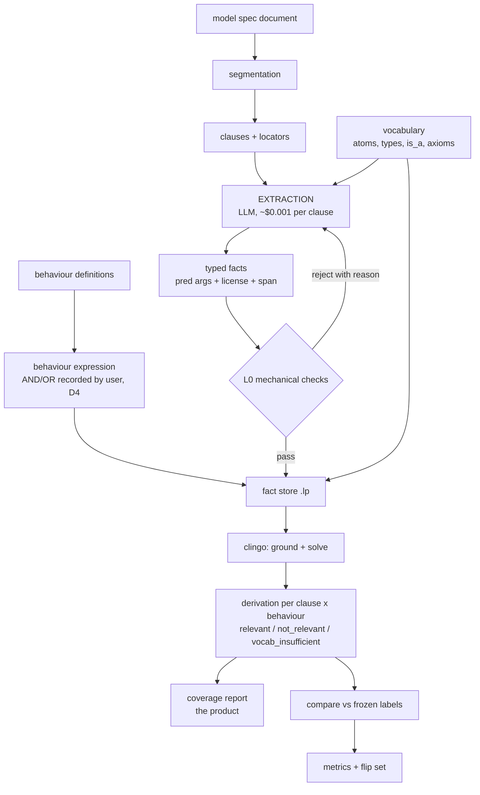
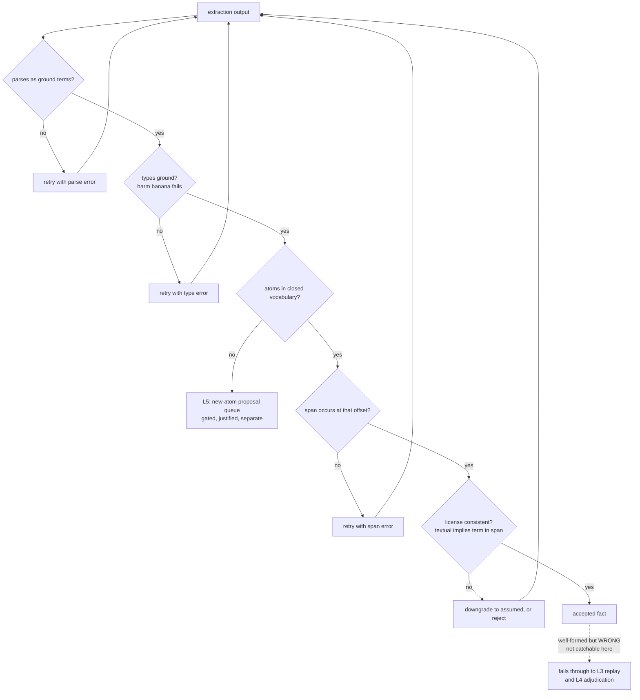
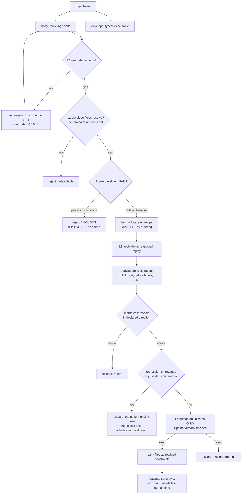

# ⛔ SUPERSEDED 2026-08-06 by `HARNESS_REDESIGN.md` — do not cite from this file

**Why:** this document proposed a *specific relational representation*. Three things falsified that
as a design activity, all verified the same day:

1. **`structural.py` — the typed query over atom slots — already exists and LOSES to the bag
   scorer at 9 behaviours** (−0.0378, CI [−0.0596, −0.0164], 5/5 draws), after winning at 3. The
   staged experiment this document was written to support has already been run once and inverted.
2. **Every hand-designed element in this project underperforms the no-choice default** —
   `act_match` loses to `any_atom`, the rung gate loses, the intersection loses badly. The one
   survivor is the document's own section partition.
3. **`INEXPR` = 0** in `S3B_FINDING_RECLASSIFICATION.md` as corrected in adversarial review: no
   S3B finding required a representation that did not exist, so the churn argument is void.

The adversarial review of this file returned **REVISE with five blocking findings** (most
seriously: it describes relevance as a clingo entailment when the live path is a graded lexical
scorer, and its dataflow deletes the scoring/threshold layer entirely). Its specific representation
claims are demoted to hypotheses H-1 … H-8 in `HARNESS_REDESIGN.md` §5.

**Retained** per `MODULE_MAP.md` §7 (superseded, kept until someone confirms nothing needs it) for
the correction record and the review trail only. Every factual claim below should be checked
against `HARNESS_REDESIGN.md` §1 before reuse.

---

# Relational Paper Encoding — DRAFT v0 (2026-08-06) — SUPERSEDED

**Paper only. No code, no migration, no cycle.** Purpose is to find out on paper whether a
relational encoding resolves the problems that actually cost money, *before* anything is built.
Per `RELATIONAL_TURN_DECISIONS.md` D10, the acceptance test is the **recurring S3B review
findings**, not the relevance items — that is where the $60–100 went.

Verdict format below: **RESOLVED** (becomes answerable by inspection) / **REDUCED** (still a
judgement, but a localized one) / **UNTOUCHED**.

---

## 1. What exists now

| layer | form | relational? |
|---|---|---|
| norms | `active(NormID, Modality, Act, Tier)` | **yes** — 4 typed args |
| conflicts | `conflict(N1, N2, Act, T1, T2)` | **yes** |
| provenance | `source/2`, `locator/4` | yes |
| **situations** | `ctx(atom_name)` — **`ctx/1` over bare constants** | **no** |
| acts | bare constants (`comply_restrict`, `assert_p`) | **no** |
| **principals** | **string suffix on the atom name** (`..__model_user`), stripped by the decoration-blind join; parsed by `patient.py` against `grammar.PRINCIPALS` | **no** |

`grammar.PRINCIPALS = (third_party, developer, operator, system, model, root, user)` — **the value
space already exists and is closed.** This matters: M-1/E-3 was never a missing enum. It was that
a name-suffix carries no argument *position*, so "which role does this principal occupy" and
"what is the identity of the attributed object" cannot be stated, only argued about.

## 1b. Data flow

### Organizing principle

**Catch every failure at the cheapest level that can catch it.** Each level below is
~10–1000× more expensive than the one before it, and the entire design is an argument about
pushing failures downward.

| level | catches | cost | who |
|---|---|---|---|
| **L0** schema / type / span checks | malformed or type-violating extraction | ~$0.001, seconds | machine, automatic retry |
| **L1** grounder | malformed hypothesis body | free, instant | machine, automatic retry |
| **L2** vacuity + envelope validation | unfalsifiable hypotheses | free | machine, reject before any measurement |
| **L3** replay vs frozen labels | hypotheses that don't work | CPU-minutes | machine |
| **L4** flip adjudication | whether a change is *right* | **human hours** | oracle |
| **L5** vocabulary extension | genuinely new concepts | human + migration | gated proposal |

Today almost everything lands at L4 or higher, via prose review. That is the churn.

### Happy path



Note `vocab_insufficient` as a first-class third outcome — it is what licenses the closed-world
`not_relevant` verdicts (see `RELATIONAL_TURN_DECISIONS.md`, OWL rejection).

### Extraction failure ladder (L0)



The dashed edge is the important one: **checks a–e are mechanical and cheap; a fact that is
well-formed and simply false is invisible at L0** and must be caught by whether it is
load-bearing (L3) or by the oracle (L4). This is why implied facts are hypotheses rather than
givens.

### Hypothesis test ladder (L1–L4)



Two properties worth reading off the diagram:

1. **Nothing reaches the human until it has survived four machine gates.** L4 is the only
   expensive box, and the retained-constraint bank shrinks its input every round — the annealing
   schedule from `RELATIONAL_TURN_DECISIONS.md` D7.
2. **The two S3B process findings die at L2, before any measurement is taken.** Vacuity and
   gate-after-observation are structurally unreachable rather than reviewed for.

## 1c. Node-by-node audit of the dataflow — inputs, error conditions, checks

Walking §1b's happy path node by node: does the data it needs exist, what can go wrong, and is
there a check? **Verified against the repo, not inferred.** Gaps are numbered `G*`.

| node | inputs exist? | error conditions | check exists? |
|---|---|---|---|
| `DOC → SEG → CL` | ✅ `modelspec_clauses.json`, locators | over-segmentation (a formatting marker becomes its own segment — **H003 is a live instance**); under-segmentation; content loss | ✅ partition **is** tested: `test_section.py::test_the_partition_is_the_documents_own_section_path`, `::test_real_index_partitions_the_real_spec`, `test_extract_section.py::test_batches_partitions_provisions_exactly`. Marker-as-segment is a *classification* defect the partition test cannot see → **G1** |
| `BEHDEF → BEXP` | ❌ **does not exist** — behaviours are weighted atom bags (`behavior_atoms.json`), not expressions with a recorded connective | no reading recorded; more than one connective in a definition; nesting | none — **G2**. Needs totality (every definition has a reading) + uniqueness (one representation at a time) |
| `VOCAB` atoms | ✅ 65 atoms, `gloss`, `kind`, `weight` | undeclared atom referenced; empty type extension | ✅ `dsl.validate`, `atom_refactor` usages |
| `VOCAB` types | ⚠️ partial — `grammar.PRINCIPALS` (7 closed values) exists; no general type system | value outside the enum | ✅ for principals (`patient.py`), ❌ generally → **G3** |
| `VOCAB` subsumption | ⚠️ **EXISTS and is narrower than assumed** — `containment.json`: `{child, parent, license, note}`, `provenance`, **`budget: {max_edges: 4, max_families: 2}`**, currently **2 edges** | the only license is **`shared_head`** (right-headed lexical compounds, e.g. *psychological manipulation* ⊑ *manipulation*). A semantic edge such as `public_official ⊑ third_party` **is not licensable**, and the budget caps at 4 regardless | ✅ `containment.load_edges`, one-child-family check (see `MODULE_MAP.md` §11 anti-rule 1) — **G4 is the license regime and the budget, NOT the absence of the layer** |
| `CL + VOCAB → EXT` | ✅ seats + briefs exist (12) | undeclared predicate; wrong arity; missing span; wrong license class | ✅ per-seat validators (`backfill_worksheet.py validate`, `select_audit.py validate`, `dossier.py validate`); ❌ no **generic** fact validator → **G5** |
| `FACTS → L0` | — | see the L0 ladder | partial; the five checks are not implemented as one gate |
| `→ STORE (.lp)` | ✅ `emit_asp.py` | contradictory facts; duplicate facts; orphan references | ✅ `validate` + cascade-out of dependents (`idx["rejected"]`, `idx["provenance"]`) |
| `STORE → CLINGO` | ✅ clingo is a declared dependency | grounding blow-up; UNSAT; timeout | ❌ no size or time guard observed → **G6** |
| `CLINGO → DER` | ⚠️ **entailment semantics unspecified for relevance** | `emit_asp.brave_conflicts` uses `--enum-mode=brave` — *union over all answer sets*. Correct for **finding** conflicts; for **relevance** it means "relevant in SOME answer set", i.e. maximally permissive. Multiple answer sets ⇒ which one decides a verdict? | ❌ → **G7 — the sharpest design gap in the diagram** |
| `DER` third value | ❌ `vocab_insufficient` does not exist; verdicts are binary | closed-world `not_relevant` asserted where the vocabulary simply had no concept | ❌ → **G8** (this is what licenses non-coverage claims at all) |
| `DER → REPORT` | ✅ | reports non-coverage that is really vocabulary insufficiency | blocked on G8 |
| `DER → CMP → METRIC` | ✅ `benchmark.py`, `compare_to_panel.py`, frozen labels | label drift; clause-id join mismatch; denominator mismatch | ✅ sha-freeze (`golden.load`, `thresholds_frozen.json`) |

### Failure-ladder nodes

| node | error condition | check |
|---|---|---|
| L0 vocabulary branch | under the relaxation this **no longer rejects** — it routes to normalization | needs rewiring; the §1b ladder still shows a reject arm |
| L1 grounder | unsafe variables, arity, scope | ✅ free and exact |
| L2 envelope resolve | field does not resolve; `denominator` returns ∅ | ✅ by construction if fields are executable |
| L2 vacuity | `gate(baseline)` passes | ✅ by construction |
| L3 replay | **non-determinism would invalidate everything**; baseline drift | ✅ determinism is a standing repo requirement (`REPRODUCIBILITY.md`) |
| L4 bank | **two banked constraints that cannot both be satisfied ⇒ every future hypothesis fails** | ❌ no satisfiability check on the retained set → **G9** |

### Gaps, ranked

- **G7** entailment semantics for relevance (brave vs. cautious vs. single-model) — undefined, and
  it silently decides every verdict. Must be settled before any test is meaningful.
- **G8** `vocab_insufficient` third value — absent; without it closed-world non-coverage claims are
  unlicensed (see the OWL rejection in `RELATIONAL_TURN_DECISIONS.md`).
- **G4** subsumption **license regime** (`shared_head` only) **and budget** (max 4 edges) — the real
  blocker for H006, *not* the absence of `is_a`.
- **G9** retained-constraint bank can become unsatisfiable; needs a consistency check each time a
  constraint is banked.
- **G2** behaviour expression artifact does not exist.
- **G5** no generic fact validator (per-seat only).
- **G6** no grounding size/time guard.
- **G3** no general type system beyond principals.
- **G1** marker-as-segment classification defect (H003) is invisible to the partition test.

## 2. Translation

The move is to stop encoding structure in identifiers and start encoding it in argument positions.

| now | relational |
|---|---|
| `ctx(harm_facilitation)` | `holds(C, harm(Bearer))` with `Bearer : principal` |
| `ctx(disclose_i)` | `holds(C, disclose(Info, Recipient))` |
| atom name `stem__model_user` | `act(C, stem, model, user)` — agent and patient as **distinct positions** |
| decoration-blind join (strip the suffix) | projection: `act(C, stem, _, _)` — blindness becomes a *query*, not a mutation |
| principal-aware join | `act(C, stem, A, P)` — a *different* query over the same facts |
| `patient.py` chain parsing | type declaration: `principal(third_party; developer; operator; system; model; root; user)` |
| (absent) | `is_a(Child, Parent)` + transitive closure |
| hypothesis = code change | mode declaration: `#modeb(1, harm(var(principal)))` |

**Single structural claim:** every place the current system encodes a relation as a decorated
string and then writes code to parse it, the relational encoding uses an argument position and
gets the parser for free.

## 3. Acceptance test — the recurring S3B findings

### M-1 / E-3 — *"`harm_bearers` value space and the text→principal mapping are STILL unpinned"*

Two separate things, conflated by the prose because nothing forced them apart.

> **CORRECTED 2026-08-06 (same day), after checking the review text rather than inferring from
> the code.** An earlier draft of this section claimed typing "resolves" M-1 by making the value
> space visible. **The value space was never invisible.** The reviewer named the fix in R1 —
> *"pin `harm_bearers` to that vocabulary and put the mapping rule in the…"* — and again in R3 —
> *"pin `harm_bearers` to the existing principal vocabulary…"*. `S3B_REDESIGN.md:494` already
> cites *"all seven values of `grammar.py`'s `PRINCIPALS`"*. The move was available, prescribed,
> and partially used elsewhere in the same document.

- **Value space** → the enum existed and was known. What recurred is a **VERIFICATION failure**,
  not a discovery failure: prose lets you assert "pinned to the principal vocabulary" without the
  claim being checkable, so the only detector is a human re-reading 90KB and noticing §5.1 does
  not honour what §4 says. The reviewer had to re-find the same defect every round.
  → **RESOLVED, but by TYPING-AS-CONSTRAINT (D6), not by relational structure (D2).** A typed
  field either validates against `principal` or fails; "pinned" stops being a claim and becomes
  an enforced property that cannot be re-litigated.
- **text→principal mapping** → **REDUCED, not resolved.** Deciding that "a public official"
  denotes `third_party` is extraction, and extraction is irreducibly a judgement. But it becomes
  a *localized, per-clause, individually-testable* judgement with a typed output and a required
  quote span — one cheap model call per clause, replayable, ablatable — instead of a global
  policy that must be argued in prose before anything can be built.

**Attribution correction:** M-1 is evidence for the **process/typed-record** thesis, not the
relational one. Credit it to D6. M-2 below remains genuine representation evidence.

### M-2 / E-2 — *"attribution keying granularity is STILL unspecified"* + *"atom-name keying would corrupt a §7.2 control"*

**RESOLVED.** The ambiguity exists only because the key is a *string that sometimes carries a
decoration*, so "key by atom name" silently means different things depending on whether the
decoration survived. Relationally, the key is a **ground term**, and the two readings the reviews
kept sliding between become two distinct, separately writable queries:

```
attribution keyed by concept only :  harm(_)
attribution keyed by concept+bearer: harm(third_party)
```

Both are expressible, neither is ambiguous, and choosing between them is a one-line declaration
whose consequences are mechanically enumerable. Granularity stops being a property of a naming
convention and becomes a property of a query. **This is the finding that recurred across R1, R3
and R4; it does not survive translation.**

### R4-E2 — *"never re-specifies the subsumption composition inherited from `patient.py`"*

**RESOLVED as an expressibility matter, REDUCED as a content matter.** `is_a/2` plus transitive
closure gives composition a single defined semantics, so "two contradictory readings" (E-1) cannot
arise. *Which* edges belong is still a judgement — but a per-edge, ablatable one (`add_is_a`
proposals, each testable by replay) rather than a global rule argued in prose.

### R4-E1 — *"not mechanical: dimensionally inconsistent, ambiguous on generic atoms"*

**REDUCED.** Typed arguments catch dimensional inconsistency at validation. "Generic atoms"
(atoms with no bearer) become explicit — `harm(_)` versus `harm(P)` with `P` bound — rather than
an implicit third case the prose kept discovering.

### Process findings (B-2, B-3, M-4, S-2, S-4, R4-S1, E-5)

**UNTOUCHED by relational encoding.** These are D6/D7 territory — required-field schema,
`gate(baseline) = FAIL`, hash-before-measure, derived pre-registration. Recorded here so the
relational work is not credited with fixing them.

## 4. Secondary check — the four adjudicated relevance items

| item | what it needs | verdict |
|---|---|---|
| **H006** (official's personal number → third-party harm) | `holds(C, harm(third_party))` via `is_a(privacy_breach, harm)` + `is_a(public_official, third_party)` — two hops | **RESOLVED** — currently inexpressible (no `is_a`, one-step closure); the tool's miss is a direct consequence |
| **H005** (boundary discussion) | behaviour expression honouring the recorded AND/OR reading | **RESOLVED by D4** — user records the reading, system honours it |
| **H002** (red-line principles, one-sided) | same | **DISSOLVED by D4** — under AND it is not relevant (panel), under OR it is (tool). Once the reading is *recorded rather than inferred*, the disagreement is not adjudicated, it disappears |
| **H007** (browsing/staleness example) | distinguish epistemic currency from caution | **UNTOUCHED** — a vocabulary-adequacy question, not a structural one. Relational encoding does not help |

Three of four resolve structurally; H007 is honest evidence that the encoding is not a universal
solvent.

## 5. Costs and risks

- **`patient.py` (1,217 lines), the principal-chain grammar, `_license_edge`, and the
  decoration-blind join largely disappear** — they are a hand-built parser for a field that
  becomes an argument. That is the payoff and also the migration risk: they encode accumulated
  contracts (`MODULE_MAP.md` §11 warns six such look-like-bugs are contracts). Each must be
  checked before deletion, not assumed redundant.
- **`atom_refactor.py` gains work**: rename/merge/split must operate on terms, not names.
- **Every artifact keyed by atom name** (annotations, per-behaviour query configs, golden
  reference, containment overlay — the "nine-plus JSON artifacts" its docstring names) needs a
  migration. `vocabulary_migrations.json` is the right vehicle; this is the single largest cost.
- **O1 unresolved**: whether acts also need arguments (`comply_restrict` → `comply(R, P)`).
  Suspect yes, but the S3B case does not force it, so it is deferred rather than decided.

## 5b. Reweighting after the M-1 correction

Checking the review text (rather than inferring from the code) moves one of the two headline
findings from the representation column to the process column:

| finding | was credited to | actually |
|---|---|---|
| M-1 / E-3 harm-bearer | relational encoding | **typed field + validation (D6)** — fix was known in R1, recurred because prose claims are unenforceable |
| M-2 / E-2 keying | relational encoding | **relational encoding (D2)** — reviewer names *atom-name keying* as the hazard itself |

Implication: the ~45%/~40% split in `RELATIONAL_TURN_DECISIONS.md` V8 likely over-credits
representation. A meaningful share of what was classified as "semantics underspecification" may
be **unverifiable prose claims about semantics** — curable by typing and validation without any
relational migration. This does not change the D9 sequencing (process first), but it raises the
expected payoff of step one and lowers it for step two.

**Action:** re-classify the ~25 findings a second time, distinguishing *inexpressible* from
*expressible-but-unverified*. That is a read of existing review text, costs nothing, and should
happen before any migration is authorised.

## 5c. What goes native vs. what still needs code

The boundary: **everything above the fact layer is the solver's job; everything converting
documents↔facts↔humans stays code.** The current design put *structure below that line* (inside
identifier strings), which is why parsers were needed on the wrong side of it.

**Goes native (deletes code):**

| feature | mechanism | replaces |
|---|---|---|
| value-space enforcement | `principal(third_party). … harm(P) :- …, principal(P).` — bad values don't ground | `patient.py` PRINCIPALS validation; part of `dsl.validate` |
| subsumption + transitivity | `isa_t(X,Y) :- isa(X,Y). isa_t(X,Z) :- isa(X,Y), isa_t(Y,Z).` | the missing capability; the one-step-closure limit |
| taxonomy cycle detection | `:- isa_t(X,X).` | a graph algorithm |
| decoration-blindness | projection `harm(_)` vs `harm(third_party)` | strip-the-suffix join logic |
| agent/patient roles | argument positions in `act(C, Stem, Agent, Patient)` | `grammar.py` chain parsing, `describe()` |
| joins (clause↔behaviour↔atom) | rule bodies | bespoke join code |
| thresholds / counting | `#count`, `#sum`, `#minimize` | hand-written scoring loops |
| ablation | omit a fact, re-ground | part of the ablation harness |
| defeasibility, priorities | already native | already native |

**Dissolves entirely — the S3B `generic` flag.** "Does this atom comprehend all principals?" is a
hand-set boolean that R1-M-3 and R3-E-1 both got tangled in. Relationally it is just whether the
bearer position is bound: `harm(_)` **is** generic, `harm(third_party)` **is** specific. It stops
being a field that can disagree with reality.

**Still needs code (irreducibly):**
1. **Text → facts.** The LLM plus a schema validator. The solver cannot read English; this is the
   boundary.
2. **Fact emission/ingestion.** JSON ↔ `pred(args).`. But an *emitter*, not a *parser* — printing
   structure you already have rather than recovering it from a naming convention. This is most of
   why `patient.py` shrinks (est. 10–20% survives; from docstrings, not a full read).
3. **Quote-span fidelity.** Does the span occur at that offset in the document? Byte-level check.
4. **Refactoring across artifacts** (`atom_refactor.py`). Survives, but renaming a *term* is
   structural rather than string surgery over decorated names.
5. **Metrics vs. labels** (MCC, flip sets, replay). Keep in Python.
6. **Human-facing rendering** — glosses, English explanation templates over answer sets.

**Two places the temptation to string-hack returns:**
- **Weights.** `weight: 3/2` maps to weak constraints (`:~`) and `#minimize` — ordinal preference
  is native. Genuine *probabilities* would need ProbLog/LPMLN, a different engine. Decide
  deliberately rather than discovering it mid-migration.
- **Meta-level properties** (statements *about* atoms). ASP does this via reification and it gets
  awkward. The generic flag was the good case because it dissolved into argument binding.
  **Standing rule: if you are about to encode something in an identifier, that is the signal you
  need another argument position or another predicate.**

## 5d. Extraction: no DSL, open proposal, mechanical normalization

A hypothesis is only expressible over the vocabulary extraction emits, so **hypothesis language
and fact language must be the same language**. That language is **clingo**. There is no
intermediate schema.

> **CORRECTED 2026-08-06 (same day), twice.** Draft 1 endorsed the existing **fixed-field record
> per seat** (`attribution_author.md`: *"The field you fill is `affected_parties`"*), with
> `emit_asp.py` compiling. Verified against the code, that design **is** the bespoke-DSL problem
> one layer down: `emit_asp.py` carries `_validate_atom` / `_validate_rule` / `_validate_incompat`
> / `_validate_exclusion` and reads fixed field names, so a new relation costs **new brief + new
> worksheet producer + new validator + new emit branch**. That is the 8-iteration mechanism, and
> it sits *below* the representation question entirely.
>
> Draft 2 proposed a **generic record** `{predicate, args, license, span}`. That is clingo with
> extra steps: if predicate and args are both arbitrary, the record is an S-expression for
> `pred(args)`, and the wrapper buys only a compiler to maintain. **Any DSL that maps 1:1 to
> clingo is clingo; any DSL that does not has a boundary, and hitting the boundary is a design
> conversation.** Both drafts are superseded by the loop below.

### The loop

1. **Propose.** The model writes clingo, seeded with the accepted forms as *suggestions*, and
   invents a new form when nothing matches. **Nothing is unproposable.** (This replaces the earlier
   "closed vocabulary by default" and "mode declarations bound what is proposable" — restriction
   prevents the million-ways problem by the same mechanism that blocks novel concepts.)
2. **Normalize — mechanically.** Extract every relational form used and triage it:

   | test | disposition |
   |---|---|
   | same predicate name + arity as an accepted form | identical — no action |
   | different name, same argument domains and positions | **candidate** alias — flag, not proof |
   | **extensionally identical** to an accepted form across the corpus (holds of exactly the same tuples) | **auto-rewrite to the canonical form, no human** |
   | extensionally identical to another *new* form | auto-merge the two, treat as one candidate |
   | extensionally **distinct** | → PENDING |

   Extensional equivalence is decidable on the corpus and is the right criterion: **a distinction
   that changes no decision is not a distinction.** Same minimality rule as atom ablation, applied
   to predicate identity.
3. **Accept.** A PENDING form goes through acceptance testing across the whole system, then to a
   human or frontier reviewer — who receives *evidence*, not a design document: **here are the
   cases where this form makes a distinction no accepted form makes.**
4. **Publish.** An accepted form is **mechanically written into the translation instructions**.

### Normalization is enforced on two layers, best-effort on the third

Not everything needs the same normalization discipline, and the three layers have very different
cost and implementation signatures (Matt, 2026-08-06):

| layer | count | discipline | implementation |
|---|---|---|---|
| **atoms / predicates** | hundreds, per-clause | **eager, ENFORCED** — shared everywhere | merge/alias pipeline at scale; `atom_refactor.py` exists |
| **behaviour expression** | ~3 now | **eager, ENFORCED** — exactly one representation at a time | a uniqueness constraint; nearly free |
| **clingo rule / expression forms** | many, per-section | **best-effort, NON-GATING** — report equivalence classes, never block | the expensive one; relaxed |

**Why the four earlier arguments for normalization do not justify gating expressions.** Tested
against the split, three of the four collapse to "atoms must be shared":
1. *cross-section queries miss* → atoms only; behaviour formulas match over predicates.
2. *hypothesis space fragments* → atoms only; ILP learns over predicates, and same-head ASP rules
   are disjunctive, so variant derivations are additive rather than conflicting.
3. *the staged experiment is a generalization test* → atoms + behaviour expression + instructions;
   per-section rule shapes are a function of document content and are not what transfers.
4. *ablation cannot compare forms never brought together* → **survives, conditionally.** If two
   variant rules can both fire on the SAME clause, ablating either shows no change because the
   other covers it, and minimality testing silently breaks. This bites only if rules are GLOBAL.
   ⇒ **Requirement: rules must be section-scoped.** Cheap to check; it is a scoping rule, not an
   argument for normalizing expressions.

**Consequence: `p_novel → 0` on the gated path**, because the human-approval gate now covers only
the two tractable layers. A novel expression form becomes a *reporting* event, not an approval event.

**The two relaxation mitigations hold, with limits:**
- *Maintenance by testing rather than uniformity* — stronger than it first appears: **extensional
  equivalence means a behavioural test generalizes across variants**, since equivalent variants
  behave identically by construction. The residual gap is variants that differ only on cases
  outside the corpus — the same finite-corpus caveat as atom merging, not a new problem.
- *Comprehensibility by compiling to English* — workable, and there is a cheaper version: **report
  the equivalence class** ("these five variants are extensionally identical on the corpus") so a
  reader sees one concept with five spellings rather than five unrelated things. Reuses `gloss`.

### The brief becomes a generated artifact

Step 4 is the prize. The accepted-form registry is the single source of truth; the brief is
rendered from it. `attribution_author.md`'s hand-maintained noun-phrase → principal table
(*"another person", "someone", "others", "the public", "victim(s)"* → `third_party`) stops being
prose and becomes rendered output. Consequences:

- no drift between the brief and what the validator enforces — both read the registry
- no update anomalies; this is D8's normalization applied to instructions
- **the brief is never reviewed; the registry is, one form at a time, with tests attached**

That is the answer to "how does this avoid becoming the new review bottleneck."

**FEATURE IN CONSIDERATION — auto-generated *expression* instructions.** Generating the atom table
and behaviour conventions is settled (above). Generating the instructions for *how to write
expressions* is not, and may be the wrong frame: that surface might instead be where we put
**instructions that reduce the screw-up / invalid rate** — a different pipeline over a subset of
the same content, optimised for "fewer grounder errors and fewer extensionally-degenerate forms"
rather than for "one canonical style." Open question; deliberately not decided here.
Note the honest cost of the relaxation: with expression forms free, expression-style instructions
cannot be fully generated, so that part of the brief stays prose. Smaller win than first claimed,
and in the right place — the drift was in the atom table, not the style guidance.

### Notation is not the difficulty axis

`affected_party(m0290, user).` and `{"predicate":"affected_party","args":[…]}` are the same
cognitive task. A JSON wrapper around a quantified rule is exactly as hard to get right as the ASP.
**There is no capability gap between notations for the extraction seat**, and an earlier draft's
suggestion of one was wrong.

The real difficulty is judgement, and it is per-seat — matching the existing small-model standard
(*"a CLAIM ABOUT THE SEAT, not about the model"*): extraction asks which party, stated or implied,
licensed by which span; the hypothesis seat asks for a correct generalization, which is harder
**for reasons unrelated to ASP**. Do not assume the small-model standard transfers between them;
measure it. The one notation effect runs *toward* clingo — unsafe variables and scope errors
produce grounder errors, caught free and instantly, where malformed JSON gets you nothing.

### Retained enforcement points

1. **Types come from the registry.** Ground terms only; `harm(banana)` fails to ground because
   `principal/1` has no such extension. Conformance enforced, not claimed — the M-1 fix.
2. **Provenance per license class — NOT a universal string check.**
   > **CORRECTED 2026-08-06 (same day).** An earlier draft required "a mandatory quote span
   > verified against the document," as a single check. That is two checks fused — the same
   > value-space/mapping conflation criticised in §3 — and it would reject **every implied
   > target**, which is most of the interesting ones. On H006 the span
   > ("the official's personal phone number … high expectation of privacy") supports
   > `harm_bearer(c223, third_party)`, but `third_party` appears nowhere in the text, and the
   > public whose accountability interest is at stake is not named at all.

   Split it, and reuse the license concept **already in `dsl.py`**
   (`AXIOM_LICENSES = ("logical", "textual", "assumed")`), extended from axioms to facts:

   | license | example | verification |
   |---|---|---|
   | `textual` | the passage states it | **span fidelity** — does this text occur at this offset? mechanical |
   | `assumed` / `implied` | "a public official" ⊨ `third_party` | **ablation + replay** — is the fact load-bearing? mechanical, different check |
   | `logical` | follows from other facts + `is_a` | solver-derived; nothing to verify |

   **Implied targets ARE facts** — asserting them is the product. A fact's provenance is therefore
   *a span plus a warrant*, not a span alone. Implied facts are not exempt from checking; they are
   checked by whether they change a decision, which is a stronger test than a string match. It also
   fixes their procedural status: an implied target is a claim that can be wrong, hence a
   **hypothesis to be tested**, not a given asserted by extraction fiat.
*(A former point 4, "mode declarations bound what is proposable," is deleted — superseded by the
open-proposal loop above. Bias belongs to the ILP hypothesis search, not to a gate on what
extraction may say.)*

**On "expressed in clingo": RAW clingo. Do NOT build a restricting DSL.**

> **CORRECTED 2026-08-06 (same day).** An earlier draft proposed a typed DSL that *compiles* to
> clingo, on the grounds that LLM-authored ASP has wrong arity, unsafe variables, and unintended
> negation scope. That argument does not survive: **wrong arity and unsafe variables are rejected
> by the grounder** — free, instant, exact, no review — and **unintended negation produces a
> valid-but-wrong program caught by ablation, replay, and `gate(baseline) = FAIL`**. Syntax is the
> grounder's job; semantics is the test harness's job. Neither needs a restricted language.
>
> The decisive objection is expressiveness: **a DSL that is not fully expressive means some
> hypothesis requires a DSL extension, which is a design conversation — the exact churn being
> eliminated.** Structurally identical to the propositional-encoding failure (concept not
> expressible → engineering project). A restricting DSL reproduces the disease one level up.
>
> There is also a positive argument for raw ASP: the grounder is a fast, free, exact verifier, so
> a malformed hypothesis self-corrects in a CEGIS loop in seconds at ~$0.001.

**Body / envelope split — preserves D6 without restricting anything:**
- **Body: raw clingo.** Fully expressive; validated by the grounder. The harness never parses it.
- **Envelope: typed record**, executed end-to-end by the harness.

**The envelope is heavily machine-used — it is the experiment.** (An earlier draft called it
"required fields around an opaque payload," which wrongly implied it was documentation. What the
harness does not parse is the *body*.) **Every envelope field must be executable or comparable;
none may be prose** — otherwise it is a checkbox, and a checkbox is exactly what S3B's S-4 defeats
(*"STILL pre-registers no figure, no procedure, no denominator, no trigger — while now asserting
'The figure is pre-registered here'"*). Presence-checking catches an absent field, not a vacuous one.

| field | type | harness action |
|---|---|---|
| `metric` | named callable | compute |
| `denominator` | selector over the corpus | resolve to a case set; "no denominator" becomes "returns 0" or "does not resolve" |
| `direction` | enum | comparison sense |
| `threshold` | number | compare |
| `procedure` | replay config | execute |
| `trigger` | predicate | evaluate |

Run order: resolve denominator → execute procedure → compute metric → compare to threshold in
direction → verdict. **The result cannot disagree with the pre-registration because one record
produces both.** Kills S-4 (threshold is a number or the record fails validation), R4-S1 (hash
precedes measurement by enforced ordering), and B-3/S-2 (`gate(baseline) = FAIL` is executed,
not asserted).

**Clingo runs the body; the harness runs the envelope; neither understands the other.**

⚠️ **Guard:** any human-readable `rationale` field must be explicitly **non-load-bearing** — no
check may reference it and no review finding may be raised about it. Without that rule the
envelope grows `notes`, then `background`, and becomes a 90KB design document again.

**Migration should be additive.** Keep existing atom names; emit typed facts alongside
(`harm_facilitation` stays, `harm(C, third_party)` is added). Relevance consults either during
transition; migrate one behaviour at a time under normal cycle discipline with a measurement at
each step. The decoration-blind join already strips decorations, so a parallel typed layer does
not disturb existing joins — turning the nine-plus atom-name-keyed artifacts from a migration into
a deprecation. **What stays genuinely large:** those artifacts eventually, and the `MODULE_MAP.md`
§11 contracts that must be checked before `patient.py` loses anything.

## 6. Provisional read

⚠️ **Superseded in part by `S3B_FINDING_RECLASSIFICATION.md`.** An earlier version of this section
claimed the encoding "resolves the two findings that recurred across four review rounds." Both
were then reclassified: **M-1 was a verification failure** (the reviewer named the fix in R1 and it
recurred anyway) and **M-2 was expressible-but-unverified** (the reviewer supplied a stateable fix
— *key per clause instance, validator-check it* — in the same paragraph). On that evidence the
relational encoding's **churn** attribution is ≈ 0%.

What the encoding is still argued on, neither of which is about churn:

1. **Capability.** H006 needs multi-hop subsumption (`public_official ⊑ third_party`,
   `privacy_breach ⊑ harm`); `is_a` is absent and closure is one-step. Two of four adjudicated
   tool misses have this shape.
2. **Hypothesis economics.** A new relation should cost a form proposal plus an extractor rule,
   not brief + producer + validator + emit branch (verified in `emit_asp.py`'s per-kind
   validators and `attribution_author.md`'s one-seat-one-field structure).

The **process** work — executable envelope, generated briefs, normalized design object — is
independent of all of this, applies to the existing propositional system unchanged, and covers
~74% of the measured churn. D9's ordering stands, for a stronger reason than originally stated.

### Assumptions not yet tested

| # | assumption | status |
|---|---|---|
| A1 | text→principal extraction is cheap **and stable across runs** | untested; ~$0.05 |
| A2 | extensional equivalence over the corpus collapses most proposed forms (normalization is tractable, PENDING queue is small) | untested; the loop fails if it doesn't |
| A3 | the small-model standard survives the extraction seat in clingo notation | untested; ~$0.05 |
| A4 | `patient.py` survival estimate (10–20%) | inferred from docstrings, not a full read |
| A5 | `MODULE_MAP.md` §11 contracts do not block decoration removal | unchecked |
| A6 | the S3B reclassification generalizes beyond one design's reviews | n=34, one design, classified by an author with a stake |

## 7. Next

1. Design a set of **very cheap tests** for A1–A6 above.
2. Clean-context **adversarial review** of this document *and* those tests — it is a design
   document and subject to the discipline it is trying to make cheaper.
3. Iterate until satisfied.
4. Run the tests.
