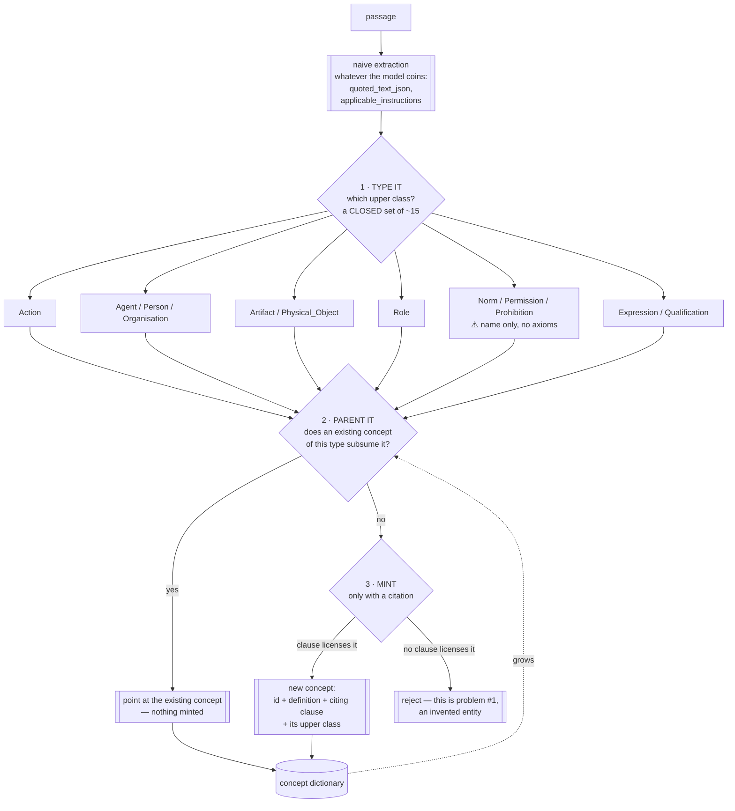
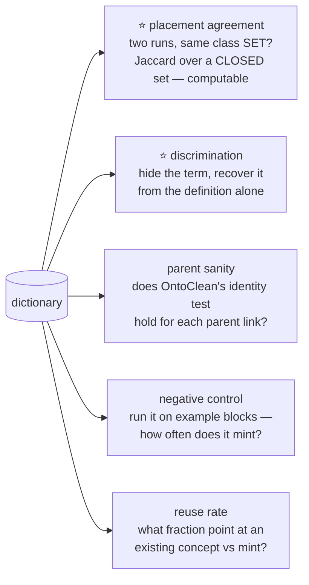

# Scratch — a concept phase that SPECIALISES an existing ontology

**Throwaway. Delete once picked and tested.**

## What changed

An earlier draft of this file asked how to *build* a concept vocabulary. That was the wrong
question. **Reuse is the field's stated norm** — the OBO Foundry's practice is to align to an upper
ontology as a template and reuse external classes rather than build from scratch. Starting from
nothing is the deviation.

⛔ And we have already reinvented a poor version. The repo's atoms carry
`kind ∈ {situation, act, entity, value}` — a hand-rolled four-category upper ontology with no
axioms, no identity criteria, and no literature behind it. That the relation layer over that
vocabulary *"fires zero times"* reads differently once you notice this: four ad-hoc categories give
nothing to reason with.

---

## What is actually available, checked 2026-08-07

**LKIF-Core** — `github.com/RinkeHoekstra/lkif-core`. A legal core ontology from the ESTRELLA
project, built as an upper-level schema for **norms, acts and roles**.

- **Last updated 23 February 2026** — live, not a paper artifact
- **CC BY 4.0**, OWL and Turtle, 167 stars / 48 forks
- 15 modules in tiers: *abstract* (top, place, mereology, time, spacetime) · *basic* (process,
  role, action, expression) · *legal* (legal-action, legal-role, norm) · *framework* (modification, rules)

Sample of what `action` actually defines — inspected, not assumed:

| class | superclass | gloss |
|---|---|---|
| `Action` | `process:Process` | a change brought about by a single agent playing a role |
| `Agent` | — | entity capable of acting; holder of propositional attitudes |
| `Person` / `Organisation` | `Agent` | an individual; a group that acts "as one" |
| `Artifact` | `Physical_Object` | created by some person to fulfil a purpose |
| `Plan` / `Personal_Plan` / `Collaborative_Plan` | `Mental_Object` | structure of sequential or concurrent actions |
| `Creation`, `Reaction`, `Transaction`, `Trade` | `Action` / `Collaborative_Plan` | |

plus `actor` / `actor_in` relating an `Action` to its `Agent`.

⇒ That is precisely the structure `kind: entity` was crudely standing in for.

### ⚠️ The `norm` module carries a commitment we ruled against

`norm` defines `Norm`, `Permission`, `Prohibition`, `Obligation`, `Allowed`, `Disallowed`,
`Obliged` — **and commits to deontic semantics**: comparative normative relations, transitivity,
equivalent-class definitions using deontic operators. It also makes `Prohibition` a subclass of
`Permission` and equivalent to `Obligation`, which is a strong and contestable modelling choice.

⭐ **Resolution: take the vocabulary, refuse the axioms.**

| tier | what we take |
|---|---|
| abstract + basic (top, process, role, action, expression) | **classes AND structure** — deontically neutral and directly useful |
| legal (norm, legal-action, legal-role) | **class names only, as concept ids.** No imported axioms |

Saying a clause is *about* a `Prohibition` does not commit us to inferring what follows from one.
That keeps the standing ruling intact: we do retrieval and contradiction-finding, not compliance.

---

## The process this is for

> *Given a passage and a naively-extracted intermediate atom, translate it to the right atom with
> minimal judgement.*

### ⭐ Why this is more deterministic than naming

**Placement into a closed set is a different kind of judgement from naming.**

- *"What should this be called?"* has unbounded answers, no wrong answer that announces itself, and
  two runs will differ. That is problem #8.
- *"Which of these fifteen classes subsume this?"* has a bounded answer space and **two runs
  agreeing is measurable.**

That is the whole move. It replaces an open generative task with a closed one, which is where small
models do well and where agreement can be computed at all.

#### ⛔ CORRECTED 2026-08-07 — "a definite right one" was false

An earlier version of this section said the question *"Is this an Action or an Artifact?"* has
"fifteen answers, **a definite right one**". **That is wrong, and building on it produced a test
that measured an artifact of its own question.**

`developer` is an `Agent` **and** a `Role` — and instantiated, a `Person`. LKIF is itself a
multiple-inheritance ontology: `Person` is a subclass of `Agent` *and* of `Natural_Object`. Forcing
a single label therefore does two bad things:

1. it **discards the multiple-inheritance structure** that is the reason to reuse an ontology at
   all; and
2. ⭐ it **manufactures disagreement**. Two runs answering `Agent` and `Role` are *both correct*.
   Under a forced single choice they score zero agreement, so a low number would be an artifact of
   the question rather than a property of the model.

⇒ **The task is set-valued placement, not classification.** Ask for the *most specific classes in
the closed set that subsume this concept* — one or more. The vocabulary stays closed, which is what
keeps it measurable; the answer stops being a single label, which is what keeps it correct.

⚠️ It still does not make the process deterministic — steps 1 and 2 are judgements. It makes them
**bounded, closed and checkable**, which is the most that is available.

---

## Validating it without a ground-truth set

We have no labelled concept set, and building one is the real cost. These need none:

**V1 is the one that only becomes possible because of the closed set** — inter-run agreement on a
free-text name is meaningless; on a set drawn from a closed vocabulary it is a number.

⚠️ **Not κ.** Fleiss'/Cohen's κ assume one label per rating and would score `{Agent}` against
`{Role}` as total disagreement when both are right — the artifact the correction above exists to
avoid. Use **mean pairwise Jaccard** between the sets returned by repeated runs. Built and
self-tested: `paper_pipeline/ontology_fit.py`, `paper_pipeline/ONTOLOGY_FIT.md`.

⭐ **And the reference line is not chance.** MIREL's annotated ECHR data gives concept-vocabulary
Jaccard of **0.30 / 0.24 / 0.29 between pairs of trained human annotators**. The question is
whether the model is within reach of two trained people — not whether it beats random subsets.
Note the band measures two *different* annotators while V1 measures one model against itself, so
it is a low floor, not a pass mark.

⛔ **V1 measures consistency, never correctness.** A stable but wrong mapping scores 1.0. There is
no ground truth here and none should be claimed; correctness needs a human writing expected
placements down *first*, which is what the tool's dry-run worksheet is for.

**V2 is known to work on this corpus** — the existing read-back's discrimination arm scores
0.888–0.976 against 0.10–0.25 chance, so the measure discriminates before we spend anything.

**V5 is the health signal.** A reuse rate near zero means the ontology is not being specialised, it
is being ignored, and we are back to arm A with extra steps.

---

## What to test, and what the last test taught us

⛔ **The previous test's lesson: a model asked for a rule produced answers wearing a rule's
clothes.** DeepSeek found the concepts correctly by reading, then stated a rule
(*"extract the concept from the clause id"*) that could not possibly have produced its own examples.
So a model is a **proposer**, never the source of a deterministic step, and anything it returns must
be verified mechanically against clauses it did not see.

**Test 1 — free.** Load LKIF-Core, count classes in the tiers we would take, and check the coverage
question: of the concepts we already have from the typographic harvest, how many have a plausible
LKIF parent? A low rate means the ontology is the wrong one, and we should know that before anything
else. ⚠️ **Every `owl:imports` in LKIF-Core is dead** — `estrellaproject.org` 301s then 404s — so
any loader that resolves imports cannot load it at all. Vendor the module files and parse them
directly. (Also: the content is unchanged since 2008 and the Feb 2026 commit was a licence change
only. Stable and well-cited, *not* actively maintained.)

**Test 2 — cheap.** Placement agreement. Take ~20 naive atoms, ask three times at temperature > 0
for the subsuming class *set*, compute mean pairwise Jaccard. ⭐ **This is the decisive number**: if
a model cannot agree with itself on a placement drawn from a closed vocabulary, the whole approach
fails at step 1, and it costs about $0.03 to find out. Built:
`paper_pipeline/ontology_fit.py --dry-run`.

⚠️ **Do not test minting yet.** Steps 1 and 2 must work before step 3 matters, and minting is where
invention enters.
