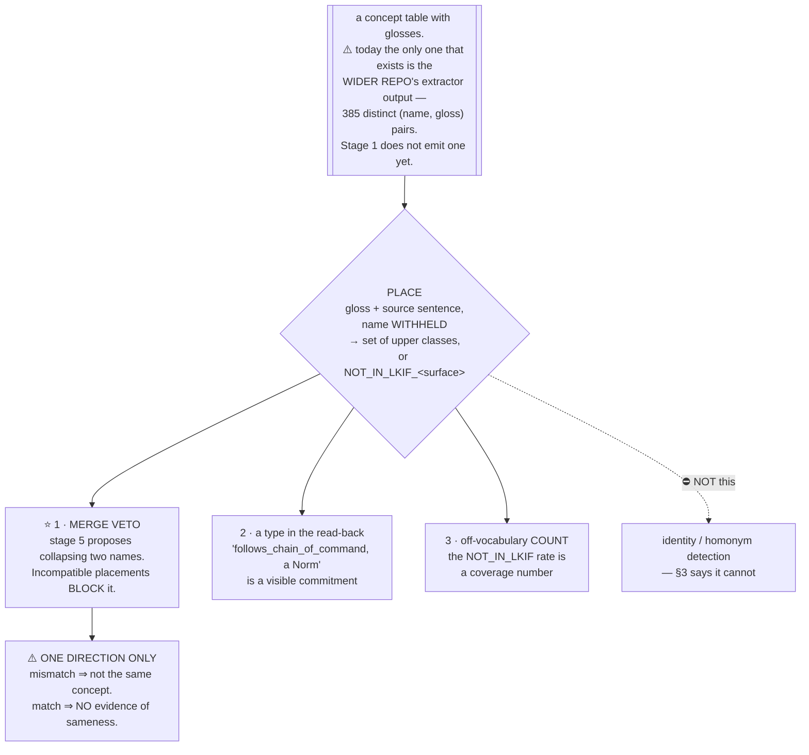

# Scratch — an ontology phase: what survives contact with the evidence

**Throwaway. Delete once picked and tested.**

Rewritten 2026-08-07 after three things landed that the previous draft was written without:

1. **LKIF-Core is unmaintained and does not load.** Content frozen since 2008; every `owl:imports`
   404s (`05_practice_from_ontology_projects.md` §1.2, §1.3, verified).
2. **The MIREL calibration** — ~0.27 concept-vocabulary Jaccard between *trained human annotators*
   (§4.2, n=3 pairs, computed off the raw data). Our 20% multi-definition rate is the ordinary rate.
3. **The ontology-fit test as built measures the wrong consistency** — run-to-run agreement on one
   token, while our failure modes are cross-document (`STATE.md` NEW-3).

The previous draft's proposal was: **produce the concept vocabulary first, by specialising an
existing ontology, before extraction.** ⛔ **Three parts of that sentence do not survive.** What is
left is smaller, is worth having, and is decided by one test that costs about $0.18.

---

## 1 ⛔ "Specialising an existing ontology" is not a thing anyone has done and kept doing

The previous draft's premise was *"reuse is the field's stated norm — the OBO Foundry aligns to an
upper ontology and reuses external classes; starting from nothing is the deviation."*

That is true of OBO. It is **not true of the field we are actually in**, and the evidence is now
direct rather than assumed:

| | | source |
|---|---|---|
| LKIF-Core forks with a sustained line of work (≥3 commits, >1 day) | **0 of 48** | 05 §1.1, `gh api`, verified |
| LKIF terms reused by DAOnt — the one funded, peer-reviewed, 2026 LKIF specialisation | **4 of ~283**, copied locally, **no `owl:imports` at all** | 05 §2.1, verified |
| surveyed legal-ontology repos alive | **1 of 9** (DPV) | 05 §9 |
| surveyed repos with a test suite | **0 of 9** | 05 §9 |

⇒ The one professional team doing exactly our move in 2026 did not specialise LKIF. They MIREOT'd
four class names into their own file. That is the practice, and the reason is §1.2: **you cannot
import a 404.**

⭐ **So the honest description of what is on offer is not "specialise an ontology". It is: borrow a
frozen list of ~21 class names as a type layer, and vendor it.** That is a much smaller claim, it is
what `ontology_fit.py` already does, and it should be said in those words so nobody later cites this
directory as having reused a maintained upper ontology.

⚠️ Being frozen is not purely a cost. A vocabulary that cannot change upstream cannot break our
identifiers either, and 2008 content with 167 citations is a stable thing to point at. The cost is
that no defect in it will ever be fixed, and two of the fixes people have attempted (`tourtiere`,
`wadie999`) **rewrite every class IRI**, so their `Action` and ours are different classes to a
reasoner (05 §1.2). Vendor, do not fork, do not point at anyone else's fork.

---

## 2 ⭐ Stage 1 does need a vocabulary fixed in advance. It is not this one.

⚠️ **Terminology, corrected 2026-08-07.** An earlier version of this section argued against putting
placement "before extraction". There is no extraction stage in this pipeline — that is the wider
repo's `extract_section.py`. The stage in question is **stage 1, TRANSLATE**. The argument below is
rewritten against the right stage, and it changed the conclusion in one place: the concern is
correct, and something *does* have to be fixed before stage 1.

**The objection, stated at full strength:** a model cannot translate 593 clauses into logic with a
free hand and be normalised afterwards. If every clause coins its own names, nothing links, and
post-hoc merging is a hard problem with its own failure modes. That is problem #8, and it is
measured.

⭐ **But a logic module has two vocabularies with completely different requirements, and only one of
them causes #8.**

| | **relation schema** | **term vocabulary** |
|---|---|---|
| what it is | predicate name + arity: `forbids/2`, `policy_class/2`, `scope/2` | the constants filling the slots: `restricted_content`, `transformation`, `information` |
| where linking happens | ⭐ **here** — `provides` / `requires` match on signatures | not here |
| can it be fixed in advance? | **yes** — it is the normative relation layer, not subject matter, and it is small | **no** — the document coins it |
| does LKIF supply it? | ⛔ **no.** LKIF has no `scope/2` and never will | ⛔ **no** — §1: the terms that matter are coined by the document |

### The controlled evidence, and it is a within-run comparison

⭐ `smoke_live2/extraction_filtered.json` — one run, 22 rules, 6 subsections, computed 2026-08-07.
Three fields produced by the **same model on the same clauses in the same call**:

| field | how it was specified | distinct values / 22 rules | used exactly once |
|---|---|---|---|
| `modality` | ⭐ a **declared closed set** | **2** (`oblige` 16, `forbid` 6) | 0 |
| `conditions` | free text | 13 | **12** |
| `act` | free text | 15 | **14** |

⇒ **The declared field did not drift at all; the free-text fields drifted almost completely.** This
is stronger than the two separate observations recorded in Part 1, because the comparison is
internal to one run — same model, same prompt, same clauses. n is small (22 rules, one run) and it
is one extractor, not stage 1.

⇒ ⭐ **What prevents drift is a declared schema, and the drift lives in the terms.**

### What the one existing translation actually needed — read off its own header

`m0255.lp`, hand-written, is the only translation this project has:

```
%% provides: lifted/2, unlifted/3, binds/2, violation/2
%% inputs:   forbids/2, produced/1, material_type/2,
%%           transformation_of_user_content/1, new_material/1, purpose/2
%% requires (from other clauses): policy_class/2, scope/2, out_of_scope/2
```

Thirteen predicates. And the constants it reasons over — `restricted_content`, `restricted`,
`transformation` — it did **not** coin. They arrive from `clauses/m0200.lp`, `m0201.lp`, `m0203.lp`,
which are **definitional** clauses translated first, and which are nothing but facts:

```prolog
policy_class(restricted_content, restricted).
scope(transformation, restricted).
out_of_scope(transformation, prohibited).
```

⭐ **The document supplied its own vocabulary, through its own definitional clauses, and that is what
made the conditional clause translatable.** n=1, and it is an existence proof rather than a rate.

### ⇒ So the pre-stage-1 phase is real, and it is two things, neither of them an upper ontology

**(A) A relation schema, hand-written once and frozen.** ~13 predicates for m0255's neighbourhood;
`forbids`, `policy_class`, `scope`, `out_of_scope`, `binds`, `violation`, plus the superiority
relation the standing ruling adopted. This is the same shape of artifact Invariant 1 already argues
is affordable — *derived once, reviewed once, applied mechanically forever after* — and it is a far
smaller thing to get right than 593 per-clause judgements. It is **not an ontology** and no upper
ontology can produce it.

**(B) The document's defined terms, obtained by running stage 1 on the definitional clauses first.**
84 of them (`modelspec_kinds.json`: conditional 188, definitional 84, meta 72, holistic 66 over 410
classified; 14.2% per `modelspec_segmentation_summary.md`). They emit facts, not rules — the easy
end of stage 1 — and every term arrives carrying the clause that defined it, which is DPV's
concept-id-equals-clause-id (05 §5.1) for free.

⇒ **This is a topological order over the corpus, not a new artifact type.** Schema → definitional
clauses → conditional clauses. It needs no ontology phase and no merge machinery.

⚠️ **It also settles open question 2 partly, in arm A's favour, for the term side only.** The
contrary published evidence against arm A is about supplying a model **its own accumulated list of
coined atoms**; a closed glossary the *document itself declares*, each entry carrying its defining
clause, is a different object. ⚠️ Marked as an **inference** — it is an argument from the difference
between the two artifacts, not a measurement — and it is testable in the same stage-1 run that has
to happen anyway.

### ⛔ The hole this does not close, and it is the real one

`m0255`'s `inputs` line — `transformation_of_user_content/1`, `new_material/1`, `material_type/2` —
is **coined ad hoc**. No definitional clause defines those, and (A) cannot enumerate them in advance
because they describe *the case being judged*, not the document. That is the same slot as the
`conditions` field which drifted 12 of 13.

⇒ **Drift will happen in `inputs`, and neither the schema nor the glossary nor an upper ontology
prevents it.** The candidate answers are that the input vocabulary is derived from the behaviour
side — which is blocked on the missing query side (`STATE.md` open #1) — or that it is normalised
after the fact, which is exactly the hard problem the objection names. **Recorded as open. It is the
sharpest form of #8 and it is not solved here.**

### Where the ontology phase sits in all of that

⛔ **Nowhere in either (A) or (B).** Placement types terms *after* they exist; it cannot produce a
predicate signature and it cannot produce a document-coined constant. ⇒ It is a pass over a concept
table, downstream of stage 1 — input a gloss and its source sentence, output a set of upper classes
or `NOT_IN_LKIF_<surface_form>` — and it is not on stage 1's critical path.

⚠️ **The concept name is withheld from that prompt.** Not a detail — see §4. `ontology_fit.py`
currently sends `CONCEPT: {id}` and would have to change.

---

## 3 ⛔ Placement does not address problem #9, and the corpus says so before we spend anything

This is the substantive finding of the rewrite, and it contradicts the previous draft's framing that
closed placement is what replaces naming for identity purposes.

**The measurement that is already on disk.** The corpus carries a hand-rolled four-category type
(`kind ∈ {situation, act, entity, value}`) on every one of the 1,423 atoms. It is a coarse type
layer — exactly the shape of thing a placement produces. So: **how often does a coarse type layer
disagree with itself across occurrences of one name?**

| | | source |
|---|---|---|
| distinct concept names | 330 | `annotations.json`, computed 2026-08-07 |
| names carrying **more than one distinct gloss** (problem #9's population) | **46**, all spanning >1 clause | ditto |
| distinct `(name, gloss)` pairs in the corpus | 385, of which **101** belong to those 46 | ditto |
| names whose **`kind` disagrees** across occurrences | ⭐ **1 of 330** (`condescending_language`) | ditto |

⇒ **A four-way type separates 1 of the 46 known multi-gloss names.** 21 classes are finer than 4, so
this does not settle it — but it moves the burden of proof onto the placement, and it gives the
test a null model that costs nothing.

⚠️ **Caveat, stated because it cuts the other way.** `kind` was assigned per-occurrence by the same
extractor that coined the name, with an accumulator carrying prior names across the run
(`extract_section.py:394-400`). Its stability may therefore be *name-conditioned* rather than
genuine type agreement, which would make 1/330 an understatement of what an independent typing would
find. This is why the test in `STEP_placement_discrimination.md` **withholds the name**.

**Why this is structural, not a tuning problem.** Read the actual multi-gloss cases. The genuine
differences are differences of **scope** — of what falls under the concept — and an upper class is
blind to scope by construction:

| name | its glosses | what differs |
|---|---|---|
| `instruction_prioritization` | "…of multiple instructions." / "…instructions or outcomes." / "…instructions or behavioral rules." | **extension**. All three are the same kind of act. |
| `expand_permissions` | "…access or authorization available to a party or process." / "…systems or data access available to an assistant or process." | **extension**, twice over |
| `default_inaction` | "Taking no action when applicable instructions conflict…" / "…while awaiting a basis for proceeding." | **trigger condition** |

And the differences an upper class *will* see are mostly not sense differences at all — they are
grammatical alternations:

| name | its glosses | what an upper class sees |
|---|---|---|
| `high_risk_activity` | "**An activity** with elevated potential for harm…" / "**Engaging in** an activity with elevated potential for harm…" | a thing vs an act — **a split, and a wrong one** |
| `condescending_language` | "**A response uses** patronizing… language." / "**Using** patronizing… language." | ditto — and this is the 1 of 330 the `kind` layer flagged |
| `content` | "Text, untrusted text, or multimodal data…" / "**The** text, untrusted text, or multimodal data…" | nothing. Correct: it is a leading article. |

⭐ **The predicted shape is anti-correlation**: placement splits paraphrases and misses sense
splits. If that is what the run shows, the ontology phase contributes **nothing** to #9 and its
scope shrinks to §5. This is a falsifiable prediction with named instances, and it is the reason to
run the test rather than argue about it.

---

## 4 ⚠️ The MIREL band is not a threshold, and the built tool uses it as one

`ONTOLOGY_FIT.md`'s verdict table reads **usable** at Jaccard CI lower bound ≥ 0.30 and **marginal**
at ≥ 0.24, taken from `reference.human_pair_jaccard`. The doc already caveats the band as "a low
floor, not a pass mark". ⛔ **That caveat is not strong enough. The two quantities are not the same
kind of number and no boundary should be read off one for the other.**

| | MIREL 0.30 / 0.24 / 0.29 | what `ontology_fit.py` measures |
|---|---|---|
| raters | two **different** trained humans | one model **against itself** |
| answer space | **open** — free-form concept vocabulary over WordNet/YAGO | **closed** — 22 declared labels |
| unit | distinct labels used anywhere in a document | class set per concept, averaged |

An open-vocabulary between-annotator score and a closed-set within-rater score do not share a scale.
A model returning one class per item from a 22-item list would clear 0.30 by consistency alone; two
humans choosing freely from WordNet cannot. ⇒ **Drop the band from the verdict rule.** It survives
as what it actually supports: *free-form naming is not beatable, so replace it* — which is the
argument for a closed task existing at all, not a pass mark for one.

⭐ **What survives from MIREL and should be kept**: the `NOT_IN_<vocab>_<surface_form>` marker
(05 §4.1). A term the vocabulary does not cover is recorded **as unresolvable, carrying its surface
word**, so off-vocabulary coverage is a count rather than an absence. That answers the open question
*"what does it do with a term the document never defines"* — mark it, keep the word, do not mint.

---

## 5 ⭐ What the phase is actually for, stated so it can be argued with

Strip the claims that did not survive and this is what is left. It is smaller than the previous
draft and it is defensible.



**1 — the merge veto, and it is the only load-bearing use.** Stage 5 (normalise) proposes collapsing
two names into one concept, and its acceptance test is *re-render every affected clause and re-run
the clause↔paraphrase review* — a render and a review **per affected clause, per proposal**
(`03_pipeline.md` §5-and-6). A placement mismatch kills a proposal for free, before any of that.

⚠️ **The inference runs one way and only one way.** Different placements ⇒ different concepts, so do
not merge. Same placement ⇒ **nothing**, because 21 classes over 330 concepts means most pairs
collide. Anyone reading a match as evidence of sameness has reintroduced problem #9 through the
filter meant to guard it.

**2 — a type on the read-back.** Problem #5 is hollow stubs: `follows_chain_of_command` reads
correctly in every explanation because it echoes the document's words. Rendering *"a Norm"* or
*"an Action"* beside it is a commitment a reviewer can disagree with. ⚠️ Small, unmeasured, and it
is a nice-to-have — not a reason to build the phase.

**3 — an off-vocabulary count.** Per §4.

⛔ **And what it is not for:** producing the concept vocabulary (§2), solving #9 (§3), or supplying
the query side. None of the three.

### The standing resolution on `norm`, unchanged and now corroborated

Take the class names, refuse the axioms. `norm` makes `Prohibition` a subclass of `Permission` and
equivalent to `Obligation` (05 §1.6, verified at `norm.ttl:285-297`) — a deontic commitment we ruled
against (`03_pipeline.md` open question 1). ⭐ DAOnt reached the same place independently: it took
`norm:Right` as a bare class with none of the axiomatisation (05 §2.1). Saying a concept *is* a
prohibition does not license inferring what follows from one.

---

## 6 What to do, in order

| | | cost | blocks what |
|---|---|---|---|
| **1** | ⭐ Run `STEP_placement_discrimination.md` — does placement separate senses at all, and does it split paraphrases? | ~$0.18 + ~30 min of human pre-registration | decides whether §5's use 1 exists |
| **2** | Drop the MIREL band from `ontology_fit.py`'s verdict rule (§4) | free | nothing; it is a correctness fix |
| **3** | Rebuild the placement pass to withhold the name and emit `NOT_IN_LKIF_<surface>` (§2, §4) | small | step 1 needs it |
| **—** | ⛔ Do **not** test minting (step 3 of the previous draft's flowchart) | | steps 1–2 must work first |

⚠️ **None of this blocks stage 1.** `03_pipeline.md` Part 6 names running stage 1 on one clause as
the highest-value next step, and it is still true: no model has produced a logic module in this form
and every downstream stage assumes one. The ontology phase feeds stage 5, which does not exist. If
there is one unit of attention, it goes to stage 1.

⇒ **The reason to run step 1 anyway is that it is cheap and it is decisive.** A negative result
deletes a phase from the design before anyone builds against it, which is the outcome this directory
exists to buy.

---

## What the previous draft got right and is retained

- **Placement into a closed set is a different kind of judgement from naming**, and the second is not
  measurable while the first is. §3 narrows *what the measurement buys*; it does not restore naming.
- **Set-valued, not single-label.** `developer` is an `Agent` **and** a `Role`; LKIF is a
  multiple-inheritance ontology (`Person ⊑ Agent`, `Person ⊑ Natural_Object`). Forcing one label
  manufactures disagreement. This correction stands and is a named check in `ontology_fit.py`'s
  self-test.
- **Jaccard, not κ.** Chance-corrected single-label statistics cannot represent a set-valued answer
  and would score `{Agent}` against `{Role}` as total disagreement.
- **A model is a proposer, never the source of a deterministic step.** DeepSeek found the concepts
  by reading and then stated a rule that could not have produced its own examples.
- **The vocabulary-only flag on `norm`** — §5.

## What was withdrawn

| claim | why |
|---|---|
| "reuse is the norm; building from scratch is the deviation" | true of OBO, false of legal ontologies — 0 of 48 forks, 4 of 283 terms (§1) |
| "LKIF-Core … live, not a paper artifact" | content frozen 2008; the Feb 2026 commit was a licence change (05 §1.3) |
| "produce the concept vocabulary first" | the vocabulary that matters is coined by the document (§2) |
| the concept phase addresses #8 and #9 | it vetoes merges in one direction; it does not detect homonyms (§3, §5) |
| "the CLOSED set of ~15" | no structural cut yields it; the set is a declared 21 + `NONE_OF_THESE`, in config |
| the MIREL band as a verdict boundary | category mismatch between the two measures (§4) |
