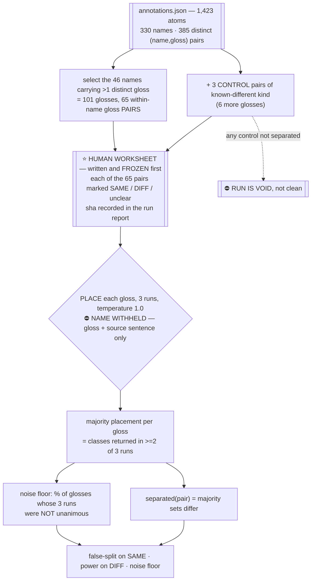

# Step X — does upper-class placement separate senses, or only grammar?

**Status: written for review. Nothing has been run. No authorisation to spend has been given.**

Written per `README.md`'s working method: a specific passing example, a specific failing example,
what evidence it produces, and what it costs — agreed *before* the work starts. The reason is on the
record: three times in this project a check was built that measured the wrong thing and reported
success, and in each case the mechanism was describable but the failing case was not.

---

## 1 The question, in one sentence

> **When two glosses of the same concept name mean genuinely different things, do their upper-class
> placements differ — and when they mean the same thing, do the placements stay the same?**

Two rates, not one. They decide different things and only one of them is load-bearing:

| rate | what it decides |
|---|---|
| **false-split** — placements differ on pairs a human marked as the *same* sense | ⭐ whether the **merge veto** (`SCRATCH_concept_phase.md` §5 use 1) is sound. A veto only needs *different placement ⇒ genuinely different*. |
| **power** — placements differ on pairs a human marked as *different* senses | whether placement contributes anything to **problem #9**. `SCRATCH` §3 predicts it does not. |

⚠️ **The veto does not need power.** A filter that never fires is useless but not wrong; a filter
that fires on identical concepts silently blocks correct merges at stage 5 and there is no
downstream check that would catch it. So false-split is the number this step exists to produce.

## 2 Why the built test does not answer it

`ontology_fit.py` measures **run-to-run agreement on one item**: ask the same model the same
question three times, compute mean pairwise Jaccard. `STATE.md` NEW-3 records the defect —
our failure modes are cross-document (#8 synonyms converging, #9 homonyms separating) and neither is
visible in one item's self-agreement.

⭐ **Concretely: a model that returns `{Action}` for every one of the 385 concepts scores 1.0.** The
verdict line would read *usable*.

What is reused from that tool, unchanged: the vendored LKIF parse (imports are dead — 05 §1.2), the
declared 21-class closed set plus `NONE_OF_THESE`, the fail-closed error table, set-valued answers,
Jaccard over sets, the cost gate, and the worksheet-as-pre-registration mechanism.

⛔ What changes: the item is a **gloss, not a name** (§3); the unit of analysis is a **pair of
glosses**; and the MIREL band is **not** used as a verdict boundary (`SCRATCH` §4).

## 3 The design

**Why the name is withheld.** If the prompt says `CONCEPT: instruction_prioritization` above each of
its three glosses, the model is answering *"what kind of thing is instruction_prioritization"* three
times and will return the same set — measuring name-anchoring, not sense discrimination. Withholding
it also makes the item what Invariant 1 says identity is: the **definition, not the label**.

⚠️ It changes `ontology_fit.py`'s `item_template`, which currently sends `CONCEPT: {id}`.

**Why 3 runs.** Without a within-gloss noise floor, "these two placements differ" cannot be told
apart from "this model does not repeat itself." The noise floor is the null for both rates.

**Why the pairs, and not a sample of 20.** These 65 pairs are the entire population of problem #9 in
this corpus — every name that carries more than one definition. There is nothing to sample.

### Sizes, all computed off `annotations.json` on 2026-08-07

| | n |
|---|---|
| atoms | 1,423 |
| distinct names | 330 |
| distinct `(name, gloss)` pairs | 385 |
| names with >1 distinct gloss — **all 46 span more than one clause** | 46 |
| their glosses | 101 |
| within-name gloss **pairs** (38 names × 1, 7 × 3, 1 × 6) | **65** |
| control pairs added | 3 (+6 glosses) |
| glosses placed | 107 |
| calls at 3 runs each | 321 |

## 4 The pre-registration, and why it is the whole test

⭐ **A human marks all 65 pairs SAME / DIFF / unclear before any call is made, and the marked sheet
is frozen with a sha recorded in the run report.**

Without it there is no ground truth and the numbers mean nothing — `ONTOLOGY_FIT.md` already says
consistency is never correctness. With it, and only if it is written first, the two rates are
scores rather than rationalisations.

- `unclear` is a real verdict and is **excluded from both denominators**, and its count is reported.
  A sheet where most pairs are `unclear` is a finding about the corpus, not a score of zero.
- The marker sees the two glosses and the source sentence of each. It does **not** see any placement.
- ⚠️ **n = 1 human, and human reliability on this task is itself unvalidated** — `03_pipeline.md`
  open question 4. A frontier model on the same brief, run blind, is the cheapest available
  divergence check; per the standing rule, divergence defaults to a **defect in the brief**, not to a
  finding about the corpus.
- Rough size: 101 short glosses, ~30 minutes.

## 5 ⭐ A specific passing example

`developer_message`, two glosses, clauses `m0058` / `m0293`:

> — *"A message containing developer-provided instructions or configuration for the assistant."*
> — *"A message originating from an application developer."*

Human mark: **SAME** — both denote the message; one describes its content and one its origin. There
is no situation in which one holds and the other does not.

The check passes on this pair when the two majority placements are identical — something like
`{Document}` or `{Expression, Document}` for both — and the pair therefore does **not** appear in
the merge-veto output. That is the desired behaviour: a filter that says nothing about a pair it has
no business separating.

⚠️ **What makes it a real example rather than a decoration:** the two glosses are lexically quite
different (*containing … instructions or configuration* vs *originating from … developer*), so a
gloss-similarity filter would flag them and a placement should not. If placement separates this
pair, §6's first prediction has fired.

## 6 ⛔ Specific failing examples — predicted before the run

These are the pre-registered predictions. Each is a named pair with a stated expected outcome, so
the step can be wrong in public.

**Failure A — a false split, from a grammatical alternation.** `high_risk_activity`, clauses
`m0136` / `m0215`:

> — *"**An activity** with elevated potential for harm that requires explicit authorization."*
> — *"**Engaging in** an activity with elevated potential for harm that requires explicit
> authorization."*

Human mark: **SAME**. Predicted placement: a thing vs an act — `{Abstract_Entity}` or `{Plan}`
against `{Action}` or `{Process}`. **Predicted: separated. This is a false split**, and at stage 5 it
would block a correct merge with no error message anywhere.

Corroborating evidence that this is the live mode: of the 330 names, the corpus's existing
four-category `kind` label disagrees with itself on exactly **one** — `condescending_language` —
and that one is the same alternation (*"A response uses patronizing language"* vs *"Using
patronizing language"*). The only case a coarse type layer flags in this corpus is a case it should
not flag.

**Failure B — a miss, on a difference of scope.** `instruction_prioritization`, three glosses:

> — *"Determining the relative priority of multiple **instructions**."*
> — *"Determining the relative priority of multiple **instructions or outcomes**."*
> — *"Determining the relative priority of multiple **instructions or behavioral rules**."*

Human mark: at least one pair **DIFF** — the three do not cover the same things, and a rule keyed
to the first is not keyed to the third. Predicted placement: identical for all three; every one is
the same kind of act. **Predicted: not separated. This is a miss**, and it is problem #9 in its
canonical form (`03_pipeline.md` Part 1 cites this exact concept).

⭐ **The composite prediction, which is the falsifiable claim:** *false-split rate exceeds power.*
Placement splits paraphrases and misses sense differences. Marked as an **inference** — it is read
off the glosses and the 1-of-330 `kind` result, not measured.

## 7 ⛔ The condition under which this check is broken, and how the run detects it

The failure this project keeps shipping: a check whose **pass state is indistinguishable from its
did-not-run state**. Here that shape is concrete and likely.

> If the model returns the same class set for nearly everything, every pair comes back "not
> separated". False-split = 0. The report reads *"no incorrect splits detected"* — which is exactly
> what a working, specific filter looks like, and exactly what a filter with **no resolution** looks
> like.

⇒ **Three positive controls, drawn from the corpus, that placement MUST separate.** If any one of
them does not, the run is reported **VOID** — not clean, not a pass, no rates computed:

| pair | glosses | why it must separate |
|---|---|---|
| `under18_user` / `under18_conversation` | *"A user who is under eighteen."* / *"A conversation involving a user under eighteen."* | ⭐ the **highest gloss-similarity distinct-name pair in the whole corpus** — token-Jaccard 0.50, the only pair ≥ 0.5 of 54,285 — and a person is not a conversation. The hardest case the veto has to get right. |
| `developer` / `developer_message` | *"A customer who supplies application-level guidance…"* / *"A message originating from an application developer."* | a person against a document |
| `developer` / `follow_up_questions` | *"A customer who supplies…"* / *"Asking whether the user wants more help…"* | a person against an act — if this one fails, the closed set is not being used at all |

⚠️ The controls are reported **before** the rates in the output, and the noise floor is reported
beside them. A control that separates in 2 of 3 runs is a warning, not a pass.

## 8 What evidence this produces

Six numbers and one table. Every one names its n.

| | |
|---|---|
| **control separation** | 3 pairs, each 3 runs — **gate**: any failure ⇒ VOID |
| **noise floor** | % of the 107 glosses whose 3 runs were not unanimous |
| ⭐ **false-split rate** | separated / (SAME pairs), n ≈ 45 expected. **The load-bearing number.** |
| **power** | separated / (DIFF pairs), n ≈ 20 expected |
| **`NOT_IN_LKIF` rate** | over 107 glosses — a coverage hint about LKIF, nothing more |
| **classes per answer** | mean and distribution, to detect a degenerate one-class-for-everything answer |
| **per-pair table** | every pair, its human mark, both majority sets, agree/differ — so a bad aggregate can be read back to cases |

### The decision rule, fixed now

| outcome | ruling |
|---|---|
| any control unseparated | **VOID.** The instrument has no resolution; no rate is reported. |
| false-split ≤ 0.15 | the **merge veto** is sound enough to use at stage 5, as a one-directional filter |
| false-split > 0.15 | ⛔ **drop the merge veto.** It blocks correct merges more often than stage 5 can afford, silently. |
| power > false-split + 0.20 | placement has genuine sense resolution — reopen its use against #9 |
| otherwise | placement contributes nothing to #9. `SCRATCH` §5 stands: veto, read-back type, off-vocabulary count, and nothing else |

⚠️ **This test can rule the phase out more confidently than it can rule it in.** With ~45 SAME pairs
a false-split rate near 0.10 carries a binomial half-width of about ±9 points, so "sound" is a
provisional reading and "unsound" at a high rate is the firmer conclusion. n is what the corpus has;
it is not a design choice.

## 9 What it does **not** measure

- **Whether the placements are correct.** No ground truth for placement exists here and none is
  claimed. The human sheet marks *sense equality between two glosses*, which is a different and much
  easier judgement than *which LKIF class subsumes this*.
- **Whether LKIF is the right ontology.** The `NOT_IN_LKIF` rate is a hint.
- **Problem #8 (synonyms converging).** ⚠️ It cannot be measured on this corpus: of 54,285
  distinct-name pairs, **zero** have gloss token-Jaccard ≥ 0.6 and exactly **one** reaches 0.5
  (computed 2026-08-07). This corpus was extracted with an accumulator that encouraged name reuse
  (`extract_section.py:394-400`), so #8's population lives in a *different* artifact —
  `smoke_live2/extraction_filtered.json`, 12 of 13 condition names used exactly once. Testing #8
  needs that corpus and is a separate step.
- **Steps 2 (PARENT) and 3 (MINT)** of the previous concept-phase design. Minting is where invention
  enters and it is not tested until placement works.
- **Anything about stage 1**, which has still never run.

## 10 Cost

| | |
|---|---|
| human | ~30 minutes, 101 glosses, before any call |
| calls | 321 (107 glosses × 3 runs) |
| ⭐ money | **~$0.16**, worst-case estimator — every call charged at the full `max_tokens`, per `ontology_fit_config.json`'s `_assumed_output_tokens` note |
| gate | `cost.max_cost_usd` = $0.50; ledger at **$2.06 of $8.50** |
| code | change `item_template` to withhold the name; add the pair/worksheet layer, controls, and the two rates. The parse, closed set, client, cost gate and fail-closed table are unchanged |
| ⛔ authorisation | **not given.** Nothing is sent until it is. |

## 11 Open, and not blocking

- **Placement is not needed until stage 5 exists**, and stage 5 does not. This step is worth doing
  now only because a negative result deletes a phase before anyone builds against it.
- **Stage 1 remains the highest-value next step** (`03_pipeline.md` Part 6). This does not compete
  with it and should not displace it.
- Whether the closed set of 21 is the right one is untouched here. If controls separate and the
  false-split rate is high, the *first* thing to inspect is the `swapped for` column — two classes
  whose glosses do not separate — before concluding anything about placement as such.
