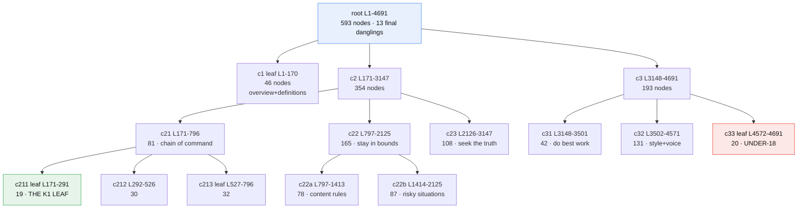
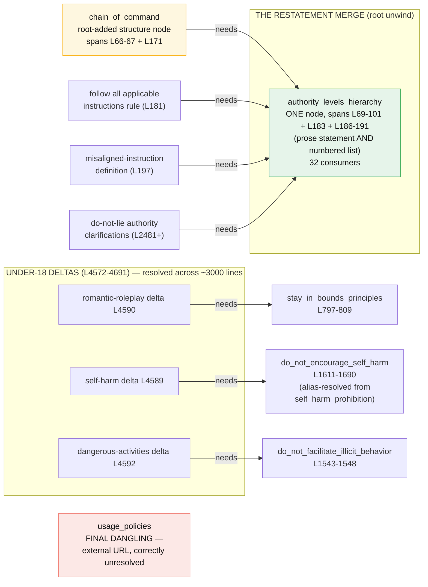

# The document graph, in two pictures

## 1. How it was built — the recursion tree

Each box is one Haiku transcript. Dividers chose their own cut points, seeded shared
vocabulary downward, and later linked their children's graphs; leaves produced the nodes.
Numbers are final node counts after each unwind.



(c212, c22a, c22b, c23, c31, c32 each have 2-3 further leaf children, omitted for
legibility — the full tree is 18 dividers + 16 leaves, in `recurse/`.)

## 2. What it contains — the motivating region of the concept graph

Boxes are graph NODES (with their document grounding); arrows read "needs".
This is the sub-graph the whole design existed to produce.



## 3. An example leaf node (what translation will consume)

The best-connected node in the graph — note it does NOT contain ASP; it is the
translation *input*: prose to check, names to join on, lines to verify against.

```json
{
  "id": "L1-170_n028",
  "establishes": "The authority hierarchy ranked from highest to lowest: Root > System > Developer > User > Guideline. Instructions at higher levels override those at lower levels in case of conflict.",
  "needs": [],
  "provides": [
    { "name": "authority_levels_hierarchy",
      "prose": "The precedence ordering of instruction sources from highest to lowest: Root > System > Developer > User > Guideline. Established in L0069-L0191, particularly the ordered list at L0186-L0191." }
  ],
  "spans": [ {"lines": [69, 101]}, {"lines": [183, 183]}, {"lines": [186, 191]} ]
}
```

And a typical delta node (Under-18, showing a long-range edge):

```json
{
  "id": "L4572-4691_n011",
  "establishes": "For U18 users, the assistant cannot engage in immersive romantic roleplay, first-person intimacy, or romantic pairing with the teen, even if a similar scene would be allowed between consenting adults. This extends the rule that prohibits role-play undermining real-world ties.",
  "needs": [
    { "name": "stay_in_bounds_principles", "prose": "The collection of limits on assistant behavior ... Section introduced at L0797-L0799." },
    { "name": "respect_real_world_ties", "prose": "Prohibition on role-play that could undermine real-world ties and relationships" }
  ],
  "provides": [],
  "spans": [ {"lines": [4590, 4590], "quote": "**Romantic or erotic roleplay:** ..."} ]
}
```

Top consumed concepts (edge counts): authority_levels_hierarchy 32,
objective_truth_seeking 19, scope_of_autonomy 13, disallowed_content_categories 12,
prevent_imminent_real_world_harm 11, stay_in_bounds_principles 10,
do_not_facilitate_illicit_behavior 10, interactive_vs_programmatic_context 10.
