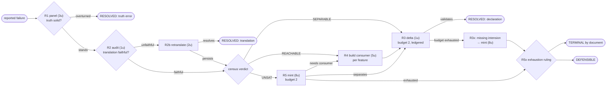

# Error-calculus router — static diagram

Judgment ports (frontier/human): R1 rulings, R2 audits, the intension inside
R3x/R5 mints, and the R5x ruling. Everything else is computation.
Verified: calculus_model.py + calculus.lp (clingo) — 0 gaps / 0 ambiguities /
0 cycles; mutation-tested 5/5.
