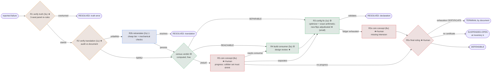
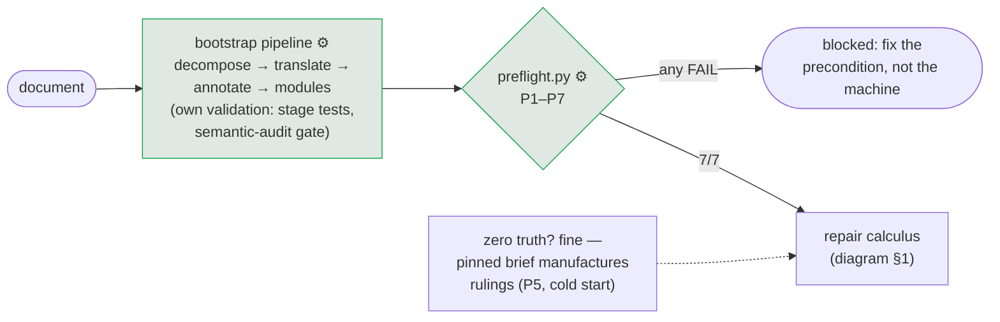
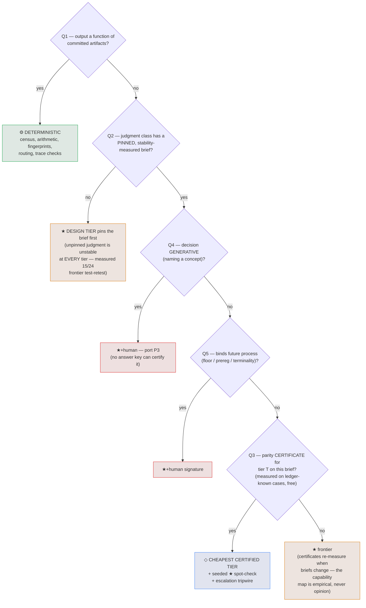

# Error-calculus router — static diagrams

Judge legend used in both diagrams below (and the widget):
**⚙ deterministic** — computed from committed artifacts, no model in the loop ·
**◇ cheap-certified** — any tier holding a measured parity certificate for the
pinned brief (plus seeded frontier spot-check) ·
**★ frontier** — measured frontier-only (cheap tiers failed parity on this brief) ·
**★+human** — generative naming or process-binding: frontier seat plus human ratification.

## 1. The router

## 2. Preconditions — what must exist before the machine can run
(calculus A14; validated mechanically by `preflight.py` before every
iteration. The machine is a REPAIR calculus: a reported failure is
E(n,b) ≠ T(n,b), so E must be computable first — it cannot start from
zero nodes. Truth is the one cold-startable component.)

| # | precondition | why it is not arbitrary | mechanical check (preflight.py) | cold-startable? |
|---|---|---|---|---|
| P1 | Decomposition: canonical node corpus, stable ids, verbatim spans, source sha pinned | E's domain — without nodes there is nothing to engage | corpus parses; every node has id+quote; sha recorded | no — bootstrap pipeline |
| P2 | Translation liveness: nodes carry bridgeable acts; every module engages >0 nodes | E must be non-degenerate (the F1 silent-empty-lane class). Liveness only — QUALITY is what the machine improves | per-module engagement >0; bridge coverage >0 | no — bootstrap pipeline |
| P3 | Keying consistency: layers + truth ledger key to the canonical corpus | routing evidence must resolve; drift silently corrupts every downstream computation | zero layer-orphans; zero hard drift; canonical drift only within the FROZEN named set (F_R1_KNOWN_DRIFT.json — any NEW node fails) | no |
| P4 | Modules: definition text + declarations within DECLARABLE_MOVES | D must live in the registry every enumerator derives from (A12) | schema + registry membership | no |
| P5 | Pinned ruling brief with a MEASURED stability record (+ truth ledger, possibly empty) | the judge IS the instruction (measured 20/20 vs 0.62–0.75); an unpinned brief is an undefined judge at any tier | stability record present in the pinned brief file | **yes — truth only**: the machine manufactures rulings through the brief |
| P6 | Harness: census / probe / verify_terminal / trace / route importable; registry handshake holds | repair without verification is the metric-gaming failure the campaign was founded on | imports + handshake assertion | no |
| P7 | Governance: hypothesis + notes ledgers, runbook, stop conditions, budget registration | no-revisit (A9), learning-as-artifact, and halt-don't-improvise are load-bearing, not decoration | files exist; STOP CONDITIONS present | no |

## 3. The capability decision tree (calculus A10 — which judge does a
## decision node need?)

Verified: calculus_model.py + calculus_model_v2.py + calculus.lp (clingo,
mutation-tested 5/5); historical validation ROUTE_VALIDATION_V0.json
(52 cases, 49/52, all traces certified).
