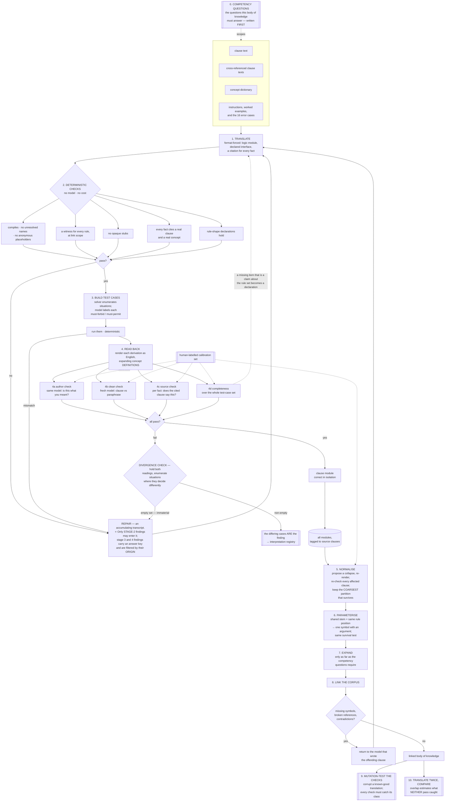
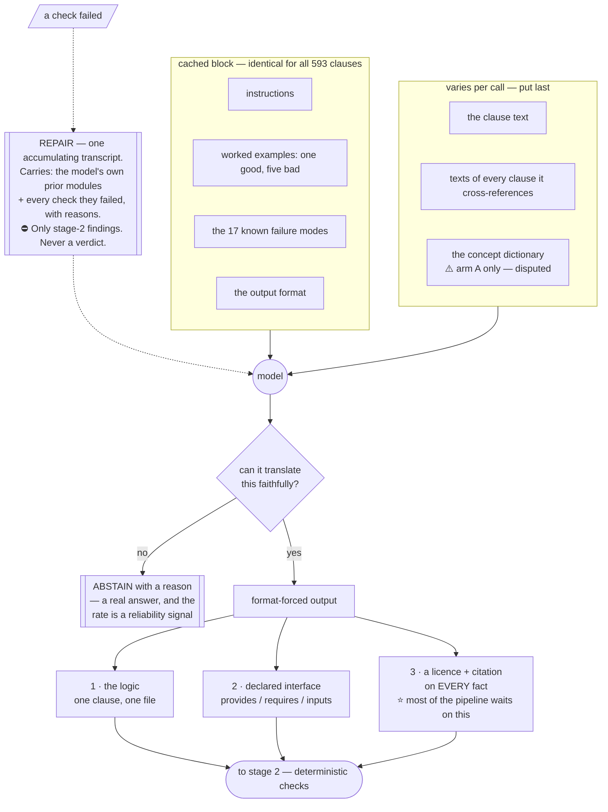

# Translating a specification into logic: the problems, and a proposal

Please match the writing style of this doc if making changes. Terms of art are marked † on first use and defined in the glossary.

Note: this is a complete redesign of the surrounding repo project. I am validating it as a prototype. For items in the walkthrough directory, this document is the source of truth above everything else.

This proposes a way to turn each clause of a specification into a small logic program, check that
it says what the clause says, and link the results into one body of knowledge that can answer
questions spanning clauses.

---

## Part 1 — What actually goes wrong

We have encountered the following problems so far. This list is expected to grow. When adding new items, we need to understand how the problem is identified:

* **Silent** — nothing complains.
* **Loud** — something errors.
* **Misleading** — you get a signal pointing the wrong way.


Every measured figure names its source and its n.

| Category | Issue | Detection | Summary |
|---|---|---|---|
| **① Inside one clause's translation** | | | |
| | **1. Made-up things** | Silent | The translation invents an entity the document never mentions — we wrote rules about a "deception policy"; the spec has no such policy. Everything downstream worked and was about a fiction. |
| | **2. Missing cross-references** | Silent | A clause modifies rules defined in *other* clauses. We translated one without reading the three it depends on, and guessed their content. |
| | **3. Rules that can never fire** | Loud but ignorable | A rule guarding a condition nothing can produce — looks like it enforces something, enforces nothing. ⚠️ In ASP terms this is **rule-coverage†**, not **vacuity†**; see the note below. clingo warns every run; we read past it. |
| | **4. Right answer, wrong stated reason** | Misleading | A rule concluded "forbidden, because the exception does not reach this," citing evidence suggesting it should. Cause: **negation as failure†** under plain grounded clingo gives no account of *why* something failed. ⚠️ A property of the tooling used, not of ASP. |
| | **5. Hollow stubs** | Silent | `follows_chain_of_command` as one opaque symbol reads correctly in every explanation — because it echoes the document's own words — while the referenced content is absent. **Survives a paraphrase check by construction.** |
| | **6. Guessing forward from a backward statement** | Silent | The clause said what an exception does *not* cover; we encoded what it *does*. The document never licensed that step. |
| | **7. Anonymous placeholders break the explainer** | Loud — crashes | `policy(P) :- policy_class(P,_)` is idiomatic ASP; **xclingo** cannot process it. ⚠️ A tool limitation, not a language property. |
| **② Only visible across clauses** | | | |
| | **8. Different names for the same thing** | Silent until you link | One clause says `scope`, another `exception_applies`; they never connect. **Measured** (n=1 run, `smoke_live2/extraction_filtered.json`, 22 rules / 6 subsections): **12 of 13 condition names used exactly once**, despite `extract_section.py:394-400` deliberately carrying the accumulator across the run to encourage sharing. |
| | **9. Same name, different meanings** | Silent | Two clauses both say `user`, meaning different things; they link cleanly and are wrong. The dangerous twin of #8 — divergence announces itself, this does not. **Measured** (`annotations.json`): 330 names, 228 reused, **46 of those (20%) carry more than one definition**. `instruction_prioritization` carries three, spanning "instructions", "instructions or outcomes", "instructions or behavioral rules". |
| | **10. Flat lists where structure was needed** | Silent | The same run produced `quoted_text_json`, `_yaml`, `_xml` and five more — eight symbols where one with a parameter was wanted. Nothing can generalise across them. |
| | **17. A cyclic priority relation is silently wrong** | Silent | If clause A is declared to beat B and B to beat A, a defeat-based encoding produces a confident wrong answer rather than an error. Found while assessing a superiority kernel, 2026-08-07. Needs a mechanical cycle check on the `beats` relation. |
| **③ In how the translation is tested** | | | |
| | **11. Test cases describing impossible situations** | Silent | A test asserted material was both brand new *and* a transformation of user-supplied content. The program accepted it and produced the right answer from an impossible state. |
| | **12. Testing one branch only** | Silent | A clause with four claims, tested with one case. ⚠️ This is **coverage†**, it has published criteria in ASP, and it is the problem this pipeline addressed least well. ⭐ **Demonstrated on the flagship example itself:** `m0255`'s two C3 rules ("purpose never creates an exemption") can be deleted with no observable effect — same 144 models, all five probe cases bit-identical. They *fire*, so rule coverage passes them; only a mutation check sees it. `paper_pipeline/phase_1/FINDINGS_m0255.md`. |
| | **13. Only testing that it forbids** | Silent | A translation that says no to everything passes every "does it correctly say no" test. ⛔ **More than a testing gap:** plain ASP's closed-world reading of `not forbidden(X)` silently commits the whole corpus to *"whatever is not forbidden is permitted"* (CEPA vs CNPA). **No probe coverage surfaces a global semantic commitment.** |
| | **14. Claims no test case can demonstrate** | Silent | "Purpose never creates an exemption" is about the *rule set*, not any situation: no rule of a certain shape may exist. Checkable only by inspecting the program. |
| | **15. "Never fired" has three causes** | Misleading | Genuinely dead, or the tests do not reach it, or **it is waiting on a clause not yet linked in.** **Measured** (n=1 rule, `m0255`'s `unlifted/3` *out_of_scope* rule): with `m0203` linked, **72 of the 144 enumerated situations witness the rule**; without it, **zero — the witness query is UNSAT**. Command and projection in Part 4 §2. |
| **④ In the checking itself** | | | |
| | **16. A reviewer cannot see invented entities** | Structurally silent | Given the clause and a read-back containing the invented "deception policy," a clean reviewer answered **faithful, nothing unsupported** — then reasoned from the fiction. Not reviewer error: the clause says "policies other than restricted or sensitive" and never enumerates which exist. (n=1. Asked about *completeness* in the same test it was exactly right, naming both uncovered claims.) |

### ⚠️ A vocabulary correction that was hiding a hole

An earlier draft called both #3 and #12 "vacuity." They are different, and the field separates them:

- **vacuity** — a requirement satisfied trivially because its trigger never arises
- **coverage** — the tests never exercise part of the program

Collapsing them is exactly what let #12 sit in this list with **no corresponding check anywhere in
the pipeline**. ASP has published structure-based coverage criteria — rule, definition and loop
coverage over the dependency graph — and they are what #12 needs. A clause with four claims and one
test case fails definition coverage mechanically, without anyone judging sufficiency.

---

## Part 2 — Three invariants

These are not stages. Each is a property every stage must preserve, and each **fails silently if
relaxed anywhere** — which is why they are stated once, here, rather than repeated per stage.

### Invariant 1 — Concept identity is not a name

⚠️ **The most uncertain thing in this document. The problem is settled; the remedy is open.**

Identity by bare name produces both #8 and #9, and 20% of reused names in the current corpus
already carry conflicting definitions. That much is measured.

**Not in dispute:** somewhere in the pipeline, symbols must resolve to concepts with written
definitions, and the read-back must render **the definition, not the label**. Otherwise a clause
pointing at the wrong concept produces a paraphrase that reads correctly and nothing catches it.
Rendering the definition is what moves an invisible cross-clause problem to where a single-clause
check already works.

**Disputed: when.** Two shapes, and the choice is empirical, not architectural.

| | **A — supply at generation** | **B — normalise afterwards** | **C — resolve deterministically** |
|---|---|---|---|
| the translator gets | the concept dictionary as context | nothing; it coins names freely | nothing; naming is not its job |
| concepts are fixed | while translating | in a separate step that maps names → concepts | by a **lookup the model never sees** |
| for | convergence by construction | ⭐ writing logic and matching concepts are **different tasks** | ⭐ takes the whole problem out of the model's hands; #8 and #9 stop being possible rather than being caught |
| against | ⛔ **contrary published evidence** — supplying a model its own accumulated atom list *increased* hallucination | needs a merge procedure with its own failure modes | requires the lookup to exist |

##### On arm C, because it is the most attractive and the least explored

If concept resolution were a **deterministic function of a word plus a meaning annotation**, then no
prompt in this pipeline would need to care about naming at all: the translator writes whatever it
writes, the lookup normalises it, and the read-back confirms the normalisation in English where a
reader can see it.

⚠️ **Off-the-shelf knowledge graphs will not supply this.** Wikidata, BabelNet, WordNet and similar
enumerate *general* concepts. The terms that matter here — *restricted content*, *the transformation
exception*, *prohibited content* — are **coined by the document and defined only in it**. A general
lookup would resolve the ordinary words and miss every term that carries the specification's actual
meaning.

⭐ **But the document defines its own vocabulary, and that is the better starting point.** 84 clauses
are already classified as definitional. A deterministic rule derived *once* from those — by a model,
reviewed once, then applied mechanically forever after — is a far smaller thing to get right than
a per-clause judgement repeated 593 times, and it is checkable: a bad rule fails visibly across a
whole class of clauses rather than silently on one.

**Open:** what the rule operates on (surface word? word plus the clause's own gloss?), what it does
with a term the document never defines, and whether one rule can cover a document that defines some
terms explicitly and leaves others to context.

⇒ **Not decided here.** Both arms are cheap. See Part 5, open question 2. Do not build the merge
machinery before knowing which arm we are in.

### Invariant 2 — Every fact declares its licence, and cites where it comes from

⛔ **Revised 2026-08-07.** An earlier draft made this binary — cite a clause or be rejected. That
was wrong twice: it contradicts a standing project ruling, and it rejects the only translation ever
built for this pipeline. `m0255`'s working result rests on `protects_third_party(restricted_content)`,
which is asserted, not read from any clause.

⚠️ **That fact is NOT the `world` exemplar, and an earlier draft of this section used it as one.**
`protects_third_party/1` lives in `walkthrough/behaviour_harm3p.lp` (lines 15–16) — it is read out
of a **behaviour statement**, so by this invariant's own closing note it belongs to the *fourth*
class, the one that does not exist yet. Holding it up as the model `world` fact made the design's
only demonstration of `world` an instance of the gap it declares two paragraphs below. It survives
here as what it is: an uncited assertion that shows why binary rejection fails.

| licence | meaning | how it is checked |
|---|---|---|
| **textual** | the cited clause says this | mechanical citation check, then a reviewer confirms the cited clause actually says it |
| **assumed** | an inference the document licenses but does not state | must name the inference; reviewable |
| **world** | knowledge from outside the document entirely | must be marked and **toggleable** — a result resting on world knowledge is a different claim |

Binary rejection has a bad escape hatch: an author satisfies it by citing a plausible-looking clause
for an assumed fact, which manufactures problems #1 and #6 **behind a passed check**, and the
licence reviewer then grades the citation rather than the licence class. Grading reaches the actual
goal — no unlicensed inference is invisible — without that exit.

#### ⭐ The `world` exemplar — RULED 2026-08-07 (Matt)

⭐ **Decision: find and use a real document-side `world` fact. One exists: `illegal/1`.** The
exemplar is `m0232` (*no_erotica_or_gore*):

> *"The assistant should not generate erotica, depictions of **illegal** or non-consensual sexual
> activities, or extreme gore, except in scientific, historical, news, artistic or other contexts
> where sensitive content is appropriate."*

Whether that prohibition fires turns on which sexual activities are illegal — and the specification
never says. It meets all four tests a `world` exemplar has to meet:

| test | why `illegal/1` passes |
|---|---|
| not `textual` | **7 clauses depend on it and 0 define its extension.** `m0209` · `m0232` · `m0253` · `m0270` · `m0271` · `m0524` · `m0586` use *illegal* / *illicit* / *unlawful*; no definitional clause in the 593 fixes what any of them covers (two further hits, `m0171` and `m0240`, are `kind: example`) |
| not `assumed` | a criminal code cannot be inferred from a behavioural specification. There is no step to name |
| not behaviour-side | the word is in the clause's **own text**, so it is a fact about the document, not read out of a behaviour statement |
| genuinely toggleable | change the jurisdiction and the verdict changes. That is exactly what *"a result resting on world knowledge is a different claim"* means, and it is what `protects_third_party` could never demonstrate, being about the behaviour rather than the document |

⛔ **Two alternatives were on the table and both are REJECTED, by name.**

- **(i) "Record that `world` may have no document-side instances and stop demonstrating it."**
  Rejected: an instance exists and seven clauses depend on it. The evidence that looked like
  absence was a measurement of something else — see the finding immediately below.
- **(ii) "Drop `world` from the contract."** Rejected on the same ground, and on a second: it would
  foreclose the case before stages 3 and 4 have ever run. A licence class is removed on evidence
  that nothing needs it, not on evidence that nothing has produced it yet.

#### ⭐ Finding: *what models produced* was read as *what the corpus requires*

⛔ **A prior claim in this repo is wrong and is corrected here.** `REVIEW_QUEUE.md` §2.1 and several
commit messages stated **zero document-side `world` facts** — 31 `textual` / 8 `assumed` / 0 `world`
across 18 hand-encoded clauses, plus `world_fact_rate` 0.000 over 72 model attempts (36 first
attempts × 2 arms) on six held-out clauses. **Those numbers are real.** What is wrong is the
inference drawn from them: they measure **what translators emitted**, not **what the corpus
requires**, and the two were conflated into one claim.

The corpus requires at least one, as above. The translators produce none for a mechanical reason: a
single-clause translator sees *illegal* as ordinary vocabulary in a sentence it is paraphrasing, not
as a predicate whose extension nothing in the document supplies. Nothing in the prompt makes the
absence of a definition visible from inside one clause.

⇒ **This predicts something testable: a single-clause translator will systematically
UNDER-produce `world` licences**, and the under-production will concentrate on terms the document
uses freely and never defines (MIREL's undefined-term marker, Part 4b, is the existing instrument
for finding them). A zero rate is therefore not evidence about the class; it is a measurement of the
translator's field of view.

⚠️ **Not yet acted on in the prompt.** `prompt/*.md` demonstrates no `world` fact at all today.
Adding `illegal/1` to it is a prompt change and needs its own held-out measurement before and after
— it is not a documentation edit, and it must not be slipped in as one.

⛔ **The three classes do not reach the behaviour side.** All are defined relative to *the
document*; a fact read out of a **behaviour statement** fits none of them. A fourth class is
required — found 2026-08-07 when a behaviour was represented for the first time
(`contradiction_probe/FINDINGS.md`, Finding 0). ⚠️ **The `world` ruling above does not touch this
gap.** It replaces a behaviour-side fact that was standing in for `world`; it supplies nothing for
the behaviour side, which still has no licence class of its own. Both remain open together.

⭐ **A conclusion inherits the weakest licence in its derivation.** That is what makes "change one
asserted fact and the match disappears" visible in the output rather than discovered later.

### Invariant 3 — One clause, one module

The formal structure stays in one-to-one correspondence with the document's structure. Modules
compose by linking, never by merging text.

This is the **isomorphism** principle from legal knowledge representation (Bench-Capon & Coenen,
1992), and its stated motivation is ours: the document is stable but will be amended, and being
able to trace which formal item corresponds to which amended text is what makes amendment
affordable. It is also what makes failures attributable — a defect belongs to a clause, so it can
be returned to whoever wrote that clause.

---

⛔ **This invariant is currently violated by the design's own handling of exceptions.** If an
exception is encoded as a negation-as-failure condition in the general rule's body, then adding a
new exception clause requires **editing the general clause's module** — merging, not linking. The
mechanism that lets an exception live in its own module and defeat a rule in another is a
**superiority relation†**, standard in defeasible deontic logic and absent from what we built. See
Part 5, open question 1.

## Part 3 — The pipeline



---

## Part 4 — Stage Details

Most stages do what their name says. These do not.

### 0 — Competency questions

#### What it is

Before you organise a body of knowledge, you write down **the questions you must be able to answer
once it is finished.** Those questions are called competency questions, and they are the first
thing you produce — before any translating, any code, any structure.

Think of a library. Before deciding how to catalogue the books, you ask what people will walk in
and request. If readers ask for books by subject and by author, you record subject and author. If
nobody ever asks *"show me every book with a blue cover,"* you do not record cover colour — not
because colour is uninteresting, but because recording it costs real effort and answers nothing
anyone needs.

The questions do not decide what is true. They decide **what is worth writing down**, and **how much detail is enough.**

#### Why they have to come first

Without them, two things go wrong, and both are expensive to discover late.

**You never stop.** Every concept can be broken into finer pieces indefinitely. "Follow the chain
of command" can be left as one idea, or split into who outranks whom, or split further into how
authority is established, and further again. There is no natural bottom. The questions supply the
stopping point: break a concept down **only as far as some question actually requires**, and no
further. Without that rule the work has no end.

**You record the wrong things.** You can spend enormous effort capturing detail nobody will ever
query while omitting something that every question depends on. You find this out at the end, when
the knowledge base is built and cannot answer the thing it was built for.

#### What a good one looks like

A competency question has a **definite answer**. That is the whole test.

| ⛔ not usable | ✅ usable |
|---|---|
| "The system should capture the meaning of the specification." | "Given a proposed action, list every passage that forbids it, and say why." |
| "It should understand exceptions." | "Under what conditions does the transformation exception apply, and when does it stop applying?" |
| "It should be accurate." | "Do these two passages contradict each other?" |

The left column cannot be checked. There is no observation that would show the system had failed.
The right column can be answered, and can be answered wrongly — which is what makes it useful.

#### Two levels, and you need both

**The general question** — what the finished thing must do:

> *Does this document address a given topic, and which passages do so?*
> *Do these two passages conflict?*
> *Under what conditions does this exception apply?*
> *If this passage were amended, which conclusions would change?*

**Concrete instances with the answer written down in advance** — this is what turns a question into
a test:

> *Does this passage permit producing restricted material that is a reworking of something the
> user supplied?* → **yes**
> *Does it permit that when what is produced is an action rather than information?* → **no**
> *Does it permit it when the person's stated reason is legitimate research?* → **no**

Writing the expected answer first matters more than it looks. If you cannot state what the answer
should be, the question is not ready — it is still too vague to build against, and you have found
that out for free rather than after weeks of work.

#### How to write them

1. **Write down what someone will actually do with the finished thing.** Not what it will contain
   — what a person will use it for.
2. **Turn each of those into a question with a definite answer.**
3. **For each question, pick two or three real cases and write the answer you expect.** Use real
   passages from the actual document, not invented ones.
4. **Throw out any question whose expected answer you cannot state.** It is not ready.
5. **Keep the list short.** Five to ten. A long list is a sign the questions are too specific and
   are describing the solution rather than the need.

#### They are revised, not fixed

The first set will be partly wrong, and that is expected. As the work proceeds you discover
questions you should have asked and questions that turned out not to matter. Revising them is
normal practice, not a sign of poor planning. What is not acceptable is having none, because then
there is nothing to revise against and no way to know when the work is done.

#### ⭐ The useful surprise: these are the same thing as the test cases

Stage 3 of this pipeline builds test cases for a single passage — *this must be forbidden, that
must be allowed.* A competency question is exactly the same kind of object, asked about the whole
document instead of one passage.

⚠️ **Corrected 2026-08-07: related, but NOT the same artifact.** One study of 234 competency
questions across five ontologies found 106 distinct question patterns in a many-to-many mapping to
query patterns — formalising a competency question is not mechanical. The earlier claim that this
makes stage 0 free does not hold; it is cheap, not free. What survives is the honesty check: a
competency question that no passage-level test supports is a promise the work is not keeping.

### 1 — Translate



#### What happens

A model is given one clause and asked to write a small logic program that says what the clause
says. It gets four things and is denied three.

⚠️ **Order the prompt for cache reuse: everything repeated first, everything that varies last.**
Instructions, worked examples and the error-case list are identical across all 593 clauses; the
clause text and its closure change every call. Putting the fixed part first lets the provider reuse
its cache, and this stage is essentially the whole per-clause budget.

⇒ **Break this rule the moment evidence says capability needs it.** Demonstrated capability
outranks cost; a cheap prompt that produces unusable modules is not cheap.

**It is given:**
| | why |
|---|---|
| the clause text | the thing being translated |
| the text of every clause this one cross-references | ⭐ a clause that modifies rules defined elsewhere cannot be translated in isolation. The document's own markdown anchors give this list mechanically | <√Are you confidence the document's own mardown anchors are sufficient to give every cross reference accurately?  I would expect to need a model here to find all of the references but I am happy if I am wrong. For example, if a section references some rules defined elsewhere, how are these provided?>
| the concept dictionary | ⚠️ **only in arm A** — see open question 2, this is disputed |
| instructions, worked examples, and the known failure modes | a reviewer told only "is this faithful?" passed a fabricated policy. Naming the failure is what makes it visible |

**It is denied:**

- the **behaviour** the clause might be matched against, and any behaviour at all
- any panel label, gold answer, or downstream verdict
- the **test cases and their expected answers**

The last one has teeth, and it is what the repair loop is designed around.

#### ⭐ How repair works, corrected 2026-08-07

⛔ **An earlier version of this section said repair runs in a "fresh conversation". Read as written
that produced the wrong implementation, and it is worth saying why so nobody re-derives it.**

**Stage 2 repair is an ACCUMULATING TRANSCRIPT**, in the model's own turn structure:

```
system   : the fixed instructions, format, worked examples, failure modes
user     : the clause and its cross-references
assistant: the module it produced
user     : every check that failed, with its reason
assistant: its next module
user     : every check that failed, with its reason
…
```

Three reasons it is a real conversation and not a summary of one. A model repairs better in the
turn structure it was trained on than from prose describing its own past output. Its own turns carry
the reasoning behind a choice, which a findings list cannot reconstruct. And the message **prefix is
byte-identical as the transcript grows**, so every turn after the first is a cache hit — a loop that
rebuilds one flat block each attempt re-sends the same tokens at full price, and the only visible
symptom is the bill.

⚠️ **It accumulates, and nothing is dropped once fixed.** A translator that cannot see its previous
attempts repeats their mistakes. Worse, a log carrying only the LATEST findings lets repair
oscillate — fix A and break B, fix B and reintroduce A — for the whole attempt budget, and the
symptom is indistinguishable from a model that simply cannot do the task.

##### ⭐ So what is actually denied, and where the real risk is

**The denial is about CONTENT, not about conversation state**, and it does not bite equally at every
stage:

| repair triggered by | does it carry an answer key? |
|---|---|
| **stage 2**, the deterministic checks | ⭐ **No.** Its findings are derived from the module itself — *"this read-back has no substitution slot"*, *"nothing declares this predicate"*. There is no expected verdict anywhere near them |
| **stage 3**, probe-case mismatch | ⛔ **Yes.** The cases carry their must-forbid / must-permit labels |
| **stage 4**, a review seat | ⛔ **Yes.** A seat's finding can name the answer it expected |

All three feed the same repair node, which is why the original rule covered them with one sentence.
It is correct for two of the three and needlessly costly for the one that runs first and most often.

⇒ ⭐ **Every finding carries an ORIGIN, and only stage-2 findings may enter the transcript.** That is
the mechanism, and it must exist from the first version — retrofitting it once stages 3 and 4 attach
is how the denial dissolves with nothing to notice. A persistent transcript makes this *more*
important than a per-call prompt did: a leaked verdict lives there for the rest of that clause's
life, not for one call.

⇒ The rendered log says *"this rule can never fire"*, never *"case C should have returned no
violation."* An excluded finding must leave a **visible hole** — a marker saying something was
withheld — rather than silently vanishing, so a reader can tell a filtered log from a clean one.

⇒ Accumulate the failures; never accumulate the answer key. ⚠️ **Convergence is untested.** If repair
does not converge, the split is the first suspect — so findings-per-attempt is recorded per clause,
and non-convergence has to be visible as data rather than as a loop quietly exhausting its budget.

#### What it produces

A module with three parts:

1. **The logic itself** — one clause, one file. Composed with other clauses by linking, never by
   merging text.
2. **A declared interface** — what this module *provides* to others, what it *requires* from them,
   and what counts as a fact about the case being judged rather than about the document. Without
   this, "a name nothing defines" cannot be told apart from "a name supplied at query time."
3. ⭐ **A licence and a citation on every fact** — `textual` with the clause it comes from,
   `assumed` with the inference named, or `world` marked and toggleable. This is the single piece
   most of the rest of the pipeline waits on.

**Output is format-forced**, so the shape is guaranteed at generation rather than checked
afterwards. Sketched as a datastructure, so "declared interface" is concrete:

```python
Licence = Literal["textual", "assumed", "world"]

@dataclass
class Fact:
    atom:      str            # 'forbids(restricted_content, m1)'
    licence:   Licence
    cites:     str | None     # clause id — REQUIRED when textual
    inference: str | None     # the step named — REQUIRED when assumed
    toggleable: bool          # REQUIRED true when world

@dataclass
class Module:
    clause_id: str            # 'm0255' — one clause, one module
    claims:    list[str]      # the clause's distinct claims, one string each
    acts:      list[str]      # ['produce(M)'] — every act this clause governs
    concepts:  list[Concept]  # predicates this clause INTRODUCES, with meanings
    ontology:  list[Fact]     # non-deontic classification INSTANCES
    asserts:   list[Assertion]   # asserts(ClauseId, Status, Act)
    beats:     list[Superiority] # beats(Sayer, Winner, Loser)
    defines:   list[Definition]  # defines(ClauseId, Kind, Term)
    closure:   list[Closure]  # per act class: does silence permit or prohibit?
    requires:  list[str]      # ['policy_class/2']  another clause defines it
    inputs:    list[str]      # ['produced/1']  supplied with the CASE — head-less
    forbid_body: list[tuple[str, str]]   # ('permit', 'purpose') — rule-set claims
                              #   that no test case can demonstrate

@dataclass
class Abstention:
    clause_id: str
    reason:    str            # counts toward the reported abstention rate
```

⚠️ **`requires` versus `inputs` is the distinction that makes the link check possible.** Without it,
"a name nothing defines" cannot be told apart from "a name supplied at query time," and every
translation looks broken or every one looks fine.

##### ⭐ The relation vocabulary, written here 2026-08-07

⛔ **It was missing from this document while five files implemented it.** The contract was built from
open question 1's CLOSED ruling and from `contradiction_probe/doc.lp`, and the resulting vocabulary
was never written back here — so a clean reviewer could not license `asserts/3`, `defines/3` or the
status set from the source of truth, and correctly declined to try.

**Every clause is written in the same four relations.** A translator does not invent relation names;
that is what lets clauses translated independently be linked and queried together.

| | |
|---|---|
| `asserts(ClauseId, Status, Act)` | attaches a deontic status to an ACT |
| `beats(Sayer, Winner, Loser)` | one clause outranks another, and WHO SAYS SO |
| `defines(ClauseId, Kind, Term)` | fixes what a class covers |
| the **ontology** block | non-deontic classification — the clause's own subject matter, where names ARE coined |

**`Status` is exactly four: `forbid` · `permit` · `oblige` · `prefer`.** `prefer` is for comparatives
— *"minimize side effects"*, *"avoid excessive hedging"*. They attach a preference, not a
prohibition: no situation violates them, so recording one as `forbid` invents a violation condition
the document does not have. (Problem #5 in a new place — the hollow stub, at the modality.)

⭐ **Declaring a concept and asserting a fact are different, and each has its own list.** `concepts`
introduces a predicate and says what it MEANS; `ontology` asserts that some particular thing IS of
that kind. A declaration written as a fact — `restricted(M)` with nothing to bind `M` — is one the
solver refuses outright, so without the distinction the only expressible form is a broken one.
⚠️ The concept declarations are **not** rendered into the logic file. Together they are the concept
dictionary, emitted as its own table: definitions buried in comments inside logic files force every
later consumer to parse ASP to recover them.

⛔ **`provides` was REMOVED.** With a fixed relation vocabulary a module's interface is stated in one
direction only — what it needs (`requires`, `inputs`) — because what it supplies is simply what it
defines, and a declared-provides list is a second copy that can disagree with the code. This
paragraph supersedes the `provides` mentions in the stage-1 diagram above.

#### Abstention is a real answer

A model that cannot faithfully translate a clause should **say so**, with a reason, rather than
produce something that passes the checks. Published work on this task reports abstention rates from
5% to 52% and treats the rate as a live reliability signal.

Without it every clause either passes or loops forever, and coverage is invisible — you cannot tell
"we translated the document" from "we translated the easy parts of the document."

#### What a good one looks like

> The clause says an exception does not reach policies outside two named classes. The module
> declares that it *requires* the policy classification from elsewhere rather than asserting it,
> gives each failure-to-apply its own named reason rather than leaving it to an absence, and marks
> the one fact that came from general knowledge rather than from the text.

#### What a bad one looks like, and each has happened

| failure | what it looks like |
|---|---|
| invents an entity | writes rules about a policy the document does not have. Everything downstream works and is about a fiction |
| translates in isolation | guesses what the referenced clauses say. Ours guessed right, which is worse than guessing wrong |
| reasons from an absence | concludes "forbidden because the exception does not reach this" with no way to say *why* it does not reach. The verdict is right and the stated reason is wrong |
| imports a name without its content | writes `follows_chain_of_command` as one opaque symbol. Reads correctly in every explanation because it echoes the document's own words |
| turns a negative into a positive | the clause says what an exception does *not* cover; the module encodes what it *does* |

#### Do we also require unit tests here?

No — because stage 4 already is them, and putting them here would break two rules at once.

- **The probe cases at stage 4 are the unit tests.** ASP has an existing framework for expressing
  them inline in the source (ASP-WIDE), which is worth using rather than inventing a format.
- **They are partly deterministic already.** The solver *enumerates* candidate situations; a model
  only labels each must-forbid or must-permit. That is the split we want — generative work small,
  deterministic work large.
- ⛔ **The labelling must not be this model.** A translator writing its own tests checks what it
  already thought of, and it would need the expected verdicts, which stage 1 is explicitly denied.

⇒ Stage 1 emits a module. Stage 4 tests it, from a different seat.

#### The open choice, and it is the first thing to test

⚠️ **Whether the model is given the concept dictionary at all is undecided**, and there is published
evidence on both sides. Supplying a model its own accumulated vocabulary has been reported to
*increase* invention rather than reduce it. Our version differs — definitions, rendered, not a bare
list of names — so it is not refuted, but it is no longer a safe assumption.

⇒ **Run both arms on the same clauses before building anything downstream that assumes one.** The
alternative arm has an independent argument in its favour: writing logic and matching concepts are
different tasks, and separating them makes each individually checkable.

#### Cost

One model call per clause, plus repair attempts. The corpus is 593 clauses. Nothing else in the
pipeline costs anything per clause, so this stage is essentially the whole budget — which is why
abstention and the arm choice should be settled on a handful of clauses first.

### 2 — Why a witness, not a test run

A rule that never fires during testing is not thereby dead. Instead ask the solver to *construct*
any situation in which the rule fires. If it can, the rule is live and you have a free test case.
If it cannot, the cause is one of three, and they are mechanically distinguishable:

| condition | diagnosis | fix |
|---|---|---|
| a needed name has no provider here, but one exists elsewhere in the corpus | **linkage** | link that clause |
| no provider anywhere | **not yet translated** | translate it |
| everything present, still no witness | **genuinely dead** | fix the rule |

⚠️ This is why the check must run at a declared link scope. Run on a clause alone, a perfectly good
rule looks dead.

**Measured**, n=1 rule — `m0255`'s `unlifted(P, M, out_of_scope)`, whose body needs `out_of_scope/2`
and only `m0203` provides it. Run from `walkthrough/`:

```bash
V=../semi-formal-experiment/.venv/bin/python
CL="clauses/m0200.lp clauses/m0201.lp clauses/m0203.lp"

# every situation the generator admits, with the dependency linked
$V -m clingo witness.lp m0255.lp $CL 0                        # → 144 models

# of those, the ones in which the rule actually fires
echo ':- not unlifted(_,_,out_of_scope).' > /tmp/fires.lp
$V -m clingo witness.lp m0255.lp $CL /tmp/fires.lp 0          # → 72 models

# the same question with m0203 dropped
$V -m clingo witness.lp m0255.lp clauses/m0200.lp clauses/m0201.lp /tmp/fires.lp 0
                                                              # → UNSATISFIABLE, 0 models
```

⇒ **72 witnesses with the dependency linked, 0 without.** The load-bearing half is the zero: with
`m0203` absent the enumeration is still satisfiable — 144 models, the same count — and *not one of
them* fires the rule. Linkage, not deadness, and the two are indistinguishable without the scope.

ⓘ **The 72 is a re-measurement.** Earlier drafts of this document and of
`01_which_checks_are_scripts.md` cited **5** witnesses. That figure does not reproduce: 144 total,
72 firing, and no projection of the answer sets tried (onto the derived atoms, onto the situation
choices, onto subset-minimal witnesses) yields 5. The qualitative claim is unaffected — it rests on
the zero, which reproduces exactly — so the number is corrected rather than the finding withdrawn.

### 3 — Why test cases must include must-permit

A translation that forbids everything passes every "does it correctly say no" test. The
must-permit set is what detects over-permissiveness, and it is the half usually omitted. This
mirrors how specification adequacy is assessed elsewhere: a specification is adequate when it
**accepts and rejects the right concrete cases**, not when it rejects the wrong ones.

The solver enumerates candidate situations; the model only labels them. That keeps the generative
work small and the deterministic work large.

### 4 — Why four reviews rather than one

They ask different questions and need different context. Collapsing them is what produced the
reviewer that passed a fabricated policy.

| | sees | catches | blind to |
|---|---|---|---|
| **4a author** | its own translation | misunderstanding | ⚠️ **measurably biased toward its own output** — LLM evaluators recognise and favour their own generations. Weakest seat: a cheap first pass, never evidence |
| **4b clean** | clause + paraphrase, never the code | unfaithful claims | anything imported from elsewhere |
| **4c source** | one fact + the clause it cites | inventions, unlicensed inferences | — |
| **4d completeness** | clause + *all* test-case paraphrases | omitted claims | wording that echoes the clause |

⚠️ **4b must never see the logic.** A reviewer shown the code grades the code, not the meaning.
⚠️ **4d needs the whole set.** A clause with four claims cannot be shown complete by one case.

#### The citation checker's coverage rule

⭐ **The denominator is computed from the translation, never supplied by the judge.** If the judge
reports which facts it judged, a judge that skips the hard ones returns a complete-looking set. The
list of items requiring judgement is derived mechanically from the file.

| check | catches |
|---|---|
| every judgeable fact has exactly one judgement | silent skipping — and the skipped ones are the hard ones |
| no judgement names an unknown fact id | a hallucinated item, or a mispaired artifact |
| every judgement carries a non-empty reason | an `unclear` with no reason is a skip in disguise |
| a run failing any of these is **not adjudicated** | hand-fixing, which is where results quietly change |

**The denominator is licence-dependent**, which is what makes it computable:

- `textual` → judged here: *does the cited clause say this?*
- `assumed` → judged here, different question: *does the clause license this inference, and is the
  inference named?*
- `world` → **not judged by this seat**; it needs a deterministic check that it is marked and
  toggleable

⛔ **Prerequisite, currently unmet: facts do not carry licences yet.** Invariant 2 is designed and
unimplemented — no fact in the one worked translation declares one. Until it does, the denominator
cannot be computed and this rule cannot exist. **The coverage gap is a symptom; the missing licence
annotation is the cause.**

⚠️ **Coverage is necessary and not sufficient.** A judge can comply fully and answer `unclear` on
every hard fact: coverage passes and nothing was learned. Pair it with **reporting the unclear
rate**, which under the divergence rule is evidence about the brief or the artifact rather than
about the document.

⇒ One validator serves every per-item seat, parameterised by how its denominator is computed.

### 6 — Divergence, replacing the ambiguity exit

⛔ **Reviewer disagreement is NOT a finding about the document.** Two objections, both standing —
this is recorded because the tempting design keeps reappearing.

⚠️ **"Diverge" here means reaching opposite verdicts, not producing different words.** Two runs
will always differ in phrasing; that is expected and uninteresting. What matters is one reviewer
saying the paraphrase is faithful and another saying it is not — a contradiction in content.

**It inverts a standing rule.** When judgement seats diverge, the default diagnosis is a defect in
the **brief or the artifact** — an ambiguous question, an under-informative dossier — and
escalation to "the document is ambiguous" comes only after those are ruled out. Contested verdicts
are recorded `unclear` and flagged for seat-defect review, never resolved by fiat. Without that
step, an under-informative brief **manufactures findings**.

**It is self-report where a deterministic check exists.** Hold both readings, enumerate the
situations in which they decide differently. **Empty set → the ambiguity is immaterial.**
Non-empty → those cases *are* the finding, concretely, for expert review. Native to ASP; no
threshold required.

⚠️ Alternative readings must land in the project's existing interpretation registry, which carries
anti-fitting constraints this design lacks: a frozen sha-pinned set, adoption on document-side
grounds only, one recorded vector never a grid, and blind adoption *including the proposal queue*.

### 5 and 6 — Why normalising and parameterising are different operations

**Normalise** is horizontal: two clauses name one concept differently; pick one entry.
**Parameterise** is vertical: eight symbols are values of one symbol with an argument.

They are not interchangeable. `quoted_text_json` and `quoted_text_yaml` are **different concepts** —
JSON is not YAML — so merging them is wrong; recognising them as values of one parameter is right.

Both use the same acceptance test, falsifiable per proposal:

1. propose the change;
2. re-render every clause using any affected symbol;
3. re-run the clause↔paraphrase review on each;
4. **all still consistent** → accept;
5. **some hold, some fail** → genuinely distinct concepts, **and the failures mark the boundary** —
   propose a new grouping from that split.

⚠️ **Three ways this degenerates.**
- **The objective must be the coarsest partition that survives.** One concept per clause passes
  step 4 trivially and is useless.
- **Candidates must be proposed cheaply** — shared stem, same rule position, definition similarity
  — because each test costs a render and a review per affected clause.
- **Order matters.** Merging A+B then testing C can land somewhere different than B+C first. Test
  each candidate group against all its members at once, prefer larger surviving groups, run to a
  fixpoint, then confirm the fixpoint is stable from a different starting order.

⚠️ **This is where correctness stops being local.** A module that passed every check in stages 1–4
can be forced to change here because another clause demands different structure. Modules are
revisable; the knowledge base only grows.

### 9 and 10 — Testing the tests

Nothing else in the pipeline checks the checks, and a check that never fires on bad input looks
exactly like a check that passes good input.

**9 — Mutation.** Take a translation that passes everything, corrupt it deliberately — delete a
condition, swap a symbol for a sibling, replace a constant with a fresh one, collapse a structured
term to a bare one — and confirm some check catches each class. **The survivors are the finding:**
a corruption nothing detects names a hole without anyone having to imagine it first.

**11 — Translate twice, enumerate the disagreement.** ⛔ **Revised 2026-08-07.** An earlier draft
ran capture–recapture on the **overlap** of the two passes' defect sets. Two objections, either
fatal on its own:

- Capture–recapture requires **independent** samples. Two passes of the same model on the same
  clause are maximally dependent, and positive dependence biases the estimate **downward** —
  understating remaining defects, in the step wired to the stopping rule.
- More fundamentally, overlap of defect sets is a measure of **structural** agreement, and a 2026
  study of 9 models × 10 EU legal provisions found behavioural divergence **essentially
  uncorrelated with structural agreement (ρ = +0.09)**; among structurally similar pairs, half were
  logically non-equivalent.

⇒ **Use the same machinery as stage 6:** enumerate the situations on which the two translations
decide differently. Behavioural rather than structural, no independence assumption, and the
disagreements are directly reviewable.

---


## Part 4b — Practice adopted from surveyed projects (2026-08-07)

Nine legal-ontology repositories were surveyed. **One is alive, one cites machine-readably, zero
have a test suite.** Three practices are adopted; one warning is recorded against our own plan.

### Adopted

**1. A CI job that loads the published artifact and runs the published queries.** DAOnt — the one
funded 2026 LKIF specialisation — ships **three different namespaces for itself** across its
ontology, its SPARQL and its Python checker, so its published queries do not query its published
ontology. Nothing caught it. This is the cheapest defect to prevent and nobody in the field
prevents it.

**2. DPV's concept record, wholesale.** The one healthy project (W3C CG). Per concept: a resolvable
`dct:source` at **clause granularity**, concept id equal to the clause id, `created` / `modified` /
`term_status`, and a CSV as the source of record with the ontology generated from it. Its **79%
citation coverage** is the realistic target, not 100%.

⇒ Plus MIREL's marker for terms the document uses and never defines, so an undefined term is
recorded rather than silently invented.

**3. A named-removal changelog per revision.** Every concept removed is listed by name with its
reason. Deletions are logged, never auto-applied. This is what makes the isomorphism principle pay
off under amendment, and it is the thing every dead project lacked.

### ⭐ The calibration that changes a target

The MIREL project's annotated ECHR data (three trained-annotator pairs) gives **concept-vocabulary
Jaccard of 0.30 / 0.24 / 0.29**, and where both annotators marked a token they disagreed on which
concept **18.4%** of the time.

⇒ **Our measured 20% multi-definition rate is the ordinary rate for this task, not a defect.**
Problem #9 has a floor set by the work itself. The target is not zero, and any measure of concept
agreement should be read against ~0.27, not against chance.

### ⚠️ Recorded against us

**Competency questions as stage 0 will not produce a query side.** Zero executable competency
questions exist across every artifact surveyed. The only implemented query side anywhere is three
hand-written SPARQL files with English verdicts hardcoded in the SELECT. DPV, with resources, did
not build one. The GConsent line dropped competency questions it could not express in SPARQL
**without reporting how many.**

⇒ The concrete risk: 593 clause modules built, and then turning *"which passages bear on this
behaviour"* into something they answer becomes an unbudgeted second project.

### ⚠️ LKIF-Core status, corrected

Described earlier in this project as actively maintained. It is not. Ontology content is unchanged
since **2008**; the February 2026 commit was a licence change only. Of 48 forks, **39 have zero own
commits** and none has a sustained line of work. ⛔ **Every `owl:imports` resolves to a 404** —
`estrellaproject.org` is gone — so no tool that resolves imports can load it. Vendoring the Turtle
files and parsing them directly is load-bearing, not stylistic.

It remains usable as a **stable, well-cited class vocabulary**. It is not a maintained dependency.

---

## Part 5 — Open questions, to be settled empirically

⚠️ **Not design details. Each is load-bearing, and each currently has no evidence or contrary
evidence.** Recorded rather than resolved, deliberately — this design has outrun its evidence once.

### 1. Representation — CLOSED 2026-08-07 by measurement

⭐ **Plain clingo, plus a superiority relation, plus exactly ONE deontic axiom.** Not deontic
operators, not a deontic library. Evidence: `contradiction_probe/FINDINGS.md` (behaviour-vs-document
contradiction) and `deontic_probe/FINDINGS.md` (relevance).

**Structure:** one encoding of the document (`asserts/3`), one of the behaviour (`b_asserts/3`),
two queries off them. Relevance is a **projection** of the behaviour file, not extra input.

⛔ **The namespace separation is mandatory.** The behaviour is norm-shaped, so unifying it with the
clauses is the simplification a translator reaches for. One `beats(clause, behaviour)` fact then
makes a real conflict **disappear** — satisfiably, with the acyclicity guard silent, because the
relation is acyclic and merely about the wrong kind of thing. That is compliance aggregation, which
this design forbids. Enforce with a type constraint.

**The one deontic axiom: `O(¬a) ≡ F(a)` over act complements.** The corpus states the same
prohibition both ways (`m0208` *"must not generate"* / `m0270` *"should refuse"*), and plain
predicates see two unrelated ground terms. ⚠️ The hand-written substitute is O(n²) **and was wrong
on its first attempt**, producing a false positive between a clause and a behaviour that agree.

**Also required, none yet implemented:**
- act-index both sides — without it the natural encoding derives **zero** conflicts, silently
- `beats/2` → **`beats(Sayer, Winner, Loser)`** — `m0255` *states* an override, scores 5/6, and is
  unreachable because nothing records who said it
- ⭐ a **forced, per-act default-closure declaration**, enforced in `link.py`

**Contrary-to-duty needs nothing:** zero clauses in 593 have a CTD antecedent. What blocks it is
that the norms it would hang off are **comparatives** — *"minimize side effects"* — which have no
violation condition.

⚠️ Evidence is 17 clauses of 593, one behaviour, hand-encoded, and the closure result rests on an
inference the behaviour text does not license.

#### Superseded: the earlier ruling and its reasoning

### 1. Representation — RULED 2026-08-07: plain ASP now, deontic possibly later

⭐ **Decision (Matt): plain clingo plus a superiority relation. Do not adopt the deontic
extension.** Not "not yet" — it will never be right for the *current* use cases. It may become
right for new ones.

**The reason is a difference in question, not in document.** Deontic operators relate rules to
**actions**: given this state of affairs, is this act obligatory, forbidden, permitted? Our two
outputs relate rules to **other rules** and to **topics**:

- *relevance* — does this passage bear on this behaviour? (rule ↔ topic)
- *contradiction* — do these two passages conflict? (rule ↔ rule)

Neither is a question about an action. We never ask "is this permitted"; we ask "which clauses are
about this, and do they disagree." The corpus agrees: 61% of clauses mention authority levels —
an **ordering**, which is rule-to-rule; all 84 definitional clauses are pure ontology; and clauses
like *"avoid excessive hedging"* are about manner and degree, where a deontic operator is a hollow
stub. The corpus has deontic *form* and our question is not deontic.

⇒ **The priority relation is the only part we need, and it is the part the extension does not have.**

⭐ **Where this would reopen: aggregation.** If the tool is ever asked *"is this action permitted by
the specification, overall?"* — resolving conflicts down to one verdict — that is a compliance
query and needs the full deontic machinery. Today's competency questions are **retrieve and show**:
*list every passage that forbids this, and why.* The north star puts us there deliberately —
surface the readings, do not pick one. A future use case that wants a verdict changes this answer.

**Assessment evidence** (`04_deolingo_assessment.md`, all reproduced with running code): the
extension's operators are unary over an act, so a claim quantified over policies has nowhere to go;
permission-versus-prohibition is a contradiction rather than a defeat, with no diagnostic; the
hardest one-clause-one-module case cannot be expressed at all; and its declared explainer version
conflicts with ours in both directions, so adopting it forks the read-back — reintroducing
problem #4 through the dependency.

#### Superseded: the original open question

The document is nothing but obligations, permissions, prohibitions, exceptions and priority
orderings. Plain ASP encodes these as ordinary predicates, producing three problems: the CEPA/CNPA
commitment is silent (#13), contrary-to-duty ("if X was violated, then Y is obligatory") is
inexpressible, and **exceptions cannot defeat a rule in another module without editing it —
violating Invariant 3.**

`deolingo` is a maintained clingo extension providing deontic operators and violation tracking.

- **Does it cover our cases?** Under assessment — `04_deolingo_assessment.md`. Load-bearing
  sub-question: **does the explanation layer still work on deolingo programs?** If not this is a
  non-starter, because the read-back is where most of the verification lives.
- **Can a model produce it?** Must be tested. Further off-distribution than plain ASP, at exactly
  the stage with no evidence.

**Intermediate option:** keep plain clingo, adopt only a **superiority relation** for defeat. Fixes
the Invariant 3 violation without a dependency; does not fix #13.

### 2. Concept identity — supply the dictionary, or normalise afterwards?

Invariant 1, arm A versus arm B. Contrary published evidence exists against arm A. Our version
differs materially (definitions rendered, not a bare list) so it is not refuted, but it is no
longer a safe import from thesaurus practice.

⭐ Arm B has an independent argument: **writing logic and matching concepts are different tasks**,
and separating them makes each individually verifiable. **Run both arms on the same clauses.** Do
not build merge machinery before knowing which arm we are in.

### 3. Can a search whose objective is a model judgement be made safe?

Stage 7's merge is exactly the shape this project already removed from its own process, on the
grounds that it makes selection and stopping into coordinate descent on the scoring instrument. A
standing ruling forbids sweeping combinations to find a good configuration. **Stage 7 as written
violates it and the fix is not obvious.** Candidates: an inner/outer split with the paid judgement
rate-limited; confidence scores rather than binary accept/reject; a formal identity criterion
replacing the behavioural proxy; or not automating the merge at all.

### 4. What is human reliability on the licence check?

Part 7 recommends spending scarce human time calibrating seat 5c. But 5c is per-fact link vetting,
and replicated results in requirements engineering find human analysts **degrade** the accuracy of
automatically generated trace links. The calibration set must measure **human** reliability on this
task before human judgements are treated as ground truth for the model.

### 5. Seat contracts — RULED 2026-08-07: adopt all ten elements

⭐ **Decision (Matt): take the whole format.** Not as ceremony — the reasoning that produced
"adopt a subset" turned out to be a costing error.

**The error was conflating the slot with the content.** Several elements were costed as though
writing them was the expense. For three of them the slot is nearly free and only the *content*
accrues — and content accrues when you need it, not up front.

| # | element | cost, correctly reckoned |
|---|---|---|
| 1 | named input artifact | one line per seat |
| 2 | fixed output shape | **≈ free** — format-forced at generation, not parsed afterwards |
| 3 | closed verdicts including `unclear` | **≈ free** — a `Literal` in the response model; enforced at generation |
| 4 | mechanical validator | **mostly dissolves into 5.** Format forcing removes the parsing half; what remains is semantic, and that *is* element 5 |
| 5 | coverage check | a few lines, and a schema cannot do it — it does not know how many facts the translation had |
| 6 | question + the failure mode it guards | two or three sentences; the cheapest thing here relative to what it buys |
| 7 | routing by case type | **machinery now, questions as needed** — see below |
| 8 | forbidden materials + a contamination stop | one paragraph, plus treating it as a hard stop |
| 9 | worked examples including a negative | **accrues for free** — hand-executing each stage produces them |
| 10 | model tier + divergence rule | one line, plus the discipline to rule out instruction defects first |

#### On 7 — the case types already exist

Routing was nearly deferred on the grounds that we do not know our case types. We do: **they are
Invariant 2's licence classes.**

| licence | the question that actually applies |
|---|---|
| `textual` | does the cited clause contain this? |
| `assumed` | does the clause **license** this inference — and is the inference named? |
| `world` | is it marked as world knowledge, and is it toggleable? |

⚠️ The `assumed` row is why one question cannot cover all three: for an inference the clause never
says it explicitly, so *"does the clause say this?"* earns a correct "no" and a wrong rejection.

⇒ **Build the slot now, fill it as cases arrive.** Retrofitting routing into a brief that has
already produced results invalidates those results; the slot is one field plus a default.

#### Consequences for the four review seats

- **`unclear` is a real verdict everywhere**, enforced by the response schema. This matters beyond
  honesty: stage 6 otherwise fires on disagreement between two *binary* verdicts, the weakest
  available evidence. "Both said unclear" is a signal; a coin-flip disagreement is not.
- **The citation checker gets a coverage rule** — every fact judged exactly once, no unknown ids,
  no empty reasons. It is the seat whose failures are silent and the one scarce human time is
  proposed for.
- **The contamination stop is a hard stop**, not a sentence in a prompt: if forbidden material
  appears, halt and report contamination instead of judging.
- **Divergence between seats defaults to a defect in our instructions**, not to a finding about the
  document. Without that rule, the ambiguity detector manufactures findings out of bad briefs.

⚠️ **Still deferred:** element 9's *volume*. We have three worked failures — a fabricated policy, a
rule that never fires, a correct verdict with a wrong reason — not a curated set. It accumulates
without effort, so this is a matter of waiting rather than of work.

⚠️ **Unverified:** that format forcing with a strict schema is available for the model and provider
we will actually use. Two of the "≈ free" entries depend on it. Confirm before relying.

---

## Part 6 — What exists, and what is only designed

⛔ **Three components of roughly fifteen have running code, and all three are deterministic.**

| built | status |
|---|---|
| link checks — cross-reference closure, unresolved names, rule-shape | working; deliberately tested against known-bad inputs |
| witness search | demonstrated, not packaged |
| read-back rendering | demonstrated |
| one hand-written translation, three linked clauses, four test cases | n=1 clause |
| one clean-reviewer test | n=1 case |

⭐ **Stage 1 has never been run.** No model has produced a logic module for a specification clause
in this form; the worked example was written by hand. Every downstream stage assumes its output.

**Measured:** that the problems are real — divergence (n=1 run), definition drift (46 of 228),
flat siblings (n=1 run), witness scope-dependence (n=1 rule), completeness review working (n=1),
faithfulness review blind to inventions (n=1), deterministic checks catching what they claim.

**Not measured:** that any proposed *remedy* works — the concept dictionary in either arm, the
merge procedure, parameterisation, divergence enumeration, mutation testing on this corpus.

**Published baselines exist** and this should be measured against them rather than presented as
novel: full rule-correspondence F1 ≈ 0.74 on legal-text formalisation into defeasible deontic
logic; 75–87% end-to-end on statutory tax reasoning via autoformalisation, with 5–52% abstention.
Part 1 is largely a re-derivation of published failure modes.

⇒ **The design has few known holes and little evidence.**

**Highest-value next step:** run stage 1 — both arms of open question 2, one clause — and find out
whether anything can enter the pipeline at all.

---

## Part 7 — Limits that remain even if everything is built

**Correctness is not local.** Stages 1–5 certify a clause correct *in isolation*. Whether it is
correct *in the corpus* depends on what other clauses demand and is visible only at stage 9. Any
per-clause pass rate reported before then overstates the result.

**Every semantic check bottoms out in a model judgement.** The standard is independent reviewers
with consensus, calibrated against humans on a sample. This project has ten recorded human
adjudications in total, and open question 4 says even those need validating first.

**Concept minting has no cost model.** Invariant 1 needs minting to be expensive enough to prevent
runaway splitting; nothing specifies the cost.

**Clause coverage is incomplete.** Invariant 3 assumes every passage maps to a clause. Two of nine
specimens examined had none — invisible in any aggregate score, and fatal to any coverage claim
built on the clause as the unit.

---

## Glossary

**Solver / logic module** — we write facts and rules; the solver computes what follows. A module is
one clause's worth.

**Predicate** — a named relationship, e.g. `forbids(policy, material)`. Name *and* slot count form
its identity.

**Atom** — ⚠️ *overloaded in this project.* Here: a predicate with its slots filled. Elsewhere in
this repository "atom" means a concept name used by the existing relevance scorer.

**Vacuity** — a requirement satisfied trivially because its trigger never arises.

**Coverage** — whether the tests exercise each rule and each definition. Distinct from vacuity.

**Negation as failure** — `not X` means "X was not derived," not "X is false." ⚠️ Under plain
grounded clingo it gives no account of *why*; goal-directed systems synthesise dual rules that
constructively prove `not X`, so the limitation is the tooling's, not the language's.

**Witness** — a concrete situation in which a rule fires; shows the rule is not dead.

**Superiority relation** — an explicit ordering saying which rule wins when two conflict. What lets
an exception live in its own module and defeat a rule in another.

**Over-permissiveness** — a translation allowing more than the document does. ⚠️ A local coinage;
the field says *under-constrained*.

**Grounding** — the solver replacing variables with every concrete value before solving.

---

## Sources

- [Bench-Capon & Coenen, *Isomorphism and legal knowledge based systems* (1992)](https://link.springer.com/article/10.1007/BF00118479)
- [Cabalar, Ciabattoni, van der Torre, *Deontic Equilibrium Logic with eXplicit Negation*, JELIA 2023](https://link.springer.com/chapter/10.1007/978-3-031-43619-2_34) · [deolingo](https://github.com/ovidiomanteiga/deolingo)
- [Horner et al., *Toward Robust Legal Text Formalization into Defeasible Deontic Logic using LLMs*](https://arxiv.org/abs/2506.08899)
- [Vernie & Grabmair, *By Their Fruits You Will Know Them*](https://arxiv.org/abs/2605.25186)
- [Jurayj, Holzenberger & Van Durme, *Language Models and Logic Programs for Trustworthy Tax Reasoning*](https://arxiv.org/html/2508.21051v2)
- [anthem 2.0 — verifying ASP against first-order specifications](https://arxiv.org/abs/2507.11704)
- [Janhunen et al., *On Testing Answer-Set Programs* — structure-based coverage criteria](https://cdn.aaai.org/ocs/4550/4550-21794-1-PB.pdf)
- [Amendola, Berei, Ricca, *Unit Testing in ASP Revisited* (ASP-WIDE)](https://www.cambridge.org/core/journals/theory-and-practice-of-logic-programming/article/unit-testing-in-asp-revisited-language-and-testdriven-development-environment/A6A07BB086CA2D888C32BCB5C9E37CD6)
- [s(CASP) — goal-directed ASP with constructive negation](https://arxiv.org/abs/2009.10238)
- [xASP2 — order-insensitive explanation graphs](https://arxiv.org/abs/2308.15879) · [clingo-explaid](https://github.com/potassco/clingo-explaid)
- [Panickssery et al., *LLM Evaluators Recognize and Favor Their Own Generations*, NeurIPS 2024](https://arxiv.org/abs/2404.13076)
- [OOPS! pitfall catalogue](https://oops.linkeddata.es/catalogue.jsp) · [OntoClean](http://www.loa.istc.cnr.it/wp-content/uploads/2020/03/OverviewOntoClean-compresso.pdf)
- [Kupferman & Vardi, vacuity detection](https://link.springer.com/article/10.1007/s100090100062)
- [Gruninger & Fox, competency questions](https://link.springer.com/chapter/10.1007/978-0-387-34847-6_3) · [Wiśniewski et al., CQ patterns](https://www.sciencedirect.com/science/article/abs/pii/S1570826819300617)
- [ISO 25964 — thesauri and interoperability](https://www.niso.org/schemas/iso25964)
- [Verus-SpecGym](https://arxiv.org/abs/2605.26457) · [Beyond Compilation](https://arxiv.org/pdf/2606.31002) · [MutDafny](https://arxiv.org/pdf/2511.15403)
- [Cleland-Huang et al., *Humans in the Traceability Loop*](https://www.researchgate.net/publication/50279915_Humans_in_the_Traceability_Loop_Can't_Live_With_'Em_Can't_Live_Without_'Em)
